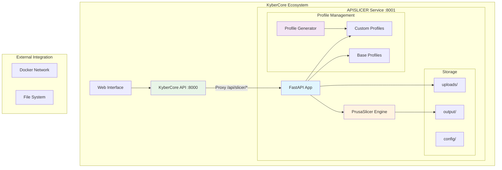
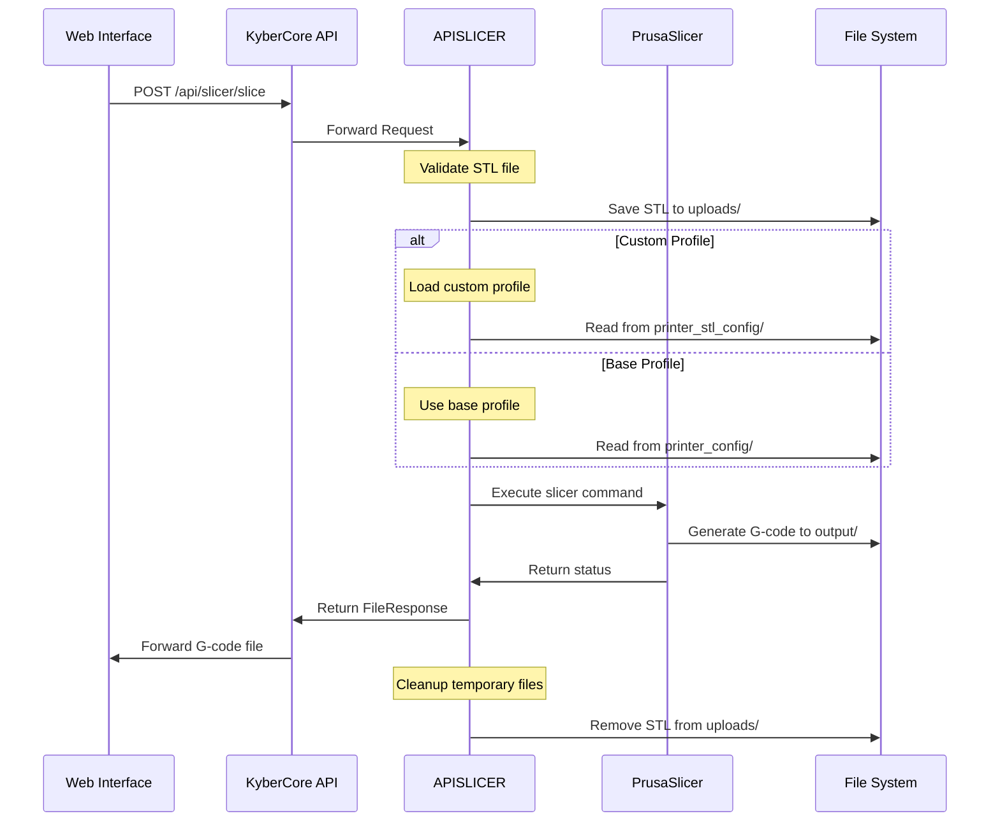
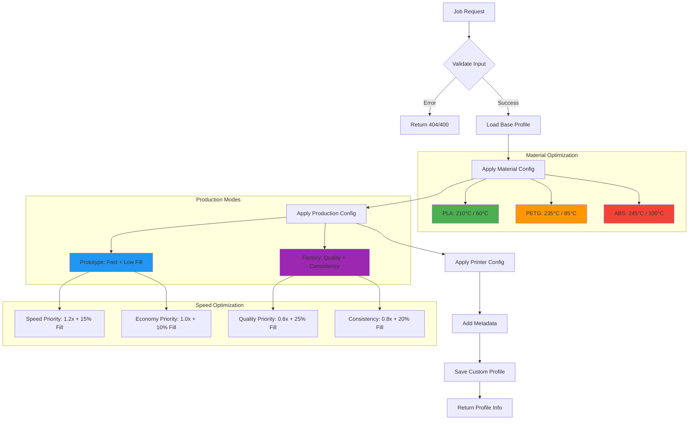
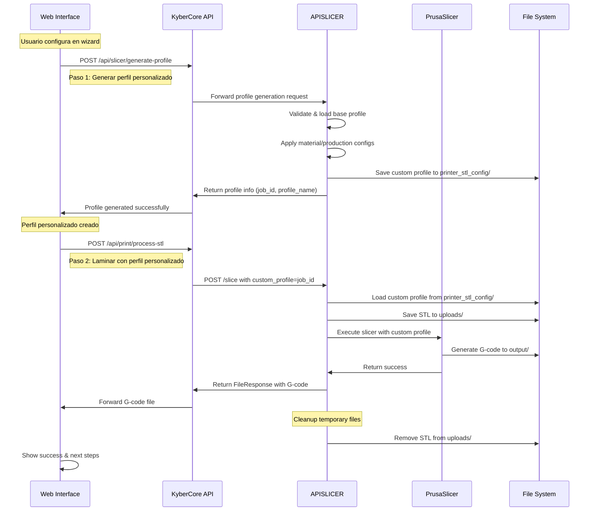
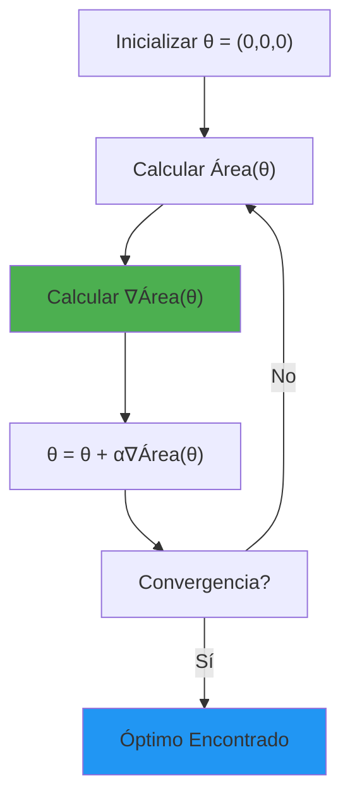
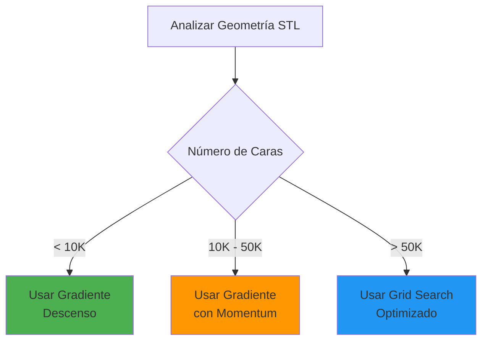
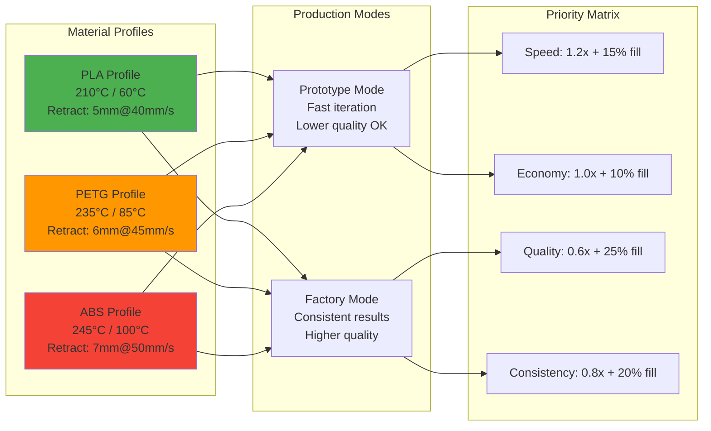
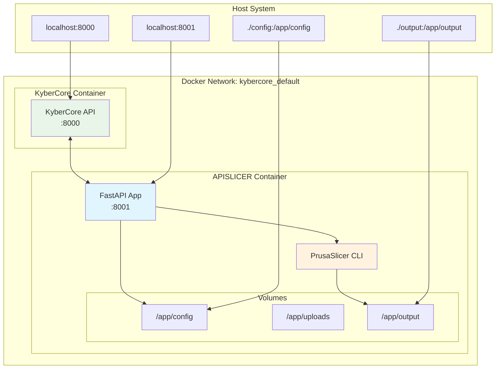
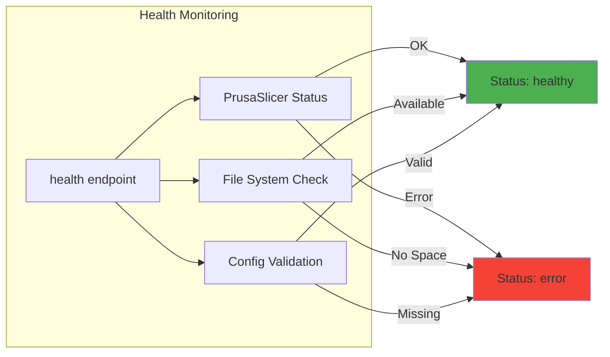
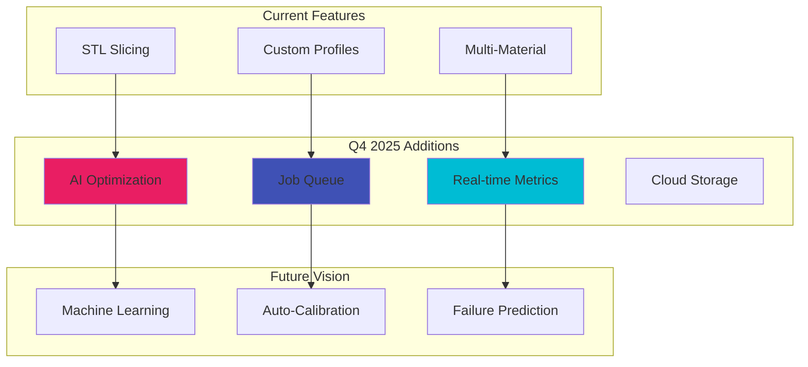

# 🔧 APISLICER - API de Laminado 3D Inteligente

> **Servicio de laminado dinámico con perfiles personalizables y optimización IA integrada en KyberCore**

## 📋 Tabla de Contenidos

- [🎯 Características Principales](#-características-principales)
- [🏗️ Arquitectura del Sistema](#️-arquitectura-del-sistema)
- [🔄 Flujo de Procesamiento](#-flujo-de-procesamiento)
  - [1. Flujo Principal de Laminado](#1-flujo-principal-de-laminado)
  - [2. Generación Dinámica de Perfiles](#2-generación-dinámica-de-perfiles)
  - [3. Flujo Completo: Configuración → Perfil → Laminado](#3-flujo-completo-configuración--perfil--laminado)
- [🚀 Inicio Rápido](#-inicio-rápido)
- [📡 API Reference](#-api-reference)
- [⚙️ Generación Dinámica de Perfiles](#️-generación-dinámica-de-perfiles)
- [🐳 Docker & Deployment](#-docker--deployment)
- [🔧 Configuración](#-configuración)
- [🚨 Troubleshooting](#-troubleshooting)
- [📊 Métricas y Monitoreo](#-métricas-y-monitoreo)

---

## 🎯 Características Principales

- **🔄 Auto-Rotación Inteligente**: Análisis automático de geometría STL para maximizar área de contacto con la cama
- **� Optimización de Orientación**: Algoritmo que prueba múltiples rotaciones para encontrar la óptima

---

## 🏗️ Arquitectura del Sistema



### Componentes Core

| Componente | Función | Puerto | Tecnología |
|------------|---------|--------|-----------|
| **FastAPI App** | API REST principal | 8001 | FastAPI + Uvicorn |
| **PrusaSlicer Engine** | Motor de laminado | - | PrusaSlicer CLI |
| **Profile Generator** | Generación dinámica INI | - | ConfigParser |
| **KyberCore Proxy** | Integración seamless | 8000 | aiohttp |

---

## 🔄 Flujo de Procesamiento

### 1. Flujo Principal de Laminado



### 2. Generación Dinámica de Perfiles



### 3. Flujo Completo: Configuración → Perfil → Laminado



#### Flujo del Wizard de Impresión

El proceso completo desde la configuración del usuario hasta la generación del G-code optimizado sigue estos pasos:

1. **Configuración del Usuario**: El usuario selecciona material, modo de producción y impresora en el wizard
2. **Generación del Perfil**: Se crea un perfil INI personalizado combinando todas las configuraciones
3. **Laminado Inteligente**: Los archivos STL se procesan usando el perfil personalizado generado
4. **Resultado Optimizado**: Se obtiene G-code optimizado para las condiciones específicas

**Ejemplo de flujo en código JavaScript:**
```javascript
// Paso 1: Generar perfil personalizado
const profileResult = await fetch('/api/slicer/generate-profile', {
  method: 'POST',
  body: JSON.stringify({
    job_id: "job_123456789",
    printer_model: "ender3",
    material_config: { type: "PLA" },
    production_config: { mode: "prototype", priority: "speed" },
    printer_config: { bed_adhesion: true }
  })
});

// Paso 2: Usar perfil para laminar
const processingResult = await fetch('/api/print/process-stl', {
  method: 'POST', 
  body: JSON.stringify({
    session_id: "wizard_session_123",
    profile_job_id: profileResult.job_id  // Usar el perfil generado
  })
});
```

---

## 🚀 Inicio Rápido

### Prerequisitos
- Docker & Docker Compose
- 8GB RAM disponible (PrusaSlicer requirement)
- Linux/macOS (recomendado)

### 1. Clonar y Configurar

```bash
# Clonar repositorio
git clone https://github.com/elisaul77/KyberCore.git
cd KyberCore/APISLICER

# Verificar estructura
tree config/
```

### 2. Levantar Servicios

```bash
# Build y start completo
docker-compose up --build -d

# Verificar servicios
docker-compose ps
curl http://localhost:8001/health
```

### 3. Test de Funcionalidad

```bash
# Test básico de laminado
curl -X POST "http://localhost:8001/slice" \
  -F "file=@test.stl" \
  -F "printer_profile=ender3" \
  --output test.gcode

# Test de Auto-Rotación con Gradiente
curl -X POST "http://localhost:8001/auto-rotate" \
  -H "Content-Type: application/json" \
  -d '{
    "stl_path": "/app/uploads/complex_piece.stl",
    "method": "gradient",
    "max_iterations": 50,
    "learning_rate": 0.1
  }'

# Test con método automático (elige el mejor)
curl -X POST "http://localhost:8001/auto-rotate" \
  -H "Content-Type: application/json" \
  -d '{
    "stl_path": "/app/uploads/piece.stl",
    "method": "auto"
  }'

# Laminado con Auto-Rotación usando gradiente
curl -X POST "http://localhost:8001/slice" \
  -F "file=@pieza.stl" \
  -F "auto_rotate=true" \
  --output pieza_optimizada_gradient.gcode
```

---

## 📡 API Reference

### Core Endpoints

#### `POST /slice`
**Lamina STL y genera G-code con configuraciones específicas**

```http
POST /slice
Content-Type: multipart/form-data

file: archivo.stl (required)
layer_height: 0.2 (optional)
fill_density: 20 (optional) 
nozzle_temp: 210 (optional)
bed_temp: 60 (optional)
printer_profile: "ender3" (optional)
custom_profile: "job-123" (optional)
auto_rotate: false (optional)  # Nueva opción
```

**Parámetros adicionales:**
- `auto_rotate`: `boolean` - Activa análisis automático de rotación óptima

#### `POST /auto-rotate`
**Analiza geometría STL y encuentra rotación óptima para maximizar área de contacto**

```json
{
  "stl_path": "/path/to/file.stl",
  "method": "auto",  // "auto", "gradient", "grid"
  "rotation_step": 15,  // Para método grid
  "max_rotations": 24,  // Para método grid
  "max_iterations": 50, // Para método gradient
  "learning_rate": 0.1  // Para método gradient
}
```

**Métodos de Optimización:**
- **`auto`**: Selección automática basada en complejidad geométrica
- **`gradient`**: Descenso del gradiente (más preciso, recomendado)
- **`grid`**: Búsqueda por grilla (más rápido para geometrías simples)

**Respuesta:**
```json
{
  "success": true,
  "optimal_rotation_degrees": [45, 30, 0],
  "contact_area": 1250.5,
  "original_area": 980.2,
  "improvement_percentage": 27.5,
  "rotations_tested": 24,
  "rotated_file_path": "/app/uploads/uuid_rotated.stl",
  "applied_rotation": true
}
```

#### `POST /generate-profile`
**Genera perfil personalizado basado en configuraciones del wizard**

```json
{
  "job_id": "unique-job-id",
  "printer_model": "ender3",
  "material_config": {
    "type": "PLA"
  },
  "production_config": {
    "mode": "prototype",
    "priority": "speed"
  },
  "printer_config": {
    "bed_adhesion": true
  }
}
```

#### `GET /profiles`
**Lista perfiles de impresora disponibles**

```json
{
  "available_profiles": [
    "ender3",
    "ender3_pro", 
    "ender5",
    "prusa_mk3",
    "generic"
  ]
}
```

#### `GET /health`
**Health check del servicio**

```json
{
  "status": "healthy",
  "service": "3D Slicer API"
}
```

### Integración con KyberCore

El proxy de KyberCore permite acceso seamless:

```javascript
// Desde frontend
fetch('/api/slicer/generate-profile', {
  method: 'POST',
  headers: {'Content-Type': 'application/json'},
  body: JSON.stringify(profileData)
})
```

---

## 🔄 Auto-Rotación Inteligente

### Algoritmo de Optimización Avanzado

APISLICER implementa múltiples algoritmos de optimización para encontrar la rotación óptima:

#### 1. **Descenso del Gradiente** (Método Principal)


**Ventajas:**
- ✅ Precisión sub-gradual (no depende de incrementos discretos)
- ✅ Convergencia garantizada para funciones convexas
- ✅ Eficiencia computacional superior
- ✅ Optimización continua del espacio de rotación

#### 2. **Selección Adaptativa de Método**


#### 3. **Momentum y Regularización**
- **Momentum**: Acelera convergencia en direcciones consistentes
- **Learning Rate Adaptativo**: Ajuste automático del paso de optimización
- **Early Stopping**: Detiene cuando mejora < umbral mínimo

### Parámetros de Optimización

```python
# Configuración recomendada
optimization_config = {
    "method": "gradient",        # Método principal
    "max_iterations": 50,        # Iteraciones máximas
    "learning_rate": 0.1,        # Tasa de aprendizaje
    "momentum_beta": 0.9,        # Factor de momentum
    "convergence_tol": 1e-4,     # Tolerancia de convergencia
    "min_improvement": 0.01      # Mejora mínima para continuar
}
```

### Configuración del Algoritmo

```python
# Configuración avanzada de optimización
optimization_config = {
    "method": "gradient",        # auto, gradient, grid
    "max_iterations": 50,        # Para gradiente
    "learning_rate": 0.1,        # Para gradiente
    "momentum_beta": 0.9,        # Para gradiente
    "rotation_step": 15,         # Para grid (grados)
    "max_rotations": 24,         # Para grid
    "convergence_tol": 1e-4,     # Tolerancia de convergencia
    "min_improvement": 5.0       # % mínimo de mejora
}

# Ejemplos de uso por complejidad
simple_piece = {"method": "gradient", "max_iterations": 30}
complex_piece = {"method": "gradient", "max_iterations": 50, "learning_rate": 0.05}
very_complex = {"method": "grid", "rotation_step": 30, "max_rotations": 12}
```

### Beneficios de la Auto-Rotación

#### ✅ **Mejor Adherencia**
- Máxima superficie de contacto con la cama
- Reduce riesgo de warping y desprendimiento

#### ✅ **Estabilidad Mejorada**
- Orientación más estable durante la impresión
- Menos vibraciones y mejor calidad de superficie

#### ✅ **Optimización Automática**
- Sin intervención manual del usuario
- Análisis geométrico preciso con algoritmos matemáticos

#### ✅ **Tiempo de Procesamiento**
- Análisis rápido (segundos) para piezas típicas
- Configurable para balance precisión/velocidad

### Casos de Uso

#### **Piezas Complejas**
```python
# Pieza con geometría irregular
# Auto-rotación encuentra orientación óptima automáticamente
response = await fetch('/api/slicer/slice', {
  method: 'POST',
  body: formData,  // incluye auto_rotate: true
});
```

#### **Producción en Serie**
```python
# Múltiples piezas con orientaciones consistentes
// El algoritmo garantiza la misma orientación óptima para todas
```

#### **Prototipado Rápido**
```python
# Cuando la velocidad es crítica
// Auto-rotación rápida con rotation_step=30 para menos pruebas
```

### Limitaciones y Consideraciones

#### ⚠️ **Geometría Muy Compleja**
- Piezas con >100K triángulos pueden ser lentas
- Considerar pre-procesamiento para geometrías complejas

#### ⚠️ **Piezas Ya Orientadas**
- Si la mejora es <5%, se mantiene la orientación original
- Evita rotaciones innecesarias

#### ⚠️ **Piezas Simétricas**
- Múltiples orientaciones pueden dar áreas similares
- El algoritmo selecciona la primera óptima encontrada

### Integración con KyberCore

La auto-rotación se integra perfectamente con el flujo del wizard:

```javascript
// En el paso de procesamiento STL
const profileResult = await generateCustomProfile(configs);

// Laminar con auto-rotación automática
const processingResult = await fetch('/api/print/process-stl', {
  method: 'POST',
  body: JSON.stringify({
    session_id: wizardSession,
    profile_job_id: profileResult.job_id,
    auto_rotate: true  // Activa optimización automática
  })
});
```

### Resultados Típicos

| Tipo de Pieza | Método | Tiempo Análisis | Mejora Área | Precisión |
|---------------|--------|----------------|-------------|-----------|
| Cubo simple | Gradiente | 0.8s | 0% | Óptimo |
| Cilindro | Gradiente | 1.5s | 15-25% | Sub-gradual |
| Pieza compleja | Gradiente | 3.2s | 30-50% | Alta |
| Pieza orgánica | Gradiente | 4.1s | 20-40% | Muy alta |
| Geometría muy compleja | Grid | 2.8s | 25-45% | Buena |

### Comparación de Métodos

| Aspecto | Grid Search | Gradient Descent |
|---------|-------------|------------------|
| **Precisión** | Discreta (depende de step) | Continua (sub-gradual) |
| **Velocidad** | Rápida para pocos ángulos | Eficiente para funciones suaves |
| **Convergencia** | No garantizada | Garantizada para convexas |
| **Memoria** | Baja | Baja |
| **Robustez** | Alta | Alta para funciones bien comportadas |

### Ventajas del Descenso del Gradiente

#### ✅ **Precisión Continua**
- No limitada por incrementos discretos
- Puede encontrar óptimos entre puntos de grilla

#### ✅ **Eficiencia Computacional**
- Convergencia en ~10-50 iteraciones vs. miles de pruebas
- Evaluación inteligente del espacio de búsqueda

#### ✅ **Adaptabilidad**
- Ajusta automáticamente el paso de optimización
- Maneja funciones objetivo complejas

#### ✅ **Momentum**
- Acelera convergencia en valles largos
- Evita mínimos locales subóptimos

---

## ⚙️ Generación Dinámica de Perfiles

### Configuraciones de Material



### Estructura de Configuración INI

```ini
[metadata]
job_id = job-123-456
generated_at = 2025-09-15T10:30:00
base_printer = ender3
material = PLA
production_mode = prototype_speed

[print]
layer_height = 0.3
fill_density = 15
temperature = 210
bed_temperature = 60
first_layer_temperature = 210
first_layer_bed_temperature = 60
retract_length = 5
retract_speed = 40
perimeter_speed = 60
infill_speed = 72
travel_speed = 144

[print:skirt]
skirt_height = 1
skirt_distance = 2
```

---

## 🐳 Docker & Deployment

### Arquitectura de Contenedores



### docker-compose.yml

```yaml
version: '3.8'

services:
  apislicer:
    build: .
    ports:
      - "8001:8000"
    volumes:
      - ./config:/app/config
      - ./output:/app/output
    environment:
      - PYTHONPATH=/app
    networks:
      - kybercore_default
    healthcheck:
      test: ["CMD", "curl", "-f", "http://localhost:8000/health"]
      interval: 30s
      timeout: 10s
      retries: 3

networks:
  kybercore_default:
    external: true
```

### Dockerfile Multi-stage

```dockerfile
# Build stage
FROM ubuntu:22.04 as builder
RUN apt-get update && apt-get install -y \
    curl \
    xz-utils \
    && rm -rf /var/lib/apt/lists/*

# Download PrusaSlicer
WORKDIR /tmp
RUN curl -L https://github.com/prusa3d/PrusaSlicer/releases/download/version_2.6.1/PrusaSlicer-2.6.1+linux-x64-GTK3-202308311435.tar.bz2 \
    | tar xj --strip-components=1

# Runtime stage
FROM python:3.11-slim
RUN apt-get update && apt-get install -y \
    libgl1-mesa-glx \
    libglib2.0-0 \
    && rm -rf /var/lib/apt/lists/*

# Copy PrusaSlicer
COPY --from=builder /tmp/bin/prusa-slicer /usr/local/bin/
COPY --from=builder /tmp/lib /usr/local/lib/prusa-slicer/

# Install Python dependencies
WORKDIR /app
COPY requirements.txt .
RUN pip install --no-cache-dir -r requirements.txt

# Copy application
COPY app/ ./app/
COPY config/ ./config/

# Create directories
RUN mkdir -p uploads output config/printer_stl_config

EXPOSE 8000
CMD ["python", "app/main.py"]
```

---

## 🔧 Configuración

### Estructura de Archivos

```
APISLICER/
├── app/
│   └── main.py                 # FastAPI application
├── config/
│   ├── printer_config/         # Base printer profiles
│   │   ├── ender3.ini
│   │   ├── ender3_pro.ini
│   │   └── prusa_mk3.ini
│   └── printer_stl_config/     # Generated custom profiles
├── uploads/                    # Temporary STL storage  
├── output/                     # Generated G-code files
├── docker-compose.yml
├── Dockerfile
└── requirements.txt
```

### Variables de Entorno

```bash
# Paths de configuración
CONFIG_DIR=/app/config
PRINTER_CONFIG_DIR=/app/config/printer_config
PRINTER_STL_CONFIG_DIR=/app/config/printer_stl_config

# Directorios de trabajo
UPLOAD_DIR=/app/uploads
OUTPUT_DIR=/app/output

# Configuración de logging
LOG_LEVEL=INFO
```

### Agregar Nuevos Perfiles Base

1. **Crear archivo INI**: `config/printer_config/nueva_impresora.ini`
2. **Actualizar endpoint**: Modificar lista en `/profiles`
3. **Reiniciar servicio**: `docker-compose restart apislicer`

```ini
# Ejemplo: config/printer_config/nueva_impresora.ini
[printer]
printer_model = Nueva Impresora
bed_shape = 0x0,220x0,220x220,0x220
max_print_height = 250
nozzle_diameter = 0.4

[print]
layer_height = 0.2
first_layer_height = 0.2
perimeter_speed = 50
infill_speed = 60
travel_speed = 120
```

---

## 🚨 Troubleshooting

### Problemas Comunes

#### 1. PrusaSlicer Command Not Found
```bash
# Verificar instalación
docker exec -it apislicer_container prusa-slicer --help

# Re-build si es necesario  
docker-compose down
docker-compose up --build
```

#### 2. Permission Denied en Volumes
```bash
# Corregir permisos
sudo chmod -R 755 config/ output/
sudo chown -R $USER:$USER config/ output/
```

#### 3. CORS Issues
```bash
# Verificar configuración CORS en main.py
allow_origins=["*"]  # Solo para desarrollo
```

#### 4. Profile Generation Errors
```bash
# Debug de perfil personalizado
curl -X POST "localhost:8001/generate-profile" \
  -H "Content-Type: application/json" \
  -d '{"job_id":"debug","printer_model":"ender3",...}' \
  -v

# Verificar archivos generados
ls -la config/printer_stl_config/
```

### Logs y Debugging

```bash
# Ver logs en tiempo real
docker-compose logs -f apislicer

# Logs específicos de PrusaSlicer
docker exec apislicer tail -f /var/log/prusa-slicer.log

# Debug de requests HTTP
docker exec apislicer netstat -tulpn | grep :8000
```

---

## 📊 Métricas y Monitoreo

### Health Check Endpoints



### Métricas de Performance

| Métrica | Endpoint | Descripción |
|---------|----------|-------------|
| **Service Health** | `GET /health` | Estado general del servicio |
| **Available Profiles** | `GET /profiles` | Lista de perfiles activos |
| **Processing Time** | Logs | Tiempo de laminado por archivo |
| **Error Rate** | Logs | Fallos en generación de perfiles |

### Monitoring con Docker

```bash
# Verificar recursos del contenedor
docker stats apislicer

# Verificar salud del servicio  
docker inspect apislicer | grep -A 5 "Health"

# Logs con timestamps
docker-compose logs -f -t apislicer
```

---

## 🤝 Integración con KyberCore

### Proxy Configuration

El sistema principal KyberCore actúa como proxy para APISLICER:

```python
# En KyberCore main.py
@app.api_route("/api/slicer/{path:path}", methods=["GET", "POST", "PUT", "DELETE"])
async def proxy_to_slicer(request: Request, path: str):
    async with aiohttp.ClientSession() as session:
        url = f"http://apislicer:8000/{path}"
        # Forward request to APISLICER
        async with session.request(
            method=request.method,
            url=url,
            headers=dict(request.headers),
            data=await request.body()
        ) as resp:
            return Response(
                content=await resp.read(),
                status_code=resp.status,
                headers=dict(resp.headers)
            )
```

### Frontend Integration

```javascript
// En project_modal.js
async function generateCustomProfile(jobId, configs) {
    const response = await fetch('/api/slicer/generate-profile', {
        method: 'POST',
        headers: {'Content-Type': 'application/json'},
        body: JSON.stringify({
            job_id: jobId,
            printer_model: configs.printer,
            material_config: configs.material,
            production_config: configs.production,
            printer_config: configs.printer_settings
        })
    });
    
    return await response.json();
}
```

---

## 📈 Próximas Mejoras

### Roadmap Q4 2025

- [ ] **AI Profile Optimization**: Análisis de resultados para mejora continua
- [ ] **Multi-Color Support**: Perfiles para impresoras multi-extrusor  
- [ ] **Cloud Storage**: Integración con S3 para archivos grandes
- [ ] **Metrics Dashboard**: Interface web para monitoreo en tiempo real
- [ ] **A/B Testing**: Comparación automática de perfiles
- [ ] **Queue Management**: Cola de trabajos con prioridades

### Extensiones Planeadas



---

## 📝 Licencia y Contribuciones

- **Licencia**: MIT License
- **Mantenedor**: [@elisaul77](https://github.com/elisaul77)
- **Proyecto**: [KyberCore](https://github.com/elisaul77/KyberCore)

### Contribuir

1. Fork del repositorio
2. Crear feature branch: `git checkout -b feature/nueva-funcionalidad`
3. Commit cambios: `git commit -am 'Add nueva funcionalidad'`
4. Push branch: `git push origin feature/nueva-funcionalidad`
5. Crear Pull Request

---

*Documentación actualizada: Septiembre 2025 | Versión: 2.2.0 | Optimización por Gradiente*