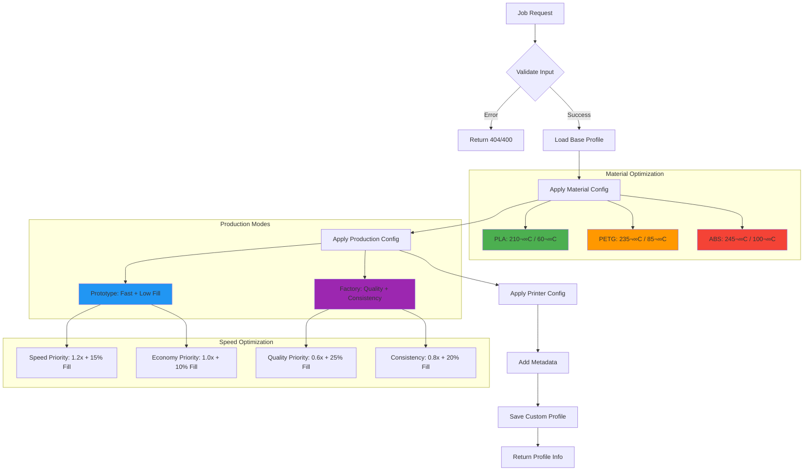

# 🔧 APISLICER - API de Laminado 3D Inteligente

> **Servicio de laminado dinámico con perfiles personalizables y optimización IA integrada en KyberCore**

## 📋 Tabla de Contenidos

- [🎯 Características Principales](#-características-principales)
- [🏗️ Arquitectura del Sistema](#️-arquitectura-del-sistema)
- [🔄 Flujo de Procesamiento](#-flujo-de-procesamiento)
  - [1. Flujo Principal de Laminado](#1-flujo-principal-de-laminado)
  - [2. Generación Dinámica de Perfiles](#2-generación-dinámica-de-perfiles)
  - [3. Flujo Completo: Configuración → Perfil → Laminado](#3-flujo-completo-configuración--perfil--laminado)
- [🚀 Inicio Rápido](#-inicio-rápido)
- [📡 API Reference](#-api-reference)
- [⚙️ Generación Dinámica de Perfiles](#️-generación-dinámica-de-perfiles)
- [🐳 Docker & Deployment](#-docker--deployment)
- [🔧 Configuración](#-configuración)
- [🚨 Troubleshooting](#-troubleshooting)
- [📊 Métricas y Monitoreo](#-métricas-y-monitoreo)

---

## 🎯 Características Principales

- **✨ Generación Dinámica de Perfiles**: Creación automática de configuraciones INI optimizadas
- **🎛️ Multi-Material**: Soporte para PLA, PETG, ABS con configuraciones específicas
- **🏭 Modos de Producción**: Perfiles optimizados para prototipado rápido y producción factory
- **🔌 Integración KyberCore**: Proxy endpoints para comunicación seamless
- **🐳 Containerizado**: Deployment completo con Docker Compose
- **📊 Headless Operation**: Sin interfaz gráfica, completamente vía API

---

## 🏗️ Arquitectura del Sistema


### Componentes Core

| Componente | Función | Puerto | Tecnología |
|------------|---------|--------|-----------|
| **FastAPI App** | API REST principal | 8001 | FastAPI + Uvicorn |
| **PrusaSlicer Engine** | Motor de laminado | - | PrusaSlicer CLI |
| **Profile Generator** | Generación dinámica INI | - | ConfigParser |
| **KyberCore Proxy** | Integración seamless | 8000 | aiohttp |

---

## 🔄 Flujo de Procesamiento

### 1. Flujo Principal de Laminado


### 2. Generación Dinámica de Perfiles



### 3. Flujo Completo: Configuración → Perfil → Laminado


#### Flujo del Wizard de Impresión

El proceso completo desde la configuración del usuario hasta la generación del G-code optimizado sigue estos pasos:

1. **Configuración del Usuario**: El usuario selecciona material, modo de producción y impresora en el wizard
2. **Generación del Perfil**: Se crea un perfil INI personalizado combinando todas las configuraciones
3. **Laminado Inteligente**: Los archivos STL se procesan usando el perfil personalizado generado
4. **Resultado Optimizado**: Se obtiene G-code optimizado para las condiciones específicas

**Ejemplo de flujo en código JavaScript:**
```javascript
// Paso 1: Generar perfil personalizado
const profileResult = await fetch('/api/slicer/generate-profile', {
  method: 'POST',
  body: JSON.stringify({
    job_id: "job_123456789",
    printer_model: "ender3",
    material_config: { type: "PLA" },
    production_config: { mode: "prototype", priority: "speed" },
    printer_config: { bed_adhesion: true }
  })
});

// Paso 2: Usar perfil para laminar
const processingResult = await fetch('/api/print/process-stl', {
  method: 'POST', 
  body: JSON.stringify({
    session_id: "wizard_session_123",
    profile_job_id: profileResult.job_id  // Usar el perfil generado
  })
});
```

---

## 🚀 Inicio Rápido

### Prerequisitos
- Docker & Docker Compose
- 8GB RAM disponible (PrusaSlicer requirement)
- Linux/macOS (recomendado)

### 1. Clonar y Configurar

```bash
# Clonar repositorio
git clone https://github.com/elisaul77/KyberCore.git
cd KyberCore/APISLICER

# Verificar estructura
tree config/
```

### 2. Levantar Servicios

```bash
# Build y start completo
docker-compose up --build -d

# Verificar servicios
docker-compose ps
curl http://localhost:8001/health
```

### 3. Test de Funcionalidad

```bash
# Test básico de laminado
curl -X POST "http://localhost:8001/slice" \
  -F "file=@test.stl" \
  -F "printer_profile=ender3" \
  --output test.gcode

# Test de generación de perfil personalizado  
curl -X POST "http://localhost:8001/generate-profile" \
  -H "Content-Type: application/json" \
  -d '{
    "job_id": "test-123",
    "printer_model": "ender3",
    "material_config": {"type": "PLA"},
    "production_config": {"mode": "prototype", "priority": "speed"},
    "printer_config": {"bed_adhesion": true}
  }'
```

---

## 📡 API Reference

### Core Endpoints

#### `POST /slice`
**Lamina STL y genera G-code con configuraciones específicas**

```http
POST /slice
Content-Type: multipart/form-data

file: archivo.stl (required)
layer_height: 0.2 (optional)
fill_density: 20 (optional) 
nozzle_temp: 210 (optional)
bed_temp: 60 (optional)
printer_profile: "ender3" (optional)
custom_profile: "job-123" (optional)
```

**Respuesta**: FileResponse con G-code generado

#### `POST /generate-profile`
**Genera perfil personalizado basado en configuraciones del wizard**

```json
{
  "job_id": "unique-job-id",
  "printer_model": "ender3",
  "material_config": {
    "type": "PLA"
  },
  "production_config": {
    "mode": "prototype",
    "priority": "speed"
  },
  "printer_config": {
    "bed_adhesion": true
  }
}
```

#### `GET /profiles`
**Lista perfiles de impresora disponibles**

```json
{
  "available_profiles": [
    "ender3",
    "ender3_pro", 
    "ender5",
    "prusa_mk3",
    "generic"
  ]
}
```

#### `GET /health`
**Health check del servicio**

```json
{
  "status": "healthy",
  "service": "3D Slicer API"
}
```

### Integración con KyberCore

El proxy de KyberCore permite acceso seamless:

```javascript
// Desde frontend
fetch('/api/slicer/generate-profile', {
  method: 'POST',
  headers: {'Content-Type': 'application/json'},
  body: JSON.stringify(profileData)
})
```

---

## ⚙️ Generación Dinámica de Perfiles

### Configuraciones de Material


### Estructura de Configuración INI

```ini
[metadata]
job_id = job-123-456
generated_at = 2025-09-15T10:30:00
base_printer = ender3
material = PLA
production_mode = prototype_speed

[print]
layer_height = 0.3
fill_density = 15
temperature = 210
bed_temperature = 60
first_layer_temperature = 210
first_layer_bed_temperature = 60
retract_length = 5
retract_speed = 40
perimeter_speed = 60
infill_speed = 72
travel_speed = 144

[print:skirt]
skirt_height = 1
skirt_distance = 2
```

---

## 🐳 Docker & Deployment

### Arquitectura de Contenedores


### docker-compose.yml

```yaml
version: '3.8'

services:
  apislicer:
    build: .
    ports:
      - "8001:8000"
    volumes:
      - ./config:/app/config
      - ./output:/app/output
    environment:
      - PYTHONPATH=/app
    networks:
      - kybercore_default
    healthcheck:
      test: ["CMD", "curl", "-f", "http://localhost:8000/health"]
      interval: 30s
      timeout: 10s
      retries: 3

networks:
  kybercore_default:
    external: true
```

### Dockerfile Multi-stage

```dockerfile
# Build stage
FROM ubuntu:22.04 as builder
RUN apt-get update && apt-get install -y \
    curl \
    xz-utils \
    && rm -rf /var/lib/apt/lists/*

# Download PrusaSlicer
WORKDIR /tmp
RUN curl -L https://github.com/prusa3d/PrusaSlicer/releases/download/version_2.6.1/PrusaSlicer-2.6.1+linux-x64-GTK3-202308311435.tar.bz2 \
    | tar xj --strip-components=1

# Runtime stage
FROM python:3.11-slim
RUN apt-get update && apt-get install -y \
    libgl1-mesa-glx \
    libglib2.0-0 \
    && rm -rf /var/lib/apt/lists/*

# Copy PrusaSlicer
COPY --from=builder /tmp/bin/prusa-slicer /usr/local/bin/
COPY --from=builder /tmp/lib /usr/local/lib/prusa-slicer/

# Install Python dependencies
WORKDIR /app
COPY requirements.txt .
RUN pip install --no-cache-dir -r requirements.txt

# Copy application
COPY app/ ./app/
COPY config/ ./config/

# Create directories
RUN mkdir -p uploads output config/printer_stl_config

EXPOSE 8000
CMD ["python", "app/main.py"]
```

---

## 🔧 Configuración

### Estructura de Archivos

```
APISLICER/
├── app/
│   └── main.py                 # FastAPI application
├── config/
│   ├── printer_config/         # Base printer profiles
│   │   ├── ender3.ini
│   │   ├── ender3_pro.ini
│   │   └── prusa_mk3.ini
│   └── printer_stl_config/     # Generated custom profiles
├── uploads/                    # Temporary STL storage  
├── output/                     # Generated G-code files
├── docker-compose.yml
├── Dockerfile
└── requirements.txt
```

### Variables de Entorno

```bash
# Paths de configuración
CONFIG_DIR=/app/config
PRINTER_CONFIG_DIR=/app/config/printer_config
PRINTER_STL_CONFIG_DIR=/app/config/printer_stl_config

# Directorios de trabajo
UPLOAD_DIR=/app/uploads
OUTPUT_DIR=/app/output

# Configuración de logging
LOG_LEVEL=INFO
```

### Agregar Nuevos Perfiles Base

1. **Crear archivo INI**: `config/printer_config/nueva_impresora.ini`
2. **Actualizar endpoint**: Modificar lista en `/profiles`
3. **Reiniciar servicio**: `docker-compose restart apislicer`

```ini
# Ejemplo: config/printer_config/nueva_impresora.ini
[printer]
printer_model = Nueva Impresora
bed_shape = 0x0,220x0,220x220,0x220
max_print_height = 250
nozzle_diameter = 0.4

[print]
layer_height = 0.2
first_layer_height = 0.2
perimeter_speed = 50
infill_speed = 60
travel_speed = 120
```

---

## 🚨 Troubleshooting

### Problemas Comunes

#### 1. PrusaSlicer Command Not Found
```bash
# Verificar instalación
docker exec -it apislicer_container prusa-slicer --help

# Re-build si es necesario  
docker-compose down
docker-compose up --build
```

#### 2. Permission Denied en Volumes
```bash
# Corregir permisos
sudo chmod -R 755 config/ output/
sudo chown -R $USER:$USER config/ output/
```

#### 3. CORS Issues
```bash
# Verificar configuración CORS en main.py
allow_origins=["*"]  # Solo para desarrollo
```

#### 4. Profile Generation Errors
```bash
# Debug de perfil personalizado
curl -X POST "localhost:8001/generate-profile" \
  -H "Content-Type: application/json" \
  -d '{"job_id":"debug","printer_model":"ender3",...}' \
  -v

# Verificar archivos generados
ls -la config/printer_stl_config/
```

### Logs y Debugging

```bash
# Ver logs en tiempo real
docker-compose logs -f apislicer

# Logs específicos de PrusaSlicer
docker exec apislicer tail -f /var/log/prusa-slicer.log

# Debug de requests HTTP
docker exec apislicer netstat -tulpn | grep :8000
```

---

## 📊 Métricas y Monitoreo

### Health Check Endpoints


### Métricas de Performance

| Métrica | Endpoint | Descripción |
|---------|----------|-------------|
| **Service Health** | `GET /health` | Estado general del servicio |
| **Available Profiles** | `GET /profiles` | Lista de perfiles activos |
| **Processing Time** | Logs | Tiempo de laminado por archivo |
| **Error Rate** | Logs | Fallos en generación de perfiles |

### Monitoring con Docker

```bash
# Verificar recursos del contenedor
docker stats apislicer

# Verificar salud del servicio  
docker inspect apislicer | grep -A 5 "Health"

# Logs con timestamps
docker-compose logs -f -t apislicer
```

---

## 🤝 Integración con KyberCore

### Proxy Configuration

El sistema principal KyberCore actúa como proxy para APISLICER:

```python
# En KyberCore main.py
@app.api_route("/api/slicer/{path:path}", methods=["GET", "POST", "PUT", "DELETE"])
async def proxy_to_slicer(request: Request, path: str):
    async with aiohttp.ClientSession() as session:
        url = f"http://apislicer:8000/{path}"
        # Forward request to APISLICER
        async with session.request(
            method=request.method,
            url=url,
            headers=dict(request.headers),
            data=await request.body()
        ) as resp:
            return Response(
                content=await resp.read(),
                status_code=resp.status,
                headers=dict(resp.headers)
            )
```

### Frontend Integration

```javascript
// En project_modal.js
async function generateCustomProfile(jobId, configs) {
    const response = await fetch('/api/slicer/generate-profile', {
        method: 'POST',
        headers: {'Content-Type': 'application/json'},
        body: JSON.stringify({
            job_id: jobId,
            printer_model: configs.printer,
            material_config: configs.material,
            production_config: configs.production,
            printer_config: configs.printer_settings
        })
    });
    
    return await response.json();
}
```

---

## 📈 Próximas Mejoras

### Roadmap Q4 2025

- [ ] **AI Profile Optimization**: Análisis de resultados para mejora continua
- [ ] **Multi-Color Support**: Perfiles para impresoras multi-extrusor  
- [ ] **Cloud Storage**: Integración con S3 para archivos grandes
- [ ] **Metrics Dashboard**: Interface web para monitoreo en tiempo real
- [ ] **A/B Testing**: Comparación automática de perfiles
- [ ] **Queue Management**: Cola de trabajos con prioridades

### Extensiones Planeadas


---

## 📝 Licencia y Contribuciones

- **Licencia**: MIT License
- **Mantenedor**: [@elisaul77](https://github.com/elisaul77)
- **Proyecto**: [KyberCore](https://github.com/elisaul77/KyberCore)

### Contribuir

1. Fork del repositorio
2. Crear feature branch: `git checkout -b feature/nueva-funcionalidad`
3. Commit cambios: `git commit -am 'Add nueva funcionalidad'`
4. Push branch: `git push origin feature/nueva-funcionalidad`
5. Crear Pull Request

---

*Documentación actualizada: Septiembre 2025 | Versión: 2.1.0*