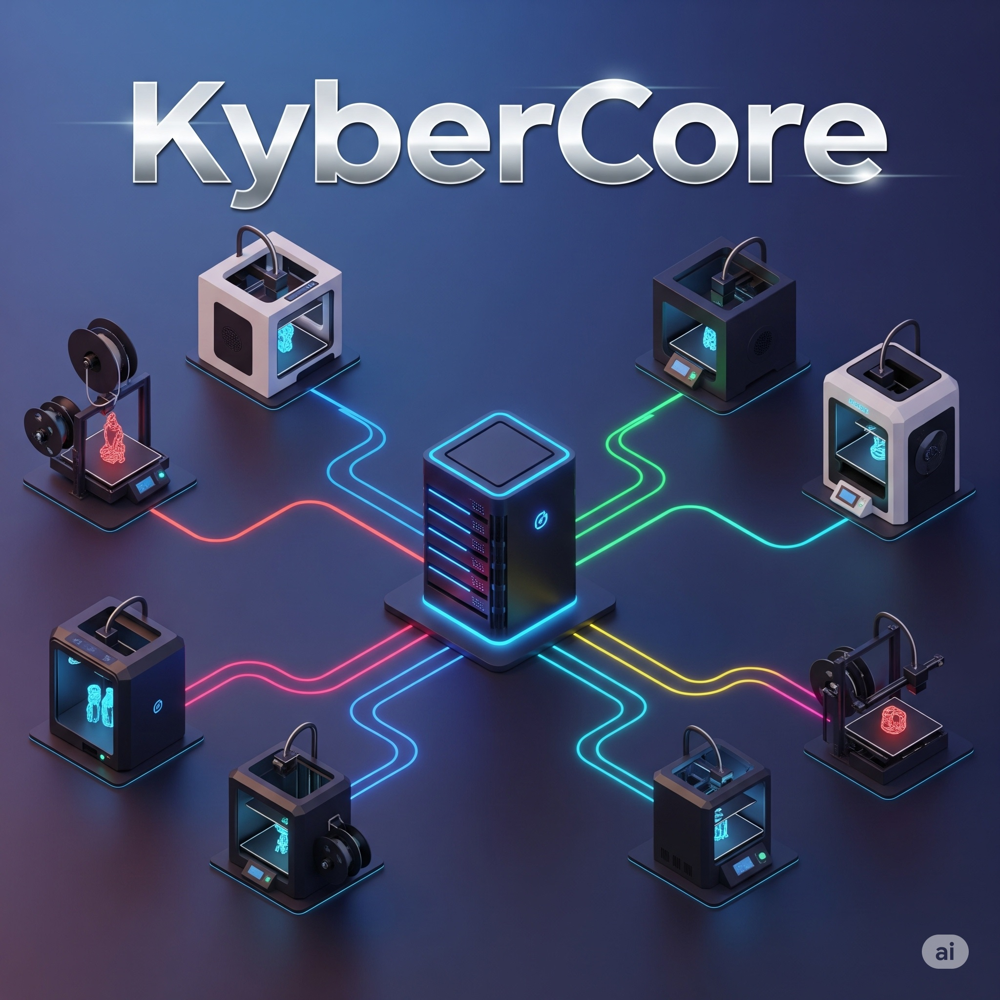

# KyberCore



🚀 [Ver Demo Interactiva (GitHub Pages)](https://elisaul77.github.io/kybercore/)  
🎥 [Ver Video Demo en YouTube](https://www.youtube.com/watch?v=r3Lz_apk1oo)  

[](https://github.com/elisaul77/kybercore/actions/workflows/ci-cd.yml)
[](https://opensource.org/licenses/MIT)
[](https://www.python.org/downloads/)
[](https://www.docker.com/)
[](https://github.com/psf/black)

[](https://github.com/sponsors/elisaul77)
[](https://paypal.me/eflorezp)
[](https://buymeacoffee.com/elisaul77)

Orquestador local de múltiples impresoras 3D con **Inteligencia Artificial integrada**, desarrollado 100% en Python y diseñado para ejecutarse en entornos Docker.

## ✨ Características principales

- 🤖 **IA como diferenciador**: Análisis inteligente, recomendaciones automáticas y optimización
- 🖨️ **Gestión de flota**: Control centralizado de múltiples impresoras 3D
- 🔄 **Tiempo real**: Monitoreo y actualizaciones en vivo via WebSocket
- 🐳 **Containerizado**: Despliegue simple con Docker
- 🏗️ **Arquitectura modular**: Fácil extensión y mantenimiento
- 📊 **Análisis de fallos**: Diagnóstico automático y sugerencias de solución

## Despliegue rápido con Docker

1. Construye la imagen:
   ```sh
   docker build -t kybercore .
   ```
2. O usa docker-compose:
   ```sh
   docker-compose up --build
   ```
3. Accede a la API o interfaz en el puerto 8000 (ajusta según configuración).

## 🔧 APISLICER - Servicio de Slicing

KyberCore incluye **APISLICER**, un servicio dedicado para la conversión de archivos STL a G-code usando PrusaSlicer.

### 🚀 Inicio Rápido

```bash
# Iniciar todos los servicios (KyberCore + APISLICER)
docker compose up --build -d

# Probar APISLICER
./scripts/test_apislicer.sh

# Acceso directo a APISLICER
curl http://localhost:8001/health
```

### 📚 Documentación APISLICER

- 📋 **[Documentación Técnica Completa](docs/apislicer-technical-docs.md)** - API, configuración y troubleshooting
- 🎨 **[Diagramas de Arquitectura](docs/apislicer-diagrams.md)** - Flujos, componentes y despliegue (Mermaid)  
- 🧪 **[Interfaz de Test Interactiva](docs/apislicer-test-interface.html)** - Herramienta web para probar la API

### ⚡ Características del Servicio

- **🔄 API REST**: Conversión STL → G-code via HTTP
- **🐳 Containerizado**: PrusaSlicer 2.8.1 en Ubuntu 24.04
- **⚙️ Configurable**: Perfiles de impresora y parámetros de slice
- **📊 Monitoreo**: Health checks y logs detallados
- **🧪 Testing**: Scripts automáticos y interfaz web

## Estructura del Proyecto
- `src/` : Código fuente principal (API, controladores, modelos, servicios, etc.)
- `APISLICER/` : Servicio de slicing STL → G-code con PrusaSlicer
- `prototype/` : Prototipos y pruebas de UI/UX
- `docs/` : Documentación estratégica y técnica
- `infografia/` : Material visual y justificación del proyecto
- `tests/` : Pruebas automatizadas
- `scripts/` : Scripts de automatización y testing

## 🤝 Contribuir

¡Las contribuciones son bienvenidas! Por favor lee [CONTRIBUTING.md](CONTRIBUTING.md) para más detalles sobre nuestro proceso de contribución.

### 💖 Apoya el Proyecto

Si KyberCore te resulta útil, considera apoyar su desarrollo:

- ⭐ **Dale una estrella** al repositorio
- 💰 **[Haz una donación](FUNDING.md)** para apoyar el desarrollo continuo
- 🐛 **Reporta bugs** y sugiere mejoras
- 📝 **Contribuye con código** o documentación
- 📢 **Comparte** el proyecto con otros makers

[](https://github.com/sponsors/elisaul77)
[](https://paypal.me/eflorezp)

Ver todas las opciones de donación en **[FUNDING.md](FUNDING.md)**

## 📋 Roadmap

Consulta la hoja de ruta completa en [`docs/investigacion.md`](docs/investigacion.md) sección 4.3.

## 📚 Documentación

- [Instrucciones de desarrollo](INSTRUCCIONES.md)
- [Documentación técnica](docs/)
- [Material visual](infografia/)

## 🐛 Reportar problemas

Usa el [sistema de issues](https://github.com/elisaul77/kybercore/issues) de GitHub para reportar bugs o sugerir mejoras.

## Licencia

Este proyecto está licenciado bajo la Licencia MIT.

Copyright (c) 2025

Se concede permiso, de forma gratuita, a cualquier persona que obtenga una copia de este software y los archivos de documentación asociados (el "Software"), para utilizar el Software sin restricción, incluyendo sin limitación los derechos a usar, copiar, modificar, fusionar, publicar, distribuir, sublicenciar y/o vender copias del Software, y permitir a las personas a quienes se les proporcione el Software a hacer lo mismo, sujeto a las siguientes condiciones:

El aviso de copyright anterior y este aviso de permiso se incluirán en todas las copias o partes sustanciales del Software.

EL SOFTWARE SE PROPORCIONA "TAL CUAL", SIN GARANTÍA DE NINGÚN TIPO, EXPRESA O IMPLÍCITA, INCLUYENDO PERO NO LIMITADO A LAS GARANTÍAS DE COMERCIALIZACIÓN, IDONEIDAD PARA UN PROPÓSITO PARTICULAR Y NO INFRACCIÓN. EN NINGÚN CASO LOS AUTORES O TITULARES DEL COPYRIGHT SERÁN RESPONSABLES POR NINGUNA RECLAMACIÓN, DAÑO U OTRA RESPONSABILIDAD, YA SEA EN UNA ACCIÓN DE CONTRATO, AGRAVIO O CUALQUIER OTRA FORMA, DERIVADA DE O EN CONEXIÓN CON EL SOFTWARE O EL USO U OTRO TIPO DE ACCIONES EN EL SOFTWARE.
