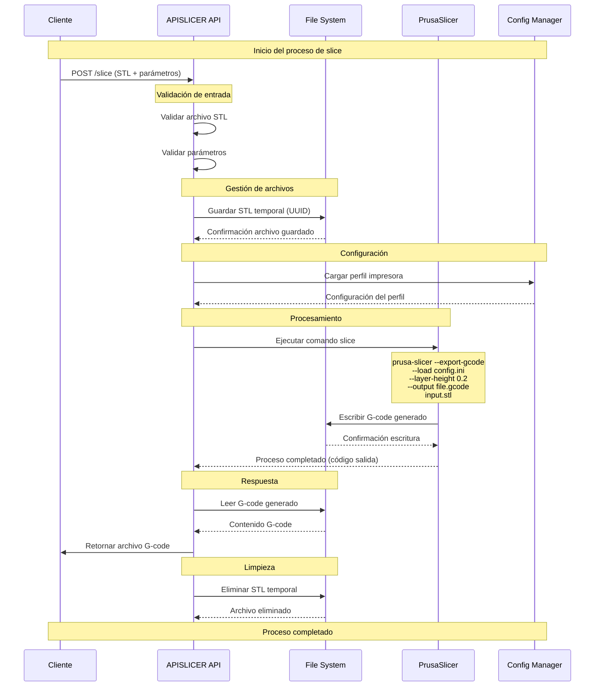
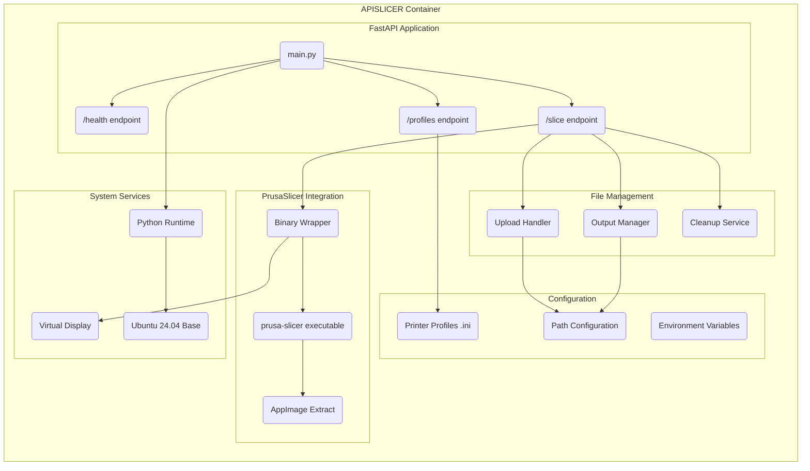
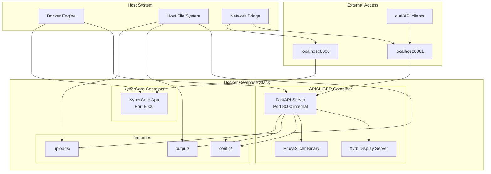
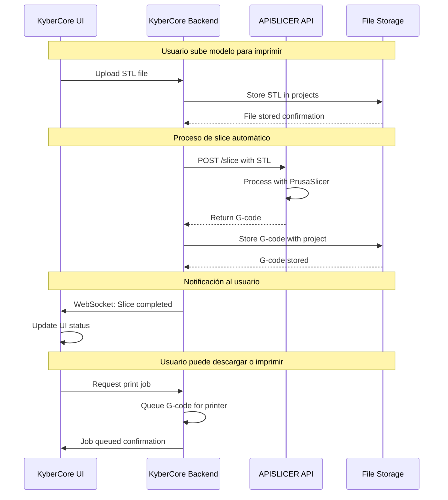
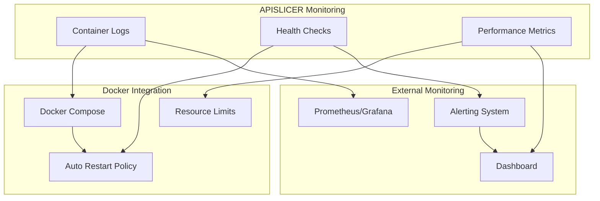

# APISLICER - Diagramas de Arquitectura

## Arquitectura General del Sistema

```mermaid
graph TB
    subgraph "KyberCore Ecosystem"
        KC[KyberCore Main App]
        DB[(Base de Datos)]
        WS[WebSocket Handler]
    end
    
    subgraph "APISLICER Service"
        API[FastAPI Server<br/>Port 8001]
        FM[File Manager]
        PS[PrusaSlicer Engine]
        CFG[Config Manager]
    end
    
    subgraph "Storage"
        UPL[/app/uploads<br/>STL Files]
        OUT[/app/output<br/>G-code Files] 
        CNF[/app/config<br/>Printer Profiles]
    end
    
    subgraph "External"
        CLI[CLI/curl]
        GUI[Web Interface]
        EXT[External Apps]
    end
    
    KC --> API
    CLI --> API
    GUI --> API
    EXT --> API
    
    API --> FM
    API --> PS
    API --> CFG
    
    FM --> UPL
    FM --> OUT
    PS --> OUT
    CFG --> CNF
    
    PS --> |reads| CNF
    PS --> |writes| OUT
```

## Flujo de Procesamiento de Archivos



## Arquitectura de Componentes




## Flujo de Estados del Archivo

```mermaid
stateDiagram-v2
    [*] --> Received: Cliente envía STL
    
    Received --> Validating: Verificar formato
    Validating --> Invalid: Formato incorrecto
    Invalid --> [*]: Error 400
    
    Validating --> Stored: STL válido
    Stored --> Processing: Ejecutar PrusaSlicer
    
    Processing --> Slicing: Proceso iniciado
    Slicing --> Failed: Error en slice
    Failed --> Cleanup: Limpiar archivos
    Cleanup --> [*]: Error 500
    
    Slicing --> Generated: G-code creado
    Generated --> Serving: Enviar al cliente
    Serving --> Cleanup2: Eliminar temporales
    Cleanup2 --> [*]: Éxito 200
```



## Diagrama de Despliegue



## Flujo de Integración con KyberCore



## Monitoreo y Observabilidad


