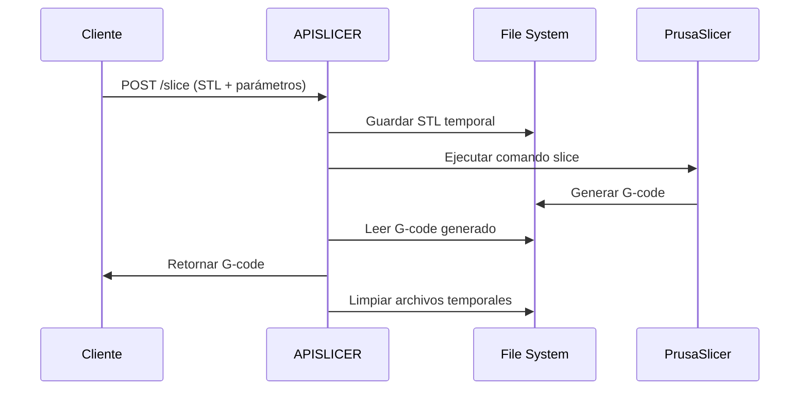

# APISLICER - Documentación Técnica Completa

## Descripción

APISLICER es un microservicio que proporciona una API REST para laminar archivos STL y generar G-code usando PrusaSlicer. Forma parte del ecosistema KyberCore como servicio integrado de procesamiento de modelos 3D.

## Arquitectura

```mermaid
graph TB
    A[Cliente/KyberCore] --> B[APISLICER API]
    B --> C[FastAPI Server]
    C --> D[File Manager]
    C --> E[PrusaSlicer Engine]
    D --> F[/app/uploads]
    D --> G[/app/output]
    E --> H[Printer Configs]
    E --> I[G-code Generator]
    I --> G
```

## Endpoints

### Health Check
**GET** `/health`

Verifica el estado del servicio.

**Respuesta:**
```json
{
  "status": "healthy",
  "service": "3D Slicer API"
}
```

### Obtener Perfiles de Impresora
**GET** `/profiles`

Lista los perfiles de impresora disponibles.

**Respuesta:**
```json
{
  "available_profiles": [
    "ender3",
    "ender3_pro", 
    "prusa_mk3",
    "custom"
  ]
}
```

### Laminar Archivo STL
**POST** `/slice`

Procesa un archivo STL y devuelve el G-code generado.

**Parámetros (multipart/form-data):**

| Parámetro | Tipo | Requerido | Default | Descripción |
|-----------|------|-----------|---------|-------------|
| `file` | File | ✅ | - | Archivo STL a procesar |
| `layer_height` | float | ❌ | 0.2 | Altura de capa en mm |
| `fill_density` | int | ❌ | 20 | Densidad de relleno (%) |
| `nozzle_temp` | int | ❌ | 210 | Temperatura del nozzle (°C) |
| `bed_temp` | int | ❌ | 60 | Temperatura de la cama (°C) |
| `printer_profile` | string | ❌ | "ender3" | Perfil de impresora |

**Ejemplo de solicitud:**
```bash
curl -F "file=@modelo.stl" \
     -F "layer_height=0.2" \
     -F "fill_density=15" \
     -F "nozzle_temp=210" \
     -F "bed_temp=60" \
     -F "printer_profile=ender3" \
     http://localhost:8001/slice \
     -o modelo.gcode
```

**Respuesta exitosa:**
- **Content-Type:** `text/plain`
- **Content-Disposition:** `attachment; filename="archivo.gcode"`
- **Cuerpo:** Archivo G-code generado

**Respuesta de error:**
```json
{
  "detail": "Descripción del error"
}
```

## Flujo de Procesamiento



## Configuración

### Variables de Entorno

| Variable | Valor | Descripción |
|----------|-------|-------------|
| `PYTHONUNBUFFERED` | 1 | Desactivar buffer de Python |
| `DISPLAY` | :99 | Display virtual para Xvfb |

### Directorios

- `/app/uploads/` - Archivos STL temporales
- `/app/output/` - G-code generado
- `/app/config/printer_configs/` - Perfiles de impresora

### Perfiles de Impresora

Los perfiles se almacenan en `/app/config/printer_configs/` como archivos `.ini`:

- `ender3.ini` - Creality Ender 3
- `ender3_pro.ini` - Creality Ender 3 Pro
- `prusa_mk3.ini` - Prusa i3 MK3
- `custom.ini` - Perfil personalizable

## Instalación y Despliegue

### Docker Compose (Recomendado)

El servicio está integrado en el `docker-compose.yml` principal:

```yaml
apislicer:
  build:
    context: ./APISLICER
  container_name: apislicer-slicer-api
  ports:
    - "8001:8000"
  volumes:
    - ./APISLICER/uploads:/app/uploads
    - ./APISLICER/output:/app/output
    - ./APISLICER/config:/app/config
  environment:
    - PYTHONUNBUFFERED=1
    - DISPLAY=:99
  restart: unless-stopped
```

### Comandos de Despliegue

```bash
# Construir y levantar
docker compose up --build -d apislicer

# Solo levantar
docker compose up -d apislicer

# Ver logs
docker compose logs -f apislicer

# Reiniciar
docker compose restart apislicer
```

## Pruebas

### Script Automatizado

Ejecutar el script de prueba incluido:

```bash
./scripts/test_apislicer.sh
```

### Prueba Manual

```bash
# 1. Health check
curl http://localhost:8001/health

# 2. Crear STL de prueba
cat > test.stl << 'EOF'
solid Cube
  facet normal 0.0 0.0 1.0
    outer loop
      vertex 0.0 0.0 5.0
      vertex 5.0 0.0 5.0
      vertex 5.0 5.0 5.0
    endloop
  endfacet
  facet normal 0.0 0.0 1.0
    outer loop
      vertex 0.0 0.0 5.0
      vertex 5.0 5.0 5.0
      vertex 0.0 5.0 5.0
    endloop
  endfacet
  facet normal 0.0 0.0 -1.0
    outer loop
      vertex 0.0 0.0 0.0
      vertex 5.0 5.0 0.0
      vertex 5.0 0.0 0.0
    endloop
  endfacet
  facet normal 0.0 0.0 -1.0
    outer loop
      vertex 0.0 0.0 0.0
      vertex 0.0 5.0 0.0
      vertex 5.0 5.0 0.0
    endloop
  endfacet
endsolid Cube
EOF

# 3. Probar slice
curl -F "file=@test.stl" \
     -F "layer_height=0.2" \
     -F "fill_density=20" \
     http://localhost:8001/slice \
     -o result.gcode

# 4. Verificar resultado
ls -la result.gcode
head -10 result.gcode
```

## Códigos de Error

| Código | Descripción | Solución |
|--------|-------------|----------|
| 400 | Archivo no es STL | Verificar extensión del archivo |
| 500 | Error en PrusaSlicer | Revisar logs del contenedor |
| 500 | No se detectaron capas | Verificar geometría del STL |
| 500 | Archivo muy pequeño | Usar STL con dimensiones mayores |

## Limitaciones

- **Formatos soportados:** Solo STL
- **Tamaño máximo:** Limitado por configuración de FastAPI
- **Procesamiento:** Un archivo a la vez (no concurrente)
- **Perfiles:** Solo los pre-configurados

## Troubleshooting

### Contenedor no inicia
```bash
docker compose logs apislicer
```

### Error de dependencias
```bash
docker compose build --no-cache apislicer
```

### PrusaSlicer no funciona
```bash
docker exec apislicer-slicer-api prusa-slicer --help
```

### Permisos de archivos
```bash
docker exec apislicer-slicer-api ls -la /app/uploads
```

## Integración con KyberCore

Para integrar APISLICER en la aplicación principal:

```python
import requests

def slice_stl(stl_file_path, settings=None):
    """Enviar STL a APISLICER y obtener G-code"""
    url = "http://apislicer-slicer-api:8000/slice"
    
    files = {"file": open(stl_file_path, "rb")}
    data = settings or {
        "layer_height": 0.2,
        "fill_density": 20,
        "nozzle_temp": 210,
        "bed_temp": 60,
        "printer_profile": "ender3"
    }
    
    response = requests.post(url, files=files, data=data)
    
    if response.status_code == 200:
        return response.content  # G-code
    else:
        raise Exception(f"Error: {response.json()}")
```

## Performance

### Métricas típicas
- **Tiempo de slice:** 1-30 segundos (según complejidad)
- **Memoria:** ~500MB durante procesamiento
- **CPU:** Uso intensivo durante slice
- **Almacenamiento:** Temporal, se limpia automáticamente

### Optimización
- Usar STLs optimizados (baja resolución para pruebas)
- Configurar límites de CPU/memoria en Docker
- Implementar cola de trabajos para múltiples requests

## Changelog

### v1.0.0 (2025-08-17)
- ✅ Integración inicial con KyberCore
- ✅ Endpoint `/slice` funcional
- ✅ Soporte para Ender 3 y Prusa MK3
- ✅ Docker con Ubuntu 24.04
- ✅ Extracción de AppImage sin FUSE
- ✅ Script de pruebas automatizado

---

Para más información, consulta el [repositorio principal de KyberCore](https://github.com/elisaul77/kybercore).
