# Sistema de Auto-Rotación Inteligente de STL

## 📋 Índice

1. [Visión General](#visión-general)
2. [Arquitectura del Sistema](#arquitectura-del-sistema)
3. [Flujo de Datos Completo](#flujo-de-datos-completo)
4. [Algoritmos de Optimización](#algoritmos-de-optimización)
5. [Integración con el Wizard](#integración-con-el-wizard)
6. [API y Endpoints](#api-y-endpoints)
7. [Almacenamiento Temporal](#almacenamiento-temporal)
8. [Umbral Dinámico](#umbral-dinámico)
9. [Casos de Uso](#casos-de-uso)
10. [Troubleshooting](#troubleshooting)

---

## Visión General

El **Sistema de Auto-Rotación Inteligente** es un componente clave de KyberCore que optimiza automáticamente la orientación de piezas STL antes del laminado, maximizando el área de contacto con la cama de impresión y mejorando la adhesión.

### Características Principales

✅ **Optimización Multi-Algoritmo**: Gradient Descent + Grid Search  
✅ **Umbral Ajustable**: Control dinámico del porcentaje de mejora mínimo (0-20%)  
✅ **Exploración Estratégica**: Combina puntos aleatorios y rotaciones comunes  
✅ **Integración Transparente**: Funciona dentro del wizard de impresión  
✅ **Persistencia Temporal**: Archivos rotados guardados para laminado posterior  
✅ **Trazabilidad Completa**: Metadata de rotación almacenada en sesión  

### Beneficios

- 🎯 **Mejor Adhesión**: Hasta 22.76% de mejora en área de contacto
- ⚡ **Reducción de Fallos**: Menos warpings y desprendimientos
- 🤖 **Automatización**: Sin intervención manual del usuario
- 📊 **Trazabilidad**: Registro completo de rotaciones aplicadas
- 🎨 **Flexibilidad**: Umbral ajustable según necesidades

---

## Arquitectura del Sistema

### Componentes del Sistema

```mermaid
graph TB
    subgraph "Frontend - Wizard Step 5"
        UI[UI Controls]
        UI --> |checkbox| ENABLE[Enable Auto-Rotation]
        UI --> |dropdown| METHOD[Optimization Method]
        UI --> |range slider| THRESHOLD[Improvement Threshold]
    end
    
    subgraph "Frontend - Processing"
        PROCESS[startSTLProcessing]
        ROTATE[applyAutoRotationToSTLs]
        SAVE[saveRotatedFilesToServer]
        
        PROCESS --> ROTATE
        ROTATE --> SAVE
    end
    
    subgraph "APISLICER - Optimization"
        UPLOAD[/auto-rotate-upload]
        GRADIENT[Gradient Descent]
        GRID[Grid Search]
        ADAPTIVE[Adaptive Strategy]
        
        UPLOAD --> ADAPTIVE
        ADAPTIVE --> GRADIENT
        ADAPTIVE --> GRID
    end
    
    subgraph "Backend - Storage"
        ENDPOINT[/api/print/save-rotated-stl]
        STORAGE[/tmp/kybercore_rotated_stls/]
        SESSION[wizard_sessions.json]
        
        ENDPOINT --> STORAGE
        ENDPOINT --> SESSION
    end
    
    subgraph "Backend - Slicing"
        SLICER[process_stl_files]
        MAP[rotated_files_map]
        LAMINAR[APISLICER /slice]
        
        SLICER --> MAP
        MAP --> LAMINAR
    end
    
    ENABLE --> PROCESS
    METHOD --> ROTATE
    THRESHOLD --> ROTATE
    
    ROTATE --> |FormData| UPLOAD
    UPLOAD --> |rotated blob| ROTATE
    
    SAVE --> |POST file| ENDPOINT
    ENDPOINT --> |file_path| SAVE
    
    PROCESS --> |session_id| SLICER
    SLICER --> |rotated STL| LAMINAR
    
    style ENABLE fill:#90EE90
    style THRESHOLD fill:#FFD700
    style UPLOAD fill:#87CEEB
    style STORAGE fill:#DDA0DD
    style LAMINAR fill:#FF6B6B
```

### Stack Tecnológico

| Capa | Tecnología | Responsabilidad |
|------|-----------|-----------------|
| **Frontend** | JavaScript (Vanilla) | UI, validación, orquestación |
| **Optimización** | Python + trimesh + scipy | Análisis geométrico y rotación |
| **API** | FastAPI | Endpoints REST |
| **Storage** | File System (/tmp/) | Archivos temporales |
| **Persistencia** | JSON | Sesiones del wizard |
| **Comunicación** | HTTP/REST + FormData | Upload de archivos binarios |

---

## Flujo de Datos Completo

### Diagrama de Secuencia Detallado

```mermaid
sequenceDiagram
    actor U as Usuario
    participant W as Wizard UI
    participant JS as Frontend JS
    participant API as KyberCore API
    participant APIS as APISLICER
    participant FS as File System
    participant S as Session Store

    U->>W: Activa Auto-Rotación<br/>(Umbral: 3%)
    U->>W: Click "Iniciar Procesamiento"
    
    W->>JS: startSTLProcessing()
    
    Note over JS: Paso 1: Generar Perfil
    JS->>API: POST /api/slicer/generate-profile
    API-->>JS: profile_job_id
    
    Note over JS: Paso 2: Auto-Rotación
    JS->>JS: applyAutoRotationToSTLs(method='auto', threshold=3.0)
    
    loop Para cada archivo STL
        JS->>API: GET /api/gallery/projects/files/{id}/{filename}
        API->>FS: Leer STL original
        FS-->>API: Blob del archivo
        API-->>JS: Blob del STL
        
        Note over JS: Crear FormData con blob
        JS->>APIS: POST /auto-rotate-upload<br/>FormData + params<br/>(improvement_threshold=3.0)
        
        Note over APIS: Fase 1: Exploración Estratégica
        APIS->>APIS: Probar 8 rotaciones estratégicas
        APIS->>APIS: Probar 7 rotaciones aleatorias
        APIS->>APIS: Seleccionar mejor punto de inicio
        
        Note over APIS: Fase 2: Optimización Gradient
        APIS->>APIS: Descenso del gradiente<br/>(max 50 iteraciones)
        APIS->>APIS: Calcular área de contacto
        APIS->>APIS: Calcular mejora (%)
        
        alt Mejora > Umbral (3%)
            APIS->>APIS: Aplicar rotación a STL
            APIS-->>JS: Blob rotado + Headers<br/>X-Rotation-Applied: true<br/>X-Improvement-Percentage: 22.76
        else Mejora <= Umbral
            APIS-->>JS: Blob original + Headers<br/>X-Rotation-Applied: false<br/>X-Improvement-Percentage: 2.5
        end
    end
    
    Note over JS: Paso 3: Guardar Archivos Rotados
    JS->>JS: saveRotatedFilesToServer(results)
    
    loop Para cada archivo procesado
        Note over JS: Crear FormData con blob rotado
        JS->>API: POST /api/print/save-rotated-stl<br/>file + session_id + rotation_info
        
        API->>FS: Guardar en /tmp/kybercore_rotated_stls/<br/>{session_id}/rotated_{timestamp}_{filename}
        FS-->>API: file_path
        
        API->>S: Actualizar session_data<br/>rotated_files_map[filename] = {<br/>  path, is_rotated, rotation_info<br/>}
        S-->>API: OK
        
        API-->>JS: {success: true, path: "/tmp/..."}
    end
    
    Note over JS: Paso 4: Procesar STL con Rotación
    JS->>API: POST /api/print/process-stl<br/>{session_id, profile_job_id}
    
    API->>S: load_wizard_session(session_id)
    S-->>API: session_data (con rotated_files_map)
    
    loop Para cada pieza seleccionada
        alt Existe en rotated_files_map
            API->>FS: Leer archivo rotado<br/>/tmp/.../rotated_..._file.stl
            Note over API: ✅ Usar archivo ROTADO
        else Archivo no rotado
            API->>FS: Leer archivo original<br/>src/proyect/{id}/files/file.stl
            Note over API: ⚪ Usar archivo ORIGINAL
        end
        
        FS-->>API: file_content (bytes)
        
        API->>APIS: POST /slice<br/>FormData(file) + custom_profile
        APIS->>APIS: Laminar con PrusaSlicer
        APIS-->>API: gcode_content
        
        API->>FS: Guardar G-code<br/>/tmp/kybercore_gcode_{session}_{file}.gcode
        FS-->>API: OK
    end
    
    API-->>JS: {success: true, processed_files: [...]}
    
    JS->>W: Actualizar UI<br/>Mostrar resultados
    W->>U: ✅ Procesamiento completado<br/>2/2 archivos rotados
```



### Estados del Archivo STL

```mermaid
stateDiagram-v2
    [*] --> Original: Archivo en proyecto
    
    Original --> Descargado: GET /api/gallery/files
    
    Descargado --> EnAnalisis: POST /auto-rotate-upload
    
    state EnAnalisis {
        [*] --> Explorando
        Explorando --> Optimizando: Mejor punto encontrado
        Optimizando --> Evaluando: Convergencia
        
        state Evaluando {
            [*] --> Comparando
            Comparando --> Rotado: mejora > threshold
            Comparando --> SinRotar: mejora <= threshold
        }
    }
    
    EnAnalisis --> BlobRotado: Rotación aplicada
    EnAnalisis --> BlobOriginal: Sin cambios
    
    BlobRotado --> Guardado: POST /save-rotated-stl
    BlobOriginal --> Guardado: POST /save-rotated-stl
    
    Guardado --> EnSesion: Actualizar rotated_files_map
    
    EnSesion --> Laminado: POST /process-stl
    
    state Laminado {
        [*] --> LeerArchivo
        LeerArchivo --> EnviarSlicer: FormData
        EnviarSlicer --> GenerarGcode: PrusaSlicer
        GenerarGcode --> GuardarGcode
    }
    
    Laminado --> [*]: G-code listo
    
    note right of BlobRotado
        Rotación: [180°, 0°, 0°]
        Mejora: 22.76%
        Área contacto: 279.76 mm²
    end note
    
    note right of EnSesion
        rotated_files_map = {
          "file.stl": {
            "path": "/tmp/.../rotated_file.stl",
            "is_rotated": true,
            "rotation_info": {...}
          }
        }
    end note
```



---

## Algoritmos de Optimización

### Estrategia Adaptativa

El sistema utiliza una **estrategia de dos fases** para encontrar la rotación óptima:

```mermaid
flowchart TD
    START([Iniciar Optimización])
    
    START --> FASE1[FASE 1: Exploración Estratégica]
    
    FASE1 --> ESTRATEGICOS[Probar 8 Rotaciones Estratégicas]
    
    subgraph "Rotaciones Estratégicas"
        R1["[0°, 0°, 0°] - Sin rotación"]
        R2["[90°, 0°, 0°] - Volcar en X"]
        R3["[180°, 0°, 0°] - Invertir en X"]
        R4["[0°, 90°, 0°] - Volcar en Y"]
        R5["[0°, 180°, 0°] - Invertir en Y"]
        R6["[0°, 0°, 90°] - Rotar en Z"]
        R7["[90°, 90°, 0°] - Combo X+Y"]
        R8["[180°, 90°, 0°] - Combo X180+Y90"]
    end
    
    ESTRATEGICOS --> ALEATORIOS[Probar 7 Rotaciones Aleatorias]
    
    subgraph "Rotaciones Aleatorias"
        RA["np.random.uniform(0, 360, 3)"]
        RA --> |"seed=42"| RA1["Ej: [245°, 78°, 312°]"]
        RA1 --> RA2["...7 puntos más"]
    end
    
    ALEATORIOS --> EVALUAR[Evaluar Área de Contacto<br/>para cada rotación]
    
    EVALUAR --> MEJOR[Seleccionar Mejor Punto<br/>max(contact_area)]
    
    MEJOR --> FASE2[FASE 2: Optimización Gradient]
    
    FASE2 --> INIT[Inicializar desde mejor punto<br/>velocity = 0<br/>beta = 0.9]
    
    INIT --> LOOP{Iteración < 50<br/>y no convergido?}
    
    LOOP --> |Sí| GRAD[Calcular Gradiente Numérico<br/>∇f(x) ≈ [f(x+h) - f(x-h)] / 2h]
    
    GRAD --> NORM[Calcular ||∇f||]
    
    NORM --> CONV{||∇f|| < 1e-4?}
    
    CONV --> |Sí| CONVERGED[Convergencia alcanzada]
    CONV --> |No| UPDATE[Actualizar con Momentum<br/>v = β·v + lr·∇f<br/>θ = θ + v]
    
    UPDATE --> AREA[Calcular área de contacto<br/>contact_area(θ)]
    
    AREA --> BEST{Mejor que actual?}
    
    BEST --> |Sí| SAVE[Guardar mejor solución<br/>best_θ = θ<br/>best_area = area]
    BEST --> |No| LOOP
    
    SAVE --> LOOP
    
    LOOP --> |No| CONVERGED
    
    CONVERGED --> CALC_IMPROVEMENT[Calcular Mejora<br/>improvement = <br/>(best_area - original_area)<br/>/ original_area × 100]
    
    CALC_IMPROVEMENT --> COMPARE{improvement > threshold?}
    
    COMPARE --> |Sí| APPLY[Aplicar Rotación<br/>mesh.apply_transform(R)]
    COMPARE --> |No| SKIP[Devolver Original]
    
    APPLY --> RETURN_ROTATED[Retornar STL Rotado +<br/>Metadata]
    SKIP --> RETURN_ORIGINAL[Retornar STL Original +<br/>Metadata]
    
    RETURN_ROTATED --> END([Fin])
    RETURN_ORIGINAL --> END
    
    style FASE1 fill:#FFE4B5
    style FASE2 fill:#B0E0E6
    style APPLY fill:#90EE90
    style SKIP fill:#FFB6C1
    style CONVERGED fill:#DDA0DD
```

### Cálculo del Área de Contacto

```python
def calculate_contact_area(mesh: trimesh.Trimesh, rotation_matrix: np.ndarray) -> float:
    """
    Calcula el área de contacto con la cama después de aplicar una rotación.
    
    Algoritmo:
    1. Rotar mesh con la matriz de transformación
    2. Encontrar Z mínimo (punto más bajo)
    3. Seleccionar vértices cercanos a la cama (Z ≈ Z_min)
    4. Proyectar vértices al plano XY
    5. Calcular convex hull de los puntos proyectados
    6. Retornar área del convex hull
    """
    
    # 1. Aplicar rotación
    rotated_mesh = mesh.copy()
    rotated_mesh.apply_transform(rotation_matrix)
    
    # 2. Encontrar punto más bajo
    z_min = np.min(rotated_mesh.vertices[:, 2])
    
    # 3. Vértices que tocan la cama (threshold = 0.1mm)
    threshold = 0.1
    contact_vertices = rotated_mesh.vertices[
        rotated_mesh.vertices[:, 2] <= z_min + threshold
    ]
    
    # 4. Proyectar al plano XY
    vertices_2d = contact_vertices[:, :2]
    
    # 5. Calcular convex hull
    hull = ConvexHull(vertices_2d)
    
    # 6. Área del hull (en 2D, volume = area)
    return hull.volume
```

### Matriz de Rotación

```python
def create_rotation_matrix(rot_x: float, rot_y: float, rot_z: float) -> np.ndarray:
    """
    Crea matriz de rotación 4x4 combinando rotaciones en X, Y, Z.
    
    Orden de aplicación: Z → Y → X (convención Euler ZYX)
    """
    
    rot_x_matrix = trimesh.transformations.rotation_matrix(
        np.radians(rot_x), [1, 0, 0]
    )
    rot_y_matrix = trimesh.transformations.rotation_matrix(
        np.radians(rot_y), [0, 1, 0]
    )
    rot_z_matrix = trimesh.transformations.rotation_matrix(
        np.radians(rot_z), [0, 0, 1]
    )
    
    # Multiplicación de matrices: R = R_z @ R_y @ R_x
    return rot_z_matrix @ rot_y_matrix @ rot_x_matrix
```

---

## Integración con el Wizard

### Paso 5: STL Processing

El sistema de auto-rotación está completamente integrado en el **Paso 5** del wizard de impresión:

```mermaid
graph LR
    subgraph "Step 5: STL Processing UI"
        CHECKBOX[✓ Habilitar Auto-Rotación]
        
        CHECKBOX --> CONTROLS[Controles de Configuración]
        
        subgraph "Controles"
            METHOD[Método: auto/gradient/grid]
            SLIDER[Umbral: 0-20%]
            DISPLAY[Display: 5%]
        end
        
        CONTROLS --> BUTTON[Botón: Iniciar Procesamiento]
    end
    
    BUTTON --> PROCESS[startSTLProcessing]
    
    PROCESS --> PROFILE[Generar Perfil]
    PROFILE --> CHECK{Auto-rotación<br/>habilitada?}
    
    CHECK --> |Sí| ROTATE[applyAutoRotationToSTLs]
    CHECK --> |No| SLICE[process-stl]
    
    ROTATE --> SAVE[saveRotatedFilesToServer]
    SAVE --> SLICE
    
    SLICE --> STEP6[Paso 6: Validación]
    
    style CHECKBOX fill:#90EE90
    style SLIDER fill:#FFD700
    style ROTATE fill:#87CEEB
    style SAVE fill:#DDA0DD
```



### HTML del Control de Umbral

```html
<div class="mt-4 p-3 bg-purple-50 border border-purple-200 rounded-lg">
    <div class="flex items-center justify-between mb-2">
        <label class="text-sm font-medium text-gray-700">
            Umbral de Mejora Mínima (%)
        </label>
        <span id="improvement-threshold-value" 
              class="text-purple-600 font-bold text-lg">
            5%
        </span>
    </div>
    
    <input type="range" 
           id="improvement-threshold" 
           min="0" 
           max="20" 
           step="0.5" 
           value="5"
           class="w-full h-2 bg-purple-200 rounded-lg appearance-none cursor-pointer">
    
    <div class="flex justify-between text-xs text-gray-500 mt-1">
        <span>0% (rotar todo)</span>
        <span>10% (medio)</span>
        <span>20% (solo grandes mejoras)</span>
    </div>
    
    <p class="text-xs text-gray-600 mt-2">
        Solo se rotarán archivos con mejora superior al umbral
    </p>
</div>
```

### Event Listener del Slider

```javascript
const thresholdSlider = document.getElementById('improvement-threshold');
const thresholdValue = document.getElementById('improvement-threshold-value');

thresholdSlider.addEventListener('input', function() {
    thresholdValue.textContent = `${this.value}%`;
});
```

---

## API y Endpoints

### Endpoints del Sistema


### Especificación Detallada

#### 1. POST /auto-rotate-upload (APISLICER)

**Request:**
```http
POST http://localhost:8001/auto-rotate-upload?method=auto&improvement_threshold=5.0&rotation_step=15&max_rotations=24&max_iterations=50&learning_rate=0.1
Content-Type: multipart/form-data

FormData:
  file: <binary STL data>
```

**Response Headers:**
```http
HTTP/1.1 200 OK
Content-Type: application/octet-stream
Content-Disposition: attachment; filename="rotated_file.stl"
X-Rotation-Applied: true
X-Rotation-Degrees: [180.0, 0.0, 0.0]
X-Improvement-Percentage: 22.76
X-Contact-Area: 279.755987696896
X-Original-Area: 228.0
X-Improvement-Threshold: 5.0
```

**Response Body:**
```
<binary STL data (rotado o original)>
```

#### 2. POST /api/print/save-rotated-stl (KyberCore)

**Request:**
```http
POST http://localhost:8000/api/print/save-rotated-stl
Content-Type: multipart/form-data

FormData:
  file: <binary STL data>
  session_id: "wizard_1759613941941_3v5zssx6s"
  is_rotated: "true"
  rotation_info: '{"rotation": [180.0, 0.0, 0.0], "improvement": 22.76, "contact_area": 279.76}'
```

**Response:**
```json
{
  "success": true,
  "path": "/tmp/kybercore_rotated_stls/wizard_123/rotated_20241004_215500_Cover_USB.stl",
  "filename": "Cover_USB.stl",
  "is_rotated": true
}
```

#### 3. POST /api/print/process-stl (KyberCore)

**Request:**
```json
{
  "session_id": "wizard_1759613941941_3v5zssx6s",
  "profile_job_id": "job_1759613330476_pztdm5m2s",
  "profile_request": {
    "printer_model": "ender3",
    "material_config": {...},
    "production_config": {...}
  }
}
```

**Response:**
```json
{
  "success": true,
  "processed_files": [
    {
      "filename": "Cover_USB.stl",
      "status": "success",
      "gcode_path": "/tmp/kybercore_gcode_wizard_123_Cover_USB.gcode",
      "estimated_time_minutes": 45,
      "filament_used_grams": 12.5,
      "profile_used": "job_1759613330476_pztdm5m2s"
    }
  ],
  "errors": [],
  "processing_summary": {
    "total_files": 2,
    "successful": 2,
    "failed": 0
  },
  "next_step": {
    "step": "validation",
    "message": "Archivos procesados. Revisa el reporte de validación."
  }
}
```

---

## Almacenamiento Temporal

### Estructura de Directorios

```
/tmp/
└── kybercore_rotated_stls/
    ├── wizard_1759613941941_3v5zssx6s/
    │   ├── rotated_20241004_215500_Cover_USB.stl
    │   └── rotated_20241004_215501_back_frame.stl
    │
    └── wizard_1759614823456_abcd1234/
        ├── rotated_20241004_220315_part1.stl
        └── Cover_USB.stl  (sin rotación, copia directa)
```

### Estructura de Sesión

```json
{
  "wizard_1759613941941_3v5zssx6s": {
    "session_id": "wizard_1759613941941_3v5zssx6s",
    "project_id": "1",
    "current_step": "validation",
    "completed_steps": [
      "piece_selection",
      "material_selection",
      "production_mode",
      "printer_assignment",
      "stl_processing"
    ],
    
    "piece_selection": {
      "selected_pieces": ["Cover_USB.stl", "back_frame.stl"]
    },
    
    "rotated_files_map": {
      "Cover_USB.stl": {
        "server_path": "/tmp/kybercore_rotated_stls/wizard_123/rotated_20241004_215500_Cover_USB.stl",
        "is_rotated": true,
        "rotation_info": {
          "rotation": [180.0, 0.0, 0.0],
          "improvement": 22.756510713937824,
          "contact_area": 279.755987696896,
          "original_area": 228.0,
          "method": "gradient_descent_multistart"
        },
        "saved_at": "2024-10-04T21:55:00.123456"
      },
      
      "back_frame.stl": {
        "server_path": "/tmp/kybercore_rotated_stls/wizard_123/rotated_20241004_215501_back_frame.stl",
        "is_rotated": true,
        "rotation_info": {
          "rotation": [180.0, 0.0, 0.0],
          "improvement": 3.2462703888593882,
          "contact_area": 17567.745137175545,
          "original_area": 17018.0,
          "method": "gradient_descent_multistart"
        },
        "saved_at": "2024-10-04T21:55:01.234567"
      }
    },
    
    "stl_processing": {
      "processed_files": [...],
      "processing_summary": {
        "total_files": 2,
        "successful": 2,
        "failed": 0
      }
    }
  }
}
```

### Limpieza de Archivos Temporales

```python
import os
import time
from pathlib import Path

def cleanup_old_rotated_files(max_age_hours=24):
    """
    Limpia archivos rotados antiguos del sistema.
    
    Args:
        max_age_hours: Edad máxima en horas antes de eliminar
    """
    rotated_dir = Path("/tmp/kybercore_rotated_stls")
    
    if not rotated_dir.exists():
        return
    
    current_time = time.time()
    max_age_seconds = max_age_hours * 3600
    
    for session_dir in rotated_dir.iterdir():
        if session_dir.is_dir():
            # Verificar edad del directorio
            dir_age = current_time - session_dir.stat().st_mtime
            
            if dir_age > max_age_seconds:
                # Eliminar directorio y su contenido
                for file in session_dir.iterdir():
                    file.unlink()
                session_dir.rmdir()
                
                logger.info(f"Limpieza: Eliminado directorio antiguo {session_dir.name}")
```

---

## Umbral Dinámico

### Control UI

```mermaid
graph LR
    SLIDER[Range Slider<br/>0-20%, step 0.5%]
    
    SLIDER --> |input event| UPDATE[Actualizar Display]
    UPDATE --> DISPLAY[Span: "X%"]
    
    SLIDER --> |user clicks process| READ[Leer Valor]
    READ --> PARSE[parseFloat value]
    PARSE --> CALL[applyAutoRotationToSTLs<br/>threshold=X]
    
    CALL --> API[POST /auto-rotate-upload<br/>improvement_threshold=X]
    
    API --> COMPARE{improvement > X?}
    
    COMPARE --> |Sí| ROTATE[Rotar]
    COMPARE --> |No| SKIP[Saltar]
    
    style SLIDER fill:#FFD700
    style COMPARE fill:#87CEEB
    style ROTATE fill:#90EE90
    style SKIP fill:#FFB6C1
```

### Casos de Uso por Umbral

| Umbral | Uso Recomendado | Resultado Esperado |
|--------|----------------|-------------------|
| **0%** | Testing, ver todas las rotaciones posibles | Rotar TODOS los archivos con cualquier mejora |
| **1-3%** | Producción agresiva, máxima optimización | Rotar archivos con mejoras pequeñas |
| **5%** | **Balanceado (default)**, producción normal | Rotar solo mejoras significativas |
| **10-15%** | Conservador, evitar rotaciones innecesarias | Rotar solo grandes mejoras |
| **20%** | Ultra conservador, casos excepcionales | Rotar muy raramente |

### Ejemplos Prácticos

#### Umbral 0% (Rotar Todo)

```
Archivo: Cover_USB.stl
  Mejora calculada: 22.76%
  22.76% > 0% → ✅ ROTAR
  
Archivo: back_frame.stl
  Mejora calculada: 3.25%
  3.25% > 0% → ✅ ROTAR
  
Archivo: tiny_part.stl
  Mejora calculada: 0.5%
  0.5% > 0% → ✅ ROTAR
  
Resultado: 3/3 archivos rotados
```

#### Umbral 5% (Default)

```
Archivo: Cover_USB.stl
  Mejora calculada: 22.76%
  22.76% > 5% → ✅ ROTAR
  
Archivo: back_frame.stl
  Mejora calculada: 3.25%
  3.25% > 5% → ❌ NO ROTAR
  
Archivo: tiny_part.stl
  Mejora calculada: 0.5%
  0.5% > 5% → ❌ NO ROTAR
  
Resultado: 1/3 archivos rotados
```

#### Umbral 10% (Conservador)

```
Archivo: Cover_USB.stl
  Mejora calculada: 22.76%
  22.76% > 10% → ✅ ROTAR
  
Archivo: back_frame.stl
  Mejora calculada: 3.25%
  3.25% > 10% → ❌ NO ROTAR
  
Archivo: large_base.stl
  Mejora calculada: 15.8%
  15.8% > 10% → ✅ ROTAR
  
Resultado: 2/3 archivos rotados
```

---

## Casos de Uso

### Caso 1: Pieza con Base Pequeña

**Problema:** Pieza vertical con base estrecha (ej: torre, soporte)

**Solución:**
```
Orientación Original:
  Área de contacto: 45 mm²
  Riesgo: Alto (base pequeña)
  
Rotación Optimizada: [90°, 0°, 0°]
  Área de contacto: 178 mm²
  Mejora: 295%
  Riesgo: Bajo
```

### Caso 2: Pieza con Geometría Compleja

**Problema:** Pieza irregular con múltiples caras

**Solución:**
```
Fase 1: Exploración
  - Probadas 15 orientaciones
  - Mejor inicial: [45°, 0°, 90°] → 350 mm²
  
Fase 2: Gradient Descent
  - Optimización desde mejor punto
  - Convergencia en 23 iteraciones
  - Solución final: [52.3°, 0°, 87.1°] → 412 mm²
  
Mejora total: 17.7%
```

### Caso 3: Múltiples Piezas en Batch

**Problema:** Procesar 10 piezas diferentes

**Solución:**
```
Configuración:
  - Umbral: 5%
  - Método: auto
  
Resultados:
  ✅ 7 piezas rotadas (mejora 5-35%)
  ⚪ 3 piezas sin rotar (mejora < 5%)
  
Tiempo total: 2m 15s
Mejora promedio: 12.3%
```

---

## Troubleshooting

### Problemas Comunes

#### 1. Archivos No Se Rotan Aunque Deberían

**Síntoma:** Umbral en 0% pero archivos no se rotan

**Diagnóstico:**
```bash
# Revisar logs de APISLICER
docker logs apislicer-slicer-api --tail 50 | grep "mejora\|improvement"

# Verificar headers de respuesta
curl -I http://localhost:8001/health
```

**Solución:**
1. Verificar que `expose_headers` esté configurado en CORS
2. Reiniciar contenedor APISLICER
3. Limpiar caché del navegador

#### 2. Backend Usa Archivos Originales

**Síntoma:** G-code no refleja rotación aplicada

**Diagnóstico:**
```bash
# Verificar archivos guardados
ls -lh /tmp/kybercore_rotated_stls/wizard_*/

# Revisar sesión
cat base_datos/wizard_sessions.json | jq '.[] | select(.session_id == "wizard_XXX") | .rotated_files_map'

# Ver logs del backend
docker logs kybercore | grep "Usando archivo"
```

**Solución:**
1. Verificar que `saveRotatedFilesToServer()` se llame
2. Verificar endpoint `/api/print/save-rotated-stl` funcione
3. Verificar que `rotated_files_map` se actualice en sesión

#### 3. Error 422 en Auto-Rotate

**Síntoma:** Error al llamar `/auto-rotate-upload`

**Diagnóstico:**
```javascript
// Verificar FormData
console.log('FormData entries:');
for (let [key, value] of formData.entries()) {
    console.log(key, value);
}

// Verificar parámetros URL
console.log('URL params:', params.toString());
```

**Solución:**
1. Verificar que `file` sea un Blob válido
2. Verificar que todos los parámetros sean strings
3. Verificar puerto correcto (8001 vs 3002)

#### 4. Mejora Calculada es 0%

**Síntoma:** Todos los archivos muestran 0% de mejora

**Diagnóstico:**
```python
# En APISLICER main.py, agregar logs
logger.info(f"Original area: {original_area}")
logger.info(f"Best area: {best_area}")
logger.info(f"Improvement: {improvement}%")
```

**Solución:**
1. Verificar que trimesh esté instalado correctamente
2. Verificar que scipy esté disponible
3. Verificar que el STL no esté corrupto

---

## Métricas y Monitoreo

### KPIs del Sistema

```mermaid
graph TB
    subgraph "Métricas de Performance"
        M1[Tiempo Promedio de Rotación]
        M2[Tasa de Éxito (%)]
        M3[Mejora Promedio (%)]
        M4[Archivos Procesados/Hora]
    end
    
    subgraph "Métricas de Calidad"
        Q1[Fallos de Adhesión Reducidos (%)]
        Q2[Satisfacción del Usuario]
        Q3[Tasa de Retrabajo]
    end
    
    subgraph "Métricas Técnicas"
        T1[Uso de CPU]
        T2[Uso de Memoria]
        T3[Espacio en /tmp/]
        T4[Latencia API (ms)]
    end
    
    M1 --> DASHBOARD[Dashboard de Métricas]
    M2 --> DASHBOARD
    M3 --> DASHBOARD
    M4 --> DASHBOARD
    
    Q1 --> DASHBOARD
    Q2 --> DASHBOARD
    Q3 --> DASHBOARD
    
    T1 --> DASHBOARD
    T2 --> DASHBOARD
    T3 --> DASHBOARD
    T4 --> DASHBOARD
    
    DASHBOARD --> ALERTS[Sistema de Alertas]
    
    style DASHBOARD fill:#FFD700
    style ALERTS fill:#FF6B6B
```

### Logs Importantes

```
INFO: Archivo STL recibido: Cover_USB.stl (3684 bytes)
INFO: Analizando rotación óptima con método: auto
INFO: FASE 1: Explorando puntos de inicio aleatorios y estratégicos...
INFO:   Estratégico 1: [0, 0, 0] → Área: 228.000
INFO:   Estratégico 2: [90, 0, 0] → Área: 156.340
INFO:   Estratégico 3: [180, 0, 0] → Área: 279.756
INFO: Mejor punto de inicio: [180.0, 0.0, 0.0] → Área: 279.756
INFO: FASE 2: Optimizando por gradiente desde el mejor punto...
INFO: Optimización finalizada después de 12 iteraciones
INFO: Mejor área encontrada: 279.756
INFO: Mejor rotación: [180.0, 0.0, 0.0]
INFO: Rotación óptima encontrada: [180.0, 0.0, 0.0] (mejora: 22.76%, umbral: 5.0%)
INFO: Rotación aplicada exitosamente: /app/uploads/6e3ddeb8-def9-4534-9ac0-b4dd011dc92d_rotated.stl
```

---

## Conclusión

El Sistema de Auto-Rotación Inteligente de KyberCore representa un avance significativo en la automatización del proceso de preparación de impresión 3D. Su arquitectura modular, algoritmos robustos y integración transparente lo convierten en una herramienta esencial para mejorar la calidad y confiabilidad de las impresiones.

### Próximos Pasos

- [ ] Implementar caché de rotaciones calculadas
- [ ] Agregar soporte para detección de soportes necesarios
- [ ] Integrar análisis de tiempo de impresión estimado
- [ ] Crear visualización 3D de antes/después en el wizard
- [ ] Implementar ML para aprender patrones de rotación óptima

---

**Versión:** 1.0  
**Fecha:** 4 de Octubre, 2025  
**Autor:** Equipo KyberCore  
**Estado:** ✅ Producción
