# 🔄 Arquitectura del Sistema de Auto-Rotación

## 📊 Análisis Crítico: Frontend vs Backend Processing

### 🔴 Problema Actual: Lógica en el Frontend

Tienes **toda la razón**. El diseño actual tiene varios problemas arquitectónicos:

#### **Flujo Actual (Problemático):**


### ❌ Problemas Identificados:

#### 1. **Violación de Separation of Concerns**
```javascript
// ❌ Frontend tiene lógica de negocio compleja
async function applyAutoRotationToSTLs(method, threshold) {
    for (const stlFile of stlFiles) {
        // Leer archivo
        // Llamar API externa
        // Procesar respuesta
        // Manejar errores
        // Guardar resultados
    }
}
```

**Problemas:**
- Frontend tiene demasiada responsabilidad
- Lógica duplicada si se implementa otra interfaz (mobile, CLI)
- Difícil de testear unitariamente
- Difícil de mantener

#### 2. **Múltiples Round-Trips Innecesarios**
```
Frontend → Backend (GET archivo 1)
Frontend → APISLICER (POST rotar 1)
Frontend → Backend (POST guardar 1)
Frontend → Backend (GET archivo 2)
Frontend → APISLICER (POST rotar 2)
Frontend → Backend (POST guardar 2)
...
```

**Consecuencias:**
- **Latencia acumulativa**: Si tienes 10 archivos, son 30 requests HTTP
- **Overhead de red**: Cada request tiene headers, handshake, etc.
- **Ancho de banda desperdiciado**: Los archivos viajan 3 veces por la red
- **No aprovecha paralelización del servidor**

#### 3. **Manejo de Errores Fragmentado**
```javascript
// ❌ Frontend maneja errores de múltiples fuentes
try {
    const file = await getFile();        // Puede fallar
    const rotated = await rotate(file);  // Puede fallar
    await save(rotated);                 // Puede fallar
} catch (error) {
    // ¿Cómo recuperarse? ¿Retry? ¿Rollback?
}
```

#### 4. **Seguridad Débil**
```javascript
// ❌ Frontend puede manipular parámetros críticos
const params = {
    improvement_threshold: userInput,  // Usuario puede inyectar valores
    method: 'auto',                    // Usuario puede cambiar en DevTools
    max_iterations: 1000               // Usuario puede DoS al servidor
};
```

#### 5. **Estado Inconsistente**
```javascript
// ❌ Si el usuario cierra el navegador a mitad del proceso
// Archivos parcialmente rotados quedan en el servidor
// No hay transaccionalidad
```

---

## ✅ Solución Propuesta: Backend-Centric Architecture

### **Flujo Mejorado:**

```mermaid
sequenceDiagram
    autonumber
    actor Usuario
    participant UI as Frontend UI
    participant API as KyberCore API
    participant Worker as Rotation Worker<br/>(Backend)
    participant APIS as APISLICER
    participant DB as Session Store
    participant FS as File System

    rect rgb(200, 230, 255)
        Note over Usuario,UI: FASE 1: Solicitud Simple
        Usuario->>UI: Activar auto-rotación (umbral: 3%)
        Usuario->>UI: Click "Procesar"
    end

    rect rgb(255, 240, 200)
        Note over UI,Worker: FASE 2: Backend Toma Control
        UI->>API: POST /api/print/process-with-rotation<br/>{session_id, threshold: 3.0, method: 'auto'}
        
        API->>DB: load_session(session_id)
        DB-->>API: {selected_pieces: [...]}
        
        API->>Worker: Iniciar tarea asíncrona<br/>rotate_and_slice_batch()
        API-->>UI: 202 Accepted<br/>{task_id, status: 'processing'}
        
        Note over UI: Frontend solo hace polling<br/>GET /api/print/task-status/{task_id}
    end

    rect rgb(200, 255, 200)
        Note over Worker,FS: FASE 3: Procesamiento Batch (Backend)
        
        loop Para cada archivo (en paralelo)
            Worker->>FS: Leer STL original
            FS-->>Worker: file_bytes
            
            Worker->>APIS: POST /auto-rotate-upload<br/>file + threshold
            APIS-->>Worker: rotated_bytes + metadata
            
            Worker->>FS: Guardar STL rotado<br/>/tmp/rotated/{session}/
            
            Worker->>APIS: POST /slice<br/>rotated_file + profile
            APIS-->>Worker: gcode_bytes
            
            Worker->>FS: Guardar G-code<br/>/tmp/gcode/{session}/
        end
        
        Worker->>DB: Actualizar sesión<br/>{rotated_files: [...], status: 'completed'}
        Worker-->>API: Task completada
    end

    rect rgb(240, 220, 255)
        Note over UI,Usuario: FASE 4: Notificación
        loop Polling cada 2s
            UI->>API: GET /api/print/task-status/{task_id}
            API-->>UI: {status: 'processing', progress: 50%}
        end
        
        UI->>API: GET /api/print/task-status/{task_id}
        API-->>UI: {status: 'completed', files: [...]}
        
        UI->>Usuario: ✅ Mostrar resultados
    end
```



---

## 🏗️ Arquitectura Propuesta Detallada

### **1. Nuevo Endpoint Unificado**

```python
# src/controllers/print_flow_controller.py

@router.post("/print/process-with-rotation")
async def process_with_rotation(request: ProcessWithRotationRequest):
    """
    Endpoint unificado que maneja todo el flujo de rotación + laminado.
    El frontend solo envía configuración y hace polling del progreso.
    """
    try:
        # Validar entrada
        session_data = load_wizard_session(request.session_id)
        if not session_data:
            raise HTTPException(404, "Sesión no encontrada")
        
        # Crear tarea asíncrona
        task_id = f"task_{uuid.uuid4()}"
        
        # Iniciar procesamiento en background
        background_tasks.add_task(
            process_rotation_and_slicing_batch,
            task_id=task_id,
            session_id=request.session_id,
            rotation_config=request.rotation_config,
            profile_config=request.profile_config
        )
        
        return JSONResponse({
            "success": True,
            "task_id": task_id,
            "status": "processing",
            "message": "Procesamiento iniciado",
            "poll_url": f"/api/print/task-status/{task_id}"
        }, status_code=202)
        
    except Exception as e:
        logger.error(f"Error iniciando procesamiento: {e}")
        raise HTTPException(500, str(e))
```

### **2. Worker de Procesamiento Batch**

```python
# src/services/rotation_worker.py

import asyncio
from concurrent.futures import ThreadPoolExecutor

class RotationWorker:
    """
    Worker que maneja el procesamiento batch de archivos STL.
    Implementa paralelización, retry logic y manejo de errores robusto.
    """
    
    def __init__(self, max_concurrent=3):
        self.max_concurrent = max_concurrent
        self.executor = ThreadPoolExecutor(max_workers=max_concurrent)
        self.tasks = {}  # {task_id: TaskStatus}
    
    async def process_batch(
        self, 
        task_id: str,
        session_id: str,
        files: List[str],
        rotation_config: dict,
        profile_config: dict
    ):
        """
        Procesa múltiples archivos en paralelo con control de concurrencia.
        """
        try:
            # Actualizar estado
            self.tasks[task_id] = TaskStatus(
                status="processing",
                total_files=len(files),
                completed=0,
                errors=[]
            )
            
            # Crear directorio temporal para la sesión
            session_dir = Path(f"/tmp/kybercore_processing/{session_id}")
            session_dir.mkdir(parents=True, exist_ok=True)
            
            # Procesar archivos en paralelo (máximo 3 simultáneos)
            semaphore = asyncio.Semaphore(self.max_concurrent)
            
            async def process_single_file(filename):
                async with semaphore:
                    return await self._process_file(
                        filename=filename,
                        session_id=session_id,
                        session_dir=session_dir,
                        rotation_config=rotation_config,
                        profile_config=profile_config
                    )
            
            # Ejecutar en paralelo
            results = await asyncio.gather(
                *[process_single_file(f) for f in files],
                return_exceptions=True
            )
            
            # Procesar resultados
            successful = []
            failed = []
            
            for filename, result in zip(files, results):
                if isinstance(result, Exception):
                    failed.append({
                        "filename": filename,
                        "error": str(result)
                    })
                else:
                    successful.append(result)
                
                # Actualizar progreso
                self.tasks[task_id].completed += 1
            
            # Actualizar sesión
            session_data = load_wizard_session(session_id)
            session_data["stl_processing"] = {
                "task_id": task_id,
                "successful": successful,
                "failed": failed,
                "completed_at": datetime.now().isoformat()
            }
            save_wizard_session(session_id, session_data)
            
            # Marcar tarea como completada
            self.tasks[task_id].status = "completed"
            self.tasks[task_id].results = successful
            self.tasks[task_id].errors = failed
            
            logger.info(f"Tarea {task_id} completada: {len(successful)} exitosos, {len(failed)} fallidos")
            
        except Exception as e:
            logger.error(f"Error en procesamiento batch: {e}")
            self.tasks[task_id].status = "failed"
            self.tasks[task_id].error = str(e)
    
    async def _process_file(
        self,
        filename: str,
        session_id: str,
        session_dir: Path,
        rotation_config: dict,
        profile_config: dict
    ):
        """
        Procesa un archivo individual: rotar → laminar → guardar.
        """
        try:
            # 1. Leer archivo original
            original_path = find_stl_file_path(session_id, filename)
            with open(original_path, 'rb') as f:
                file_bytes = f.read()
            
            # 2. Aplicar auto-rotación si está habilitada
            if rotation_config.get("enabled"):
                rotated_bytes, rotation_info = await self._rotate_file(
                    file_bytes=file_bytes,
                    filename=filename,
                    config=rotation_config
                )
                
                # Guardar archivo rotado
                rotated_path = session_dir / f"rotated_{filename}"
                with open(rotated_path, 'wb') as f:
                    f.write(rotated_bytes)
                
                file_to_slice = rotated_bytes
            else:
                file_to_slice = file_bytes
                rotation_info = None
            
            # 3. Laminar archivo (rotado o original)
            gcode_bytes = await self._slice_file(
                file_bytes=file_to_slice,
                filename=filename,
                profile_config=profile_config
            )
            
            # 4. Guardar G-code
            gcode_path = session_dir / f"gcode_{filename.replace('.stl', '.gcode')}"
            with open(gcode_path, 'wb') as f:
                f.write(gcode_bytes)
            
            return {
                "filename": filename,
                "success": True,
                "rotated": rotation_info is not None,
                "rotation_info": rotation_info,
                "gcode_path": str(gcode_path),
                "gcode_size": len(gcode_bytes)
            }
            
        except Exception as e:
            logger.error(f"Error procesando {filename}: {e}")
            raise
    
    async def _rotate_file(self, file_bytes: bytes, filename: str, config: dict):
        """
        Llama a APISLICER para rotar el archivo.
        Implementa retry logic y timeouts.
        """
        max_retries = 3
        retry_delay = 2
        
        for attempt in range(max_retries):
            try:
                async with aiohttp.ClientSession() as session:
                    # Preparar FormData
                    data = aiohttp.FormData()
                    data.add_field('file', file_bytes, filename=filename)
                    
                    # Agregar parámetros
                    for key, value in config.items():
                        if key != "enabled":
                            data.add_field(key, str(value))
                    
                    # Llamar a APISLICER con timeout
                    async with session.post(
                        'http://apislicer:8000/auto-rotate-upload',
                        data=data,
                        timeout=aiohttp.ClientTimeout(total=120)
                    ) as response:
                        if response.status == 200:
                            rotated_bytes = await response.read()
                            
                            # Extraer metadata de headers
                            rotation_info = {
                                "applied": response.headers.get('X-Rotation-Applied') == 'true',
                                "degrees": json.loads(response.headers.get('X-Rotation-Degrees', '[0,0,0]')),
                                "improvement": float(response.headers.get('X-Improvement-Percentage', '0'))
                            }
                            
                            return rotated_bytes, rotation_info
                        else:
                            raise Exception(f"APISLICER error: {response.status}")
            
            except asyncio.TimeoutError:
                logger.warning(f"Timeout rotando {filename}, intento {attempt+1}/{max_retries}")
                if attempt < max_retries - 1:
                    await asyncio.sleep(retry_delay)
                else:
                    raise
            
            except Exception as e:
                logger.error(f"Error rotando {filename}: {e}")
                if attempt < max_retries - 1:
                    await asyncio.sleep(retry_delay)
                else:
                    raise
    
    async def _slice_file(self, file_bytes: bytes, filename: str, profile_config: dict):
        """
        Llama a APISLICER para laminar el archivo.
        """
        async with aiohttp.ClientSession() as session:
            data = aiohttp.FormData()
            data.add_field('file', file_bytes, filename=filename)
            data.add_field('custom_profile', profile_config['job_id'])
            
            async with session.post(
                'http://apislicer:8000/slice',
                data=data,
                timeout=aiohttp.ClientTimeout(total=180)
            ) as response:
                if response.status == 200:
                    return await response.read()
                else:
                    raise Exception(f"Error laminando: {response.status}")

# Instancia global del worker
rotation_worker = RotationWorker(max_concurrent=3)
```

### **3. Endpoint de Polling**

```python
@router.get("/print/task-status/{task_id}")
async def get_task_status(task_id: str):
    """
    Endpoint para que el frontend haga polling del progreso.
    """
    task = rotation_worker.tasks.get(task_id)
    
    if not task:
        raise HTTPException(404, "Tarea no encontrada")
    
    return JSONResponse({
        "task_id": task_id,
        "status": task.status,
        "progress": {
            "total": task.total_files,
            "completed": task.completed,
            "percentage": (task.completed / task.total_files * 100) if task.total_files > 0 else 0
        },
        "results": task.results if task.status == "completed" else None,
        "errors": task.errors if task.errors else []
    })
```

### **4. Frontend Simplificado**

```javascript
// src/web/static/js/modules/gallery/project_modal.js

async function startSTLProcessing() {
    try {
        // ✅ Frontend solo envía configuración
        const response = await fetch('/api/print/process-with-rotation', {
            method: 'POST',
            headers: { 'Content-Type': 'application/json' },
            body: JSON.stringify({
                session_id: currentWizardSessionId,
                rotation_config: {
                    enabled: document.getElementById('enable-auto-rotation').checked,
                    method: document.getElementById('rotation-method').value,
                    improvement_threshold: parseFloat(document.getElementById('improvement-threshold').value)
                },
                profile_config: {
                    job_id: profileResult.job_id,
                    printer_model: selectedPrinterData.model
                }
            })
        });
        
        const result = await response.json();
        
        if (result.success) {
            // ✅ Iniciar polling
            await pollTaskProgress(result.task_id);
        }
        
    } catch (error) {
        showToast('Error', error.message, 'error');
    }
}

async function pollTaskProgress(taskId) {
    const pollInterval = 2000; // 2 segundos
    
    while (true) {
        const response = await fetch(`/api/print/task-status/${taskId}`);
        const status = await response.json();
        
        // Actualizar UI con progreso
        updateProgressBar(status.progress.percentage);
        updateStepStatus(2, 'in-progress', 
            `Procesando... ${status.progress.completed}/${status.progress.total}`
        );
        
        if (status.status === 'completed') {
            showToast('Completado', 
                `${status.results.length} archivos procesados`, 
                'success'
            );
            loadNextStep();
            break;
        } else if (status.status === 'failed') {
            showToast('Error', status.error, 'error');
            break;
        }
        
        await new Promise(resolve => setTimeout(resolve, pollInterval));
    }
}
```

---

## 📊 Comparación: Antes vs Después

| Aspecto | ❌ Actual (Frontend-Heavy) | ✅ Propuesto (Backend-Centric) |
|---------|---------------------------|-------------------------------|
| **Lógica de negocio** | En JavaScript (frontend) | En Python (backend) |
| **Requests HTTP** | ~30 para 10 archivos | 1 inicial + N polling |
| **Latencia total** | Alta (round-trips) | Baja (procesamiento paralelo) |
| **Paralelización** | No | Sí (3 archivos simultáneos) |
| **Manejo de errores** | Fragmentado | Centralizado con retry |
| **Seguridad** | Usuario controla params | Backend valida y limita |
| **Transaccionalidad** | No garantizada | Atómica por sesión |
| **Escalabilidad** | Limitada por cliente | Escalable en servidor |
| **Testing** | Difícil (E2E only) | Fácil (unit + integration) |
| **Mantenibilidad** | Baja | Alta |
| **Experiencia usuario** | Puede bloquearse | Siempre responsiva |

---

## 🎯 Ventajas de la Arquitectura Backend-Centric

### **1. Performance**
```
Antes (10 archivos):
- 10 GET  (descargar STL)       → 3s
- 10 POST (rotar en APISLICER)  → 15s
- 10 POST (guardar rotados)     → 2s
TOTAL: ~20 segundos secuencial

Después (10 archivos):
- 1 POST (iniciar tarea)        → 0.1s
- Backend procesa 3 paralelos   → 6s (3 tandas de 2s)
TOTAL: ~6 segundos
```

### **2. Confiabilidad**
```python
# ✅ Backend puede implementar retry automático
for attempt in range(3):
    try:
        result = await rotate_file()
        break
    except TimeoutError:
        if attempt < 2:
            await asyncio.sleep(2)
        else:
            # Fallback: usar archivo original
            result = original_file
```

### **3. Observabilidad**
```python
# ✅ Backend puede loggear detalladamente
logger.info(f"Rotando {filename}: intento {attempt}")
logger.info(f"Mejora calculada: {improvement}%")
logger.info(f"Tiempo de rotación: {elapsed}s")

# Métricas para monitoreo
metrics.histogram('rotation_time', elapsed)
metrics.increment('files_rotated', tags=['improvement:high'])
```

### **4. Escalabilidad Horizontal**
```yaml
# docker-compose.yml
services:
  kybercore:
    replicas: 3  # ✅ Múltiples workers procesando
    environment:
      - ROTATION_WORKER_POOL_SIZE=5
```

---

## 🚀 Plan de Migración

### **Fase 1: Implementar Backend sin romper Frontend**
```python
# Crear nuevos endpoints manteniendo los viejos
@router.post("/print/process-with-rotation")  # Nuevo
async def process_with_rotation():
    # Lógica nueva

@router.post("/print/save-rotated-stl")  # Mantener para backward compatibility
async def save_rotated_stl():
    # Lógica vieja (deprecated)
```

### **Fase 2: Migrar Frontend Gradualmente**
```javascript
// Feature flag para probar nueva arquitectura
const USE_BACKEND_ROTATION = localStorage.getItem('use_backend_rotation') === 'true';

if (USE_BACKEND_ROTATION) {
    await startSTLProcessingV2();  // Nueva
} else {
    await startSTLProcessing();    // Vieja
}
```

### **Fase 3: Deprecar Endpoints Viejos**
```python
@router.post("/print/save-rotated-stl")
@deprecated(version="2.0", alternative="/print/process-with-rotation")
async def save_rotated_stl():
    logger.warning("Endpoint deprecated, usar /print/process-with-rotation")
    # ...
```

---

## 🎓 Conclusión

**Tu intuición es correcta**: la lógica de procesamiento de archivos **definitivamente debería estar en el backend**. La arquitectura actual funciona, pero tiene limitaciones de escalabilidad, mantenibilidad y rendimiento.

### Recomendación:
1. **Corto plazo**: Mantener arquitectura actual funcionando
2. **Mediano plazo**: Implementar backend-centric en paralelo con feature flag
3. **Largo plazo**: Migrar completamente y deprecar endpoints viejos

### Prioridad:
- Si el sistema es para uso personal/pequeño: arquitectura actual es suficiente
- Si planeas escalar o tener múltiples usuarios: **migrar a backend-centric es crítico**

¿Quieres que implemente la arquitectura backend-centric? Puedo crear un PR con la nueva implementación manteniendo backward compatibility.
