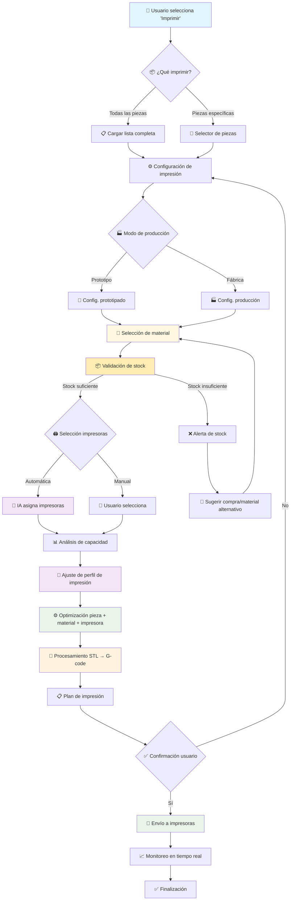
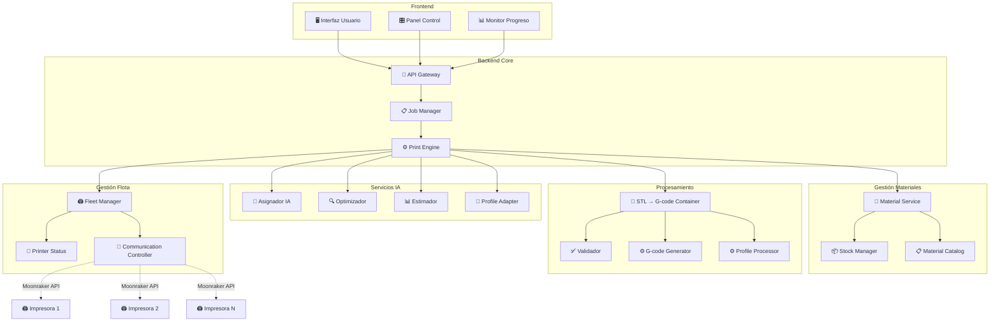
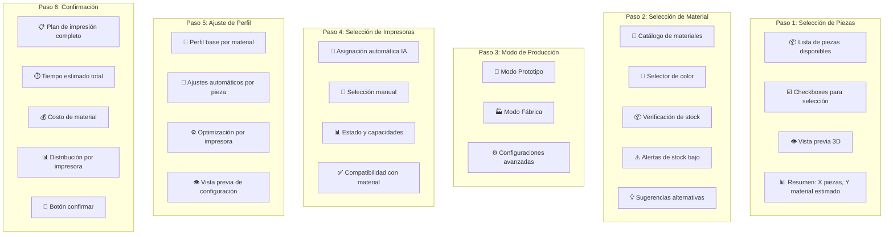
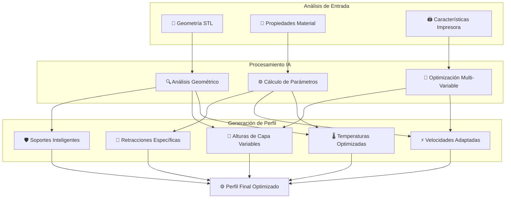
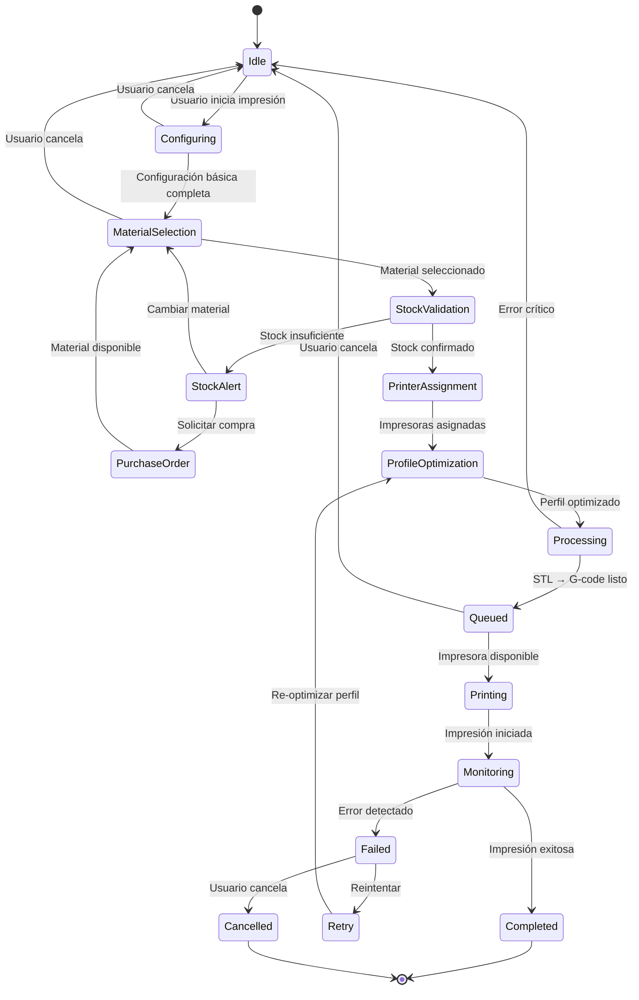

# Sistema de Impresión Autónomo - KyberCore

## 📋 Visión General

El sistema de impresión autónomo de KyberCore permite a los usuarios enviar trabajos de impresión de manera inteligente y completamente automatizada. La funcionalidad está diseñada para adaptarse tanto a necesidades de prototipado individual como a producción en serie, optimizando el uso de la flota de impresoras disponibles.

## 🎯 Objetivos Principales

- **Autonomía completa**: Proceso de impresión sin intervención manual
- **Flexibilidad de selección**: Elegir piezas específicas o proyecto completo
- **Gestión inteligente de impresoras**: Distribución automática o manual
- **Modos de producción**: Prototipado vs. Fabricación en serie
- **Optimización de bandejas**: Aprovechamiento máximo del espacio de impresión
- **Integración con procesamiento**: Uso del contenedor STL → G-code existente

## 🔧 Características Implementadas

### 1. **Selección de Piezas**
- ✅ **Todas las piezas**: Imprimir proyecto completo
- ✅ **Piezas específicas**: Selección manual individual
- ✅ **Vista previa**: Visualización de piezas seleccionadas
- ✅ **Información detallada**: Tiempo estimado, material requerido

### 2. **Gestión de Impresoras**
- ✅ **Selección automática**: IA asigna impresoras óptimas
- ✅ **Selección manual**: Usuario elige impresoras específicas
- ✅ **Estado en tiempo real**: Verificación de disponibilidad
- ✅ **Capacidades por impresora**: Materiales, volumen, características

### 3. **Modos de Producción**

#### 🔬 **Modo Prototipo**
- Una pieza por bandeja de impresión
- Prioridad en velocidad de entrega
- Optimización para iteración rápida
- Menor densidad de impresión

#### 🏭 **Modo Fábrica**
- Múltiples copias de la misma pieza por bandeja
- Optimización de material y tiempo
- Maximización del throughput
- Distribución inteligente en la flota

### 4. **Procesamiento Inteligente**
- ✅ **Gestión de materiales**: Catálogo completo con propiedades
- ✅ **Validación de stock**: Verificación en tiempo real de disponibilidad
- ✅ **Perfiles adaptativos**: Ajuste automático según pieza + material + impresora
- ✅ **Conversión STL → G-code**: Integración con contenedor existente
- ✅ **Optimización de parámetros**: Según modo y material
- ✅ **Validación previa**: Verificación de viabilidad
- ✅ **Estimaciones precisas**: Tiempo, material, costos

### 5. **Sistema de Materiales y Stock**
- ✅ **Catálogo de materiales**: PLA, ABS, PETG, TPU, etc.
- ✅ **Propiedades por material**: Temperatura, velocidad, retracción
- ✅ **Inventario en tiempo real**: Stock disponible por material/color
- ✅ **Alertas de stock bajo**: Notificaciones automáticas
- ✅ **Sugerencias inteligentes**: Materiales alternativos compatibles
- ✅ **Cálculo de consumo**: Estimación precisa por trabajo

## 🔄 Flujo de Trabajo



## 🏗️ Arquitectura Técnica

### **Componentes Principales**



## 🎨 Diseño de Interfaz

### **Modal de Configuración de Impresión**



## 📊 Algoritmos de Optimización

### **Sistema de Perfiles Adaptativos**

El sistema de perfiles adaptativos es el corazón de la inteligencia de impresión, combinando análisis geométrico, propiedades de materiales y características específicas de cada impresora.



#### **Factores de Optimización por Pieza:**
- **Overhangs y puentes**: Ajuste de velocidades y cooling
- **Detalles finos**: Optimización de altura de capa y flujo
- **Paredes delgadas**: Configuración específica de perímetros
- **Superficies críticas**: Calidad vs velocidad adaptativa

#### **Adaptación por Material:**
- **PLA**: Temperaturas conservadoras, alta velocidad
- **ABS**: Control de warping, cama caliente optimizada
- **PETG**: Balance químico-resistencia, retracción mínima
- **TPU**: Velocidades reducidas, presión específica

#### **Calibración por Impresora:**
- **Offset específico**: Compensación por desgaste/calibración
- **Aceleración máxima**: Límites físicos de cada máquina
- **Cooling efficiency**: Capacidad de enfriamiento específica
- **Extrusor characteristics**: Flow rate y temperatura real

### **Asignación Inteligente de Impresoras**

1. **Análisis de Capacidades**
   - Volumen de impresión disponible
   - Materiales compatibles instalados
   - Estado actual (disponible/ocupada)
   - Historial de rendimiento por material

2. **Validación de Materiales**
   - Verificación de material cargado en cada impresora
   - Compatibilidad temperatura de extrusor/cama
   - Disponibilidad de stock suficiente
   - Validación de configuraciones específicas

3. **Optimización de Perfiles**
   - **Análisis geométrico de pieza**: Overhangs, puentes, detalles finos
   - **Adaptación por material**: Temperaturas, velocidades, retracciones
   - **Optimización por impresora**: Calibración específica, offsets
   - **Modo de producción**: Calidad vs velocidad vs economía

4. **Optimización Multi-objetivo**
   - Minimizar tiempo total de producción
   - Maximizar utilización de flota
   - Balancear carga de trabajo
   - Priorizar según urgencia y material disponible

5. **Distribución en Modo Fábrica**
   - Cálculo de piezas por bandeja según material
   - Optimización espacial 2D/3D considerando shrinkage
   - Consideración de tiempo de setup y cambio material
   - Minimización de desperdicio y warping

## 🔄 Estados del Sistema



## 📁 Estructura de Archivos

```
src/
├── controllers/
│   ├── print_controller.py          # Controlador principal de impresión
│   ├── material_controller.py       # Gestión de materiales y stock
│   └── job_controller.py            # Gestión de trabajos
├── services/
│   ├── print_service.py             # Lógica de negocio de impresión
│   ├── material_service.py          # Gestión de materiales
│   ├── stock_service.py             # Validación y gestión de inventario
│   ├── profile_service.py           # Ajuste de perfiles de impresión
│   ├── printer_assignment_service.py # Asignación inteligente
│   ├── gcode_processor_service.py   # Integración con contenedor
│   └── optimization_service.py      # Algoritmos de optimización
├── models/
│   ├── print_job.py                 # Modelo de trabajo de impresión
│   ├── print_config.py              # Configuración de impresión
│   ├── material.py                  # Modelo de material
│   ├── stock_item.py                # Inventario de materiales
│   ├── print_profile.py             # Perfiles de impresión
│   └── print_queue.py               # Cola de impresión
├── web/
│   ├── templates/modules/
│   │   ├── print_modal.html         # Modal de configuración
│   │   └── material_selector.html   # Selector de materiales
│   └── static/js/modules/
│       ├── print_manager.js         # Frontend de impresión
│       └── material_manager.js      # Gestión de materiales
└── utils/
    ├── stl_analyzer.py              # Análisis de archivos STL
    ├── material_calculator.py       # Cálculos de consumo
    ├── profile_optimizer.py         # Optimización de perfiles
    └── print_estimator.py           # Estimaciones de tiempo/costo
```

## 🚀 Plan de Implementación

### **Fase 1: Infraestructura Base** (Semana 1-2)
- [ ] Crear modelos de datos (PrintJob, PrintConfig, Material, StockItem)
- [ ] Implementar controlador base de impresión y materiales
- [ ] Sistema básico de gestión de stock
- [ ] Integrar con contenedor STL → G-code existente
- [ ] Crear interfaz básica de selección

### **Fase 2: Sistema de Materiales y Perfiles** (Semana 3-4)
- [ ] Catálogo completo de materiales con propiedades
- [ ] Sistema de validación de stock en tiempo real
- [ ] Motor de ajuste de perfiles adaptativos
- [ ] Algoritmos de optimización pieza + material + impresora
- [ ] Interfaz de selección de materiales

### **Fase 3: Lógica de Negocio Avanzada** (Semana 5-6)
- [ ] Desarrollar service de asignación inteligente de impresoras
- [ ] Implementar modos Prototipo vs Fábrica con materiales
- [ ] Sistema de alertas y sugerencias de stock
- [ ] Estimaciones precisas de consumo y costos

### **Fase 4: Interfaz Completa y IA** (Semana 7-8)
- [ ] Modal completo de configuración en 6 pasos
- [ ] Vista previa 3D de piezas con material
- [ ] Panel de monitoreo en tiempo real
- [ ] Algoritmos de ML para optimización de perfiles
- [ ] Sistema de recomendaciones inteligentes

## 🔗 Integración con Sistemas Existentes

### **Contenedor STL → G-code**
- **Entrada**: Archivos STL + configuraciones
- **Proceso**: Slicing automático con parámetros optimizados
- **Salida**: G-code listo para impresión
- **Integración**: API REST para procesamiento en lote

### **Fleet Manager**
- **Comunicación**: API Moonraker para cada impresora
- **Monitoreo**: Estado, progreso, temperatura
- **Control**: Inicio, pausa, cancelación de trabajos
- **Sincronización**: Actualización en tiempo real

### **Base de Datos**
- **Historial**: Trabajos completados y estadísticas
- **Configuraciones**: Perfiles de impresión guardados
- **Usuarios**: Preferencias y configuraciones personales
- **Analytics**: Métricas de rendimiento y utilización

---

## 📝 Notas de Implementación

> **Prioridad Alta**: Integración con contenedor existente y funcionalidad básica
> 
> **Consideraciones**: Mantener compatibilidad con arquitectura modular actual
> 
> **Testing**: Implementar pruebas unitarias para cada componente crítico
> 
> **Documentación**: Mantener documentación actualizada durante desarrollo
