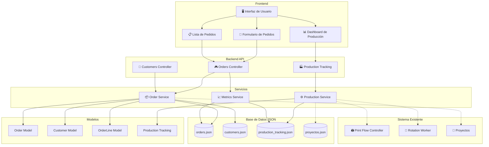
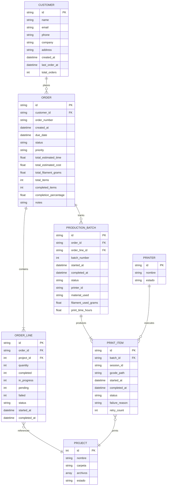
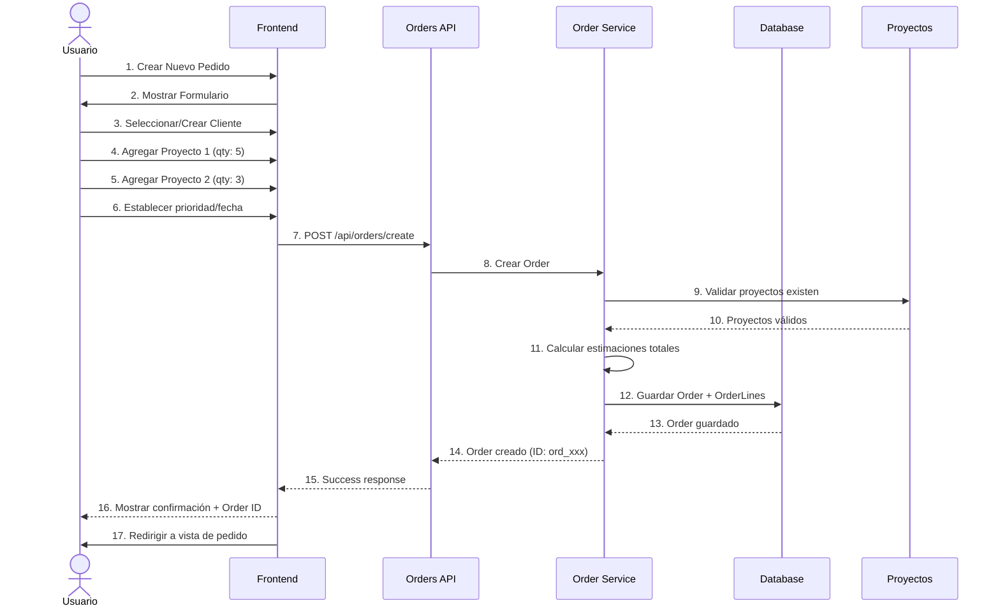
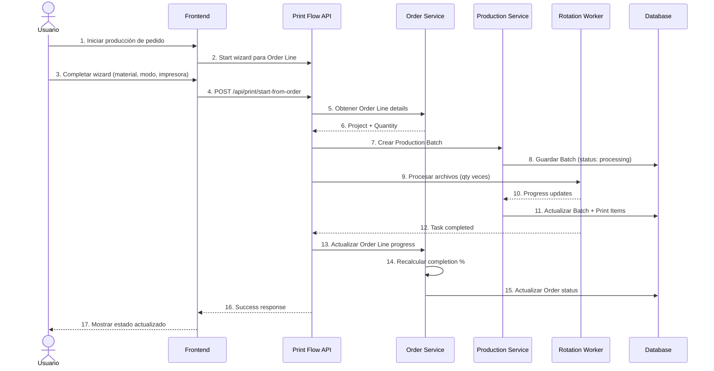
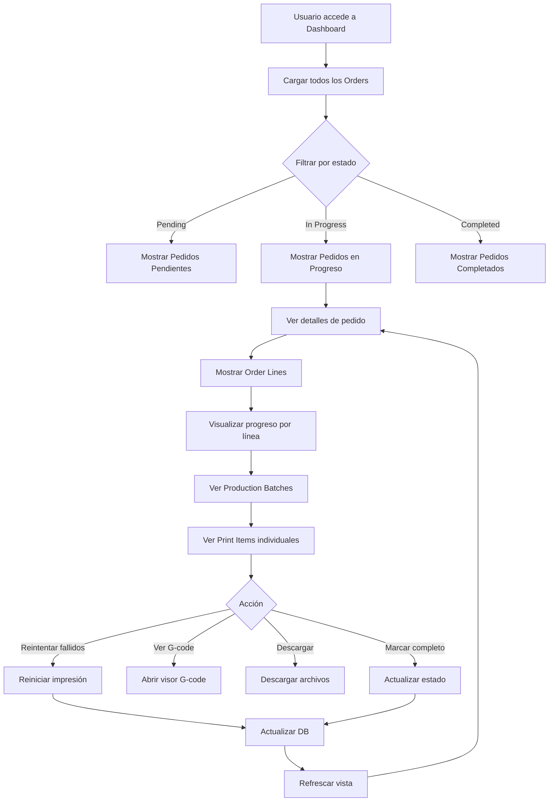
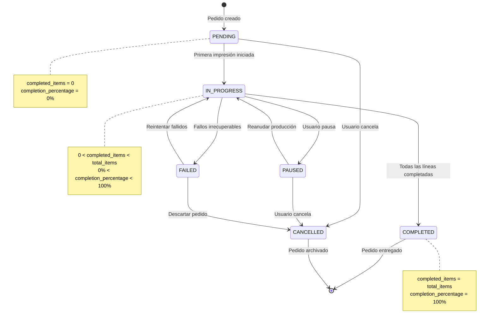
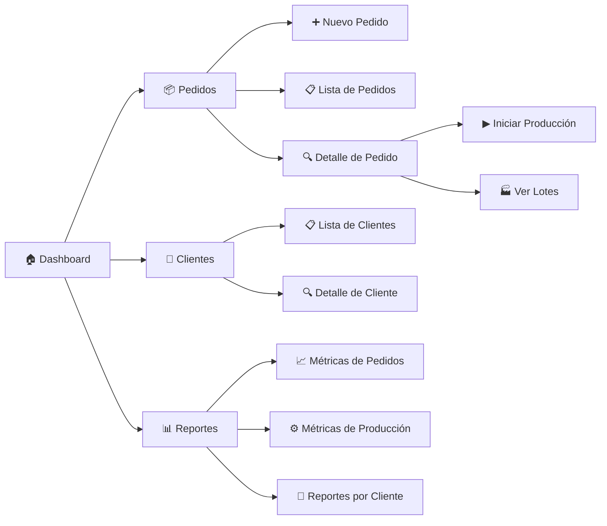
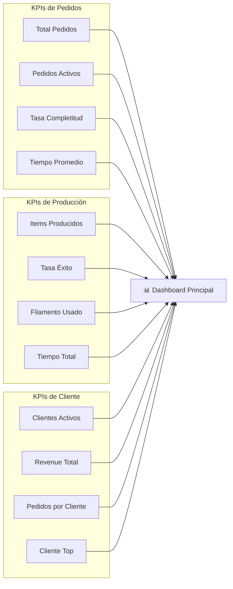

# Sistema de Gestión de Pedidos y Seguimiento de Producción

> **Documento de Especificación Técnica v1.0**  
> **Fecha:** 2025-10-07  
> **Autor:** Sistema KyberCore  
> **Estado:** Propuesta de Diseño

---

## 📋 Tabla de Contenidos

1. [Visión General](#1-visión-general)
2. [Arquitectura del Sistema](#2-arquitectura-del-sistema)
3. [Modelo de Datos](#3-modelo-de-datos)
4. [Flujos de Trabajo](#4-flujos-de-trabajo)
5. [API Endpoints](#5-api-endpoints)
6. [Interfaz de Usuario](#6-interfaz-de-usuario)
7. [Casos de Uso](#7-casos-de-uso)
8. [Implementación](#8-implementación)
9. [Métricas y Reportes](#9-métricas-y-reportes)
10. [Consideraciones Futuras](#10-consideraciones-futuras)

---

## 1. Visión General

### 1.1 Problema a Resolver

Actualmente, KyberCore permite:
- ✅ Importar proyectos 3D desde Thingiverse/Printables
- ✅ Gestionar biblioteca de proyectos
- ✅ Procesar archivos STL/3MF con auto-rotación inteligente
- ✅ Generar G-code optimizado
- ✅ Gestionar flota de impresoras

**Pero falta:**
- ❌ Gestión de clientes y pedidos
- ❌ Seguimiento de producción por lotes
- ❌ Control de cantidades (múltiples copias de un proyecto)
- ❌ Estado de completitud de pedidos
- ❌ Histórico de pedidos completados
- ❌ Métricas de producción

### 1.2 Solución Propuesta

**Sistema de Pedidos y Producción** que permita:
- 📦 Crear pedidos asociados a clientes
- 🔢 Definir cantidades de proyectos por pedido
- 📊 Seguimiento en tiempo real del progreso de producción
- 🎯 Multi-proyecto: un pedido puede incluir varios proyectos
- 📈 Dashboard de métricas y KPIs de producción
- 📜 Histórico completo de pedidos

### 1.3 Beneficios

| Beneficio | Impacto |
|-----------|---------|
| **Organización** | Agrupar trabajos relacionados bajo un pedido |
| **Trazabilidad** | Saber qué se imprimió, cuándo y para quién |
| **Planificación** | Priorizar pedidos urgentes vs. normales |
| **Costos** | Calcular costos reales por pedido (material + tiempo) |
| **Clientes** | Mantener historial de pedidos por cliente |
| **Métricas** | KPIs de producción: tiempo, eficiencia, tasa de éxito |

---

## 2. Arquitectura del Sistema

### 2.1 Diagrama de Componentes



### 2.2 Integración con Sistema Existente

El nuevo sistema se integra con los componentes existentes de KyberCore:

1. **Proyectos**: Los pedidos referencian proyectos existentes
2. **Print Flow**: El flujo de impresión se vincula a líneas de pedido
3. **Rotation Worker**: Se trackea el progreso de procesamiento
4. **Impresoras**: Se asignan trabajos basados en pedidos

**Principio clave:** No reemplazar, sino **extender** la funcionalidad actual.

---

## 3. Modelo de Datos

### 3.1 Diagrama de Entidad-Relación



### 3.2 Entidades Principales

#### 3.2.1 Customer (Cliente)

```python
class Customer(BaseModel):
    id: str  # "cust_<uuid>"
    name: str
    email: Optional[str] = None
    phone: Optional[str] = None
    company: Optional[str] = None
    address: Optional[str] = None
    created_at: datetime
    last_order_at: Optional[datetime] = None
    total_orders: int = 0
    notes: Optional[str] = None
```

**Propósito:** Identificar y mantener información de clientes para trazabilidad.

#### 3.2.2 Order (Pedido)

```python
class OrderStatus(str, Enum):
    PENDING = "pending"          # Creado, sin iniciar
    IN_PROGRESS = "in_progress"  # Al menos una pieza iniciada
    PAUSED = "paused"            # Pausado temporalmente
    COMPLETED = "completed"      # Todas las piezas completadas
    CANCELLED = "cancelled"      # Cancelado
    FAILED = "failed"            # Falló irrecuperablemente

class OrderPriority(str, Enum):
    LOW = "low"
    NORMAL = "normal"
    HIGH = "high"
    URGENT = "urgent"

class Order(BaseModel):
    id: str  # "ord_<timestamp>_<random>"
    order_number: str  # "ORD-2025-001" (human-readable)
    customer_id: str
    
    # Líneas de pedido (proyectos + cantidades)
    order_lines: List[OrderLine]
    
    # Estado
    status: OrderStatus
    priority: OrderPriority
    
    # Fechas
    created_at: datetime
    due_date: Optional[datetime] = None
    started_at: Optional[datetime] = None
    completed_at: Optional[datetime] = None
    
    # Métricas agregadas
    total_estimated_time_hours: float = 0.0
    total_estimated_cost: float = 0.0
    total_filament_grams: float = 0.0
    total_items: int = 0
    completed_items: int = 0
    completion_percentage: float = 0.0
    
    # Otros
    notes: Optional[str] = None
    tags: List[str] = []
```

**Propósito:** Contenedor principal que agrupa múltiples proyectos y cantidades.

#### 3.2.3 OrderLine (Línea de Pedido)

```python
class OrderLineStatus(str, Enum):
    PENDING = "pending"
    IN_PROGRESS = "in_progress"
    COMPLETED = "completed"
    FAILED = "failed"

class OrderLine(BaseModel):
    id: str  # "line_<uuid>"
    order_id: str
    project_id: int  # Referencia a proyectos.json
    project_name: str
    
    # Cantidades
    quantity: int  # Cantidad solicitada
    completed: int = 0
    in_progress: int = 0
    pending: int = 0
    failed: int = 0
    
    # Estado
    status: OrderLineStatus
    
    # Fechas
    started_at: Optional[datetime] = None
    completed_at: Optional[datetime] = None
    
    # Estimaciones (por unidad)
    estimated_time_per_unit_hours: float = 0.0
    estimated_filament_per_unit_grams: float = 0.0
    estimated_cost_per_unit: float = 0.0
```

**Propósito:** Detallar qué proyectos y en qué cantidad forman parte del pedido.

#### 3.2.4 ProductionBatch (Lote de Producción)

```python
class BatchStatus(str, Enum):
    PENDING = "pending"
    PROCESSING = "processing"
    COMPLETED = "completed"
    FAILED = "failed"

class ProductionBatch(BaseModel):
    id: str  # "batch_<uuid>"
    order_id: str
    order_line_id: str
    batch_number: int  # Número secuencial dentro de la línea
    
    # Datos de impresión
    session_id: str  # Referencia a session del wizard
    printer_id: str
    material_type: str
    material_color: str
    
    # Estado
    status: BatchStatus
    started_at: Optional[datetime] = None
    completed_at: Optional[datetime] = None
    
    # Métricas reales
    actual_filament_used_grams: float = 0.0
    actual_print_time_hours: float = 0.0
    
    # Items individuales (archivos G-code generados)
    print_items: List[PrintItem] = []
```

**Propósito:** Trackear cada sesión de impresión asociada a una línea de pedido.

#### 3.2.5 PrintItem (Item de Impresión)

```python
class PrintItemStatus(str, Enum):
    PENDING = "pending"
    PROCESSING = "processing"
    COMPLETED = "completed"
    FAILED = "failed"

class PrintItem(BaseModel):
    id: str  # "item_<uuid>"
    batch_id: str
    filename: str  # Nombre del archivo STL/3MF original
    gcode_path: Optional[str] = None
    
    # Estado
    status: PrintItemStatus
    started_at: Optional[datetime] = None
    completed_at: Optional[datetime] = None
    
    # Error tracking
    failure_reason: Optional[str] = None
    retry_count: int = 0
    
    # Métricas
    processing_time_seconds: float = 0.0
```

**Propósito:** Trackear cada archivo individual procesado en un lote.

### 3.3 Relaciones Clave

```
Customer (1) --> (N) Orders
Order (1) --> (N) OrderLines
OrderLine (N) --> (1) Project
Order (1) --> (N) ProductionBatches
ProductionBatch (1) --> (N) PrintItems
ProductionBatch (N) --> (1) Printer
```

---

## 4. Flujos de Trabajo

### 4.1 Flujo de Creación de Pedido



### 4.2 Flujo de Producción (Impresión)



### 4.3 Flujo de Seguimiento



### 4.4 Estados del Pedido



---

## 5. API Endpoints

### 5.1 Gestión de Clientes

```python
# Listar todos los clientes
GET /api/customers
Response: {
    "success": true,
    "customers": [Customer, ...]
}

# Obtener cliente por ID
GET /api/customers/{customer_id}
Response: {
    "success": true,
    "customer": Customer
}

# Crear cliente
POST /api/customers/create
Body: {
    "name": "Juan Pérez",
    "email": "juan@example.com",
    "phone": "+34 600 123 456",
    "company": "Empresa XYZ"
}
Response: {
    "success": true,
    "customer_id": "cust_abc123"
}

# Actualizar cliente
PUT /api/customers/{customer_id}
Body: Customer partial update
Response: {"success": true}

# Eliminar cliente
DELETE /api/customers/{customer_id}
Response: {"success": true}
```

### 5.2 Gestión de Pedidos

```python
# Listar todos los pedidos
GET /api/orders?status=in_progress&priority=high
Response: {
    "success": true,
    "orders": [Order, ...],
    "total": 15,
    "filtered": 3
}

# Obtener pedido por ID
GET /api/orders/{order_id}
Response: {
    "success": true,
    "order": Order (con order_lines pobladas)
}

# Crear pedido
POST /api/orders/create
Body: {
    "customer_id": "cust_abc123",
    "order_lines": [
        {"project_id": 1, "quantity": 5},
        {"project_id": 3, "quantity": 2}
    ],
    "priority": "high",
    "due_date": "2025-10-15T00:00:00Z",
    "notes": "Cliente necesita urgente"
}
Response: {
    "success": true,
    "order_id": "ord_1728234567_xyz",
    "order_number": "ORD-2025-001"
}

# Actualizar pedido
PUT /api/orders/{order_id}
Body: {
    "priority": "urgent",
    "due_date": "2025-10-10T00:00:00Z"
}
Response: {"success": true}

# Cancelar pedido
POST /api/orders/{order_id}/cancel
Response: {"success": true}

# Obtener progreso de pedido
GET /api/orders/{order_id}/progress
Response: {
    "success": true,
    "order_id": "ord_xxx",
    "completion_percentage": 65.5,
    "completed_items": 5,
    "total_items": 8,
    "order_lines": [
        {
            "line_id": "line_1",
            "project_name": "Starship",
            "quantity": 5,
            "completed": 5,
            "pending": 0
        },
        {
            "line_id": "line_2",
            "project_name": "Drone Frame",
            "quantity": 3,
            "completed": 0,
            "pending": 3
        }
    ]
}
```

### 5.3 Gestión de Producción

```python
# Iniciar producción desde pedido
POST /api/production/start-from-order
Body: {
    "order_id": "ord_xxx",
    "order_line_id": "line_1",
    "printer_id": "ender3_001",
    "material_type": "PLA",
    "material_color": "Negro"
}
Response: {
    "success": true,
    "batch_id": "batch_abc",
    "session_id": "temp_xxx",
    "message": "Producción iniciada"
}

# Obtener batches de un pedido
GET /api/production/batches?order_id=ord_xxx
Response: {
    "success": true,
    "batches": [ProductionBatch, ...]
}

# Actualizar estado de batch
PUT /api/production/batches/{batch_id}/status
Body: {
    "status": "completed",
    "actual_filament_used_grams": 45.2,
    "actual_print_time_hours": 3.5
}
Response: {"success": true}

# Obtener items de un batch
GET /api/production/batches/{batch_id}/items
Response: {
    "success": true,
    "items": [PrintItem, ...]
}
```

### 5.4 Métricas y Reportes

```python
# Dashboard de métricas
GET /api/orders/metrics
Response: {
    "success": true,
    "metrics": {
        "total_orders": 150,
        "active_orders": 8,
        "completed_orders": 142,
        "total_items_produced": 1245,
        "average_completion_time_hours": 24.5,
        "success_rate_percentage": 98.2
    }
}

# Reporte por cliente
GET /api/customers/{customer_id}/report
Response: {
    "success": true,
    "customer": Customer,
    "statistics": {
        "total_orders": 12,
        "total_spent": 543.50,
        "total_items": 85,
        "average_order_size": 7.1
    },
    "recent_orders": [Order, ...]
}

# Reporte por período
GET /api/orders/report?start_date=2025-10-01&end_date=2025-10-31
Response: {
    "success": true,
    "period": {"start": "...", "end": "..."},
    "orders_created": 25,
    "orders_completed": 22,
    "total_production_hours": 456.3,
    "total_filament_used_kg": 12.5,
    "revenue": 2345.60
}
```

---

## 6. Interfaz de Usuario

### 6.1 Vistas Principales

#### 6.1.1 Dashboard de Pedidos

```
┌─────────────────────────────────────────────────────────────┐
│ 📊 Dashboard de Producción                         [+ Nuevo]│
├─────────────────────────────────────────────────────────────┤
│                                                               │
│  🔴 Urgentes (2)   🟡 En Progreso (5)   🟢 Completados (8)  │
│                                                               │
│  ┌───────────────────────────────────────────────────────┐  │
│  │ Pedidos Activos                                       │  │
│  ├───────────────────────────────────────────────────────┤  │
│  │ ORD-2025-015 │ Cliente ABC │ 75% │ ⏰ 2d restantes │  │
│  │ ORD-2025-014 │ Cliente XYZ │ 40% │ ⏰ 5d restantes │  │
│  │ ORD-2025-013 │ Cliente 123 │ 90% │ ⏰ 1d restantes │  │
│  └───────────────────────────────────────────────────────┘  │
│                                                               │
│  📈 Métricas del Mes                                         │
│  ├─ Pedidos completados: 25                                 │
│  ├─ Tiempo promedio: 18.5 horas                             │
│  ├─ Tasa de éxito: 98.5%                                    │
│  └─ Filamento usado: 8.2 kg                                 │
└─────────────────────────────────────────────────────────────┘
```

#### 6.1.2 Vista Detallada de Pedido

```
┌─────────────────────────────────────────────────────────────┐
│ 📦 Pedido ORD-2025-015                          [Editar] [✖]│
├─────────────────────────────────────────────────────────────┤
│ Cliente: Juan Pérez (Empresa ABC)                           │
│ Estado: 🟡 En Progreso (75%)                                 │
│ Prioridad: 🔴 Alta                                           │
│ Fecha límite: 2025-10-10                                     │
├─────────────────────────────────────────────────────────────┤
│ Líneas de Pedido:                                            │
│                                                               │
│  1. Starship Model                          [▶ Imprimir]    │
│     ├─ Cantidad: 5 unidades                                 │
│     ├─ Completado: 4 / 5 (80%)                              │
│     ├─ Tiempo estimado: 15h total                           │
│     └─ [████████░░] 80%                                      │
│                                                               │
│  2. Drone Frame Parts                       [▶ Imprimir]    │
│     ├─ Cantidad: 3 unidades                                 │
│     ├─ Completado: 2 / 3 (67%)                              │
│     ├─ Tiempo estimado: 8h total                            │
│     └─ [██████░░░░] 67%                                      │
├─────────────────────────────────────────────────────────────┤
│ Progreso Global: [███████░░░] 75% (9/12 items)              │
│                                                               │
│ Historial de Producción:                                     │
│  ✅ Batch #1 - 3 items - Completado (2025-10-07 10:30)      │
│  ✅ Batch #2 - 4 items - Completado (2025-10-08 14:15)      │
│  🔄 Batch #3 - 2 items - En progreso (iniciado 16:45)       │
│  ⏸️ Batch #4 - 3 items - Pendiente                          │
└─────────────────────────────────────────────────────────────┘
```

#### 6.1.3 Formulario de Nuevo Pedido

```
┌─────────────────────────────────────────────────────────────┐
│ ➕ Crear Nuevo Pedido                                        │
├─────────────────────────────────────────────────────────────┤
│                                                               │
│ 👤 Cliente:                                                  │
│    [Seleccionar cliente ▼] o [+ Crear nuevo]                │
│                                                               │
│ 📦 Proyectos:                                                │
│    ┌─────────────────────────────────────────────────────┐  │
│    │ Proyecto          │ Cantidad │ Est. Tiempo │ Acción │  │
│    ├─────────────────────────────────────────────────────┤  │
│    │ Starship          │   [5]    │   15h       │  [✖]  │  │
│    │ Drone Frame       │   [3]    │   8h        │  [✖]  │  │
│    └─────────────────────────────────────────────────────┘  │
│    [+ Agregar proyecto]                                      │
│                                                               │
│ ⏰ Fecha de entrega:                                         │
│    [2025-10-15 ▼]                                            │
│                                                               │
│ 🔥 Prioridad:                                                │
│    ○ Baja  ○ Normal  ● Alta  ○ Urgente                      │
│                                                               │
│ 📝 Notas:                                                    │
│    [Cliente necesita para demostración importante...]        │
│                                                               │
│ ┌─────────────────────────────────────────────────────────┐  │
│ │ Resumen:                                                │  │
│ │ Total items: 8                                          │  │
│ │ Tiempo estimado: 23 horas                               │  │
│ │ Filamento estimado: 245 gramos                          │  │
│ │ Costo estimado: €32.50                                  │  │
│ └─────────────────────────────────────────────────────────┘  │
│                                                               │
│                     [Cancelar] [Crear Pedido]                │
└─────────────────────────────────────────────────────────────┘
```

### 6.2 Navegación



---

## 7. Casos de Uso

### 7.1 Caso de Uso 1: Pedido Simple

**Escenario:** Un cliente necesita 5 copias del proyecto "Starship"

**Flujo:**
1. Usuario crea nuevo pedido
2. Selecciona cliente "SpaceX Demo"
3. Agrega proyecto "Starship" con cantidad 5
4. Establece prioridad "Normal" y fecha "2025-10-15"
5. Sistema calcula: 15h tiempo, 250g filamento, €28.50 costo
6. Usuario confirma y crea pedido
7. Sistema genera Order con OrderLine única
8. Usuario accede a detalle de pedido
9. Inicia producción desde la línea del pedido
10. Sistema procesa 5 copias en lote
11. Al completarse, Order se marca como completado

### 7.2 Caso de Uso 2: Pedido Multi-Proyecto

**Escenario:** Cliente necesita un kit completo (múltiples piezas de diferentes proyectos)

**Flujo:**
1. Usuario crea pedido para "Cliente ABC"
2. Agrega:
   - Proyecto "Drone Frame" × 2
   - Proyecto "Propeller Set" × 4
   - Proyecto "Landing Gear" × 2
3. Sistema calcula totales agregados
4. Usuario confirma pedido
5. Sistema crea Order con 3 OrderLines
6. Usuario inicia producción línea por línea
7. Cada línea genera su propio ProductionBatch
8. Sistema trackea progreso global del pedido
9. Dashboard muestra: "Pedido 60% completo (5/8 items)"
10. Al completar todas las líneas, pedido se marca completado

### 7.3 Caso de Uso 3: Gestión de Fallos

**Escenario:** Durante la producción, algunas piezas fallan

**Flujo:**
1. Batch procesando 5 copias de "Starship"
2. 3 completan exitosamente, 2 fallan (cama desnivelada)
3. Sistema marca Print Items como "failed"
4. Order Line muestra: "completed: 3, failed: 2, pending: 0"
5. Usuario ve en dashboard que hay ítems fallidos
6. Usuario accede a batch y ve detalle de fallos
7. Usuario corrige problema de impresora
8. Usuario hace clic en "Reintentar fallidos"
9. Sistema crea nuevo Batch solo con 2 items
10. Al completarse, Order Line actualiza: "completed: 5"
11. Pedido se marca completado

### 7.4 Caso de Uso 4: Priorización Urgente

**Escenario:** Cliente llama urgentemente necesitando pedido ya

**Flujo:**
1. Usuario busca pedido "ORD-2025-012" (prioridad normal)
2. Edita pedido y cambia prioridad a "Urgente"
3. Cambia fecha de entrega a mañana
4. Sistema re-ordena cola de producción
5. Dashboard resalta pedido en rojo
6. Usuario asigna mejor impresora disponible
7. Inicia producción inmediata
8. Sistema notifica cuando se completa cada lote
9. Usuario monitorea progreso en tiempo real
10. Al completar, entrega a cliente

### 7.5 Caso de Uso 5: Análisis de Cliente

**Escenario:** Gerente quiere analizar historial de un cliente VIP

**Flujo:**
1. Usuario accede a sección "Clientes"
2. Busca cliente "SpaceX Demo"
3. Sistema muestra perfil con estadísticas:
   - Total pedidos: 15
   - Total gastado: €1,245.50
   - Promedio por pedido: €83.00
   - Items producidos: 125
4. Usuario ve lista de pedidos históricos
5. Identifica patrones: cliente siempre pide "Starship" en múltiplos de 5
6. Usuario crea plantilla de pedido recurrente
7. Próxima vez, creación de pedido es 1-click

---

## 8. Implementación

### 8.1 Estructura de Archivos

```
KyberCore/
├── src/
│   ├── models/
│   │   ├── order_models.py         # 🆕 Nuevos modelos
│   │   ├── customer_models.py      # 🆕
│   │   └── production_models.py    # 🆕
│   │
│   ├── controllers/
│   │   ├── orders_controller.py    # 🆕 CRUD de pedidos
│   │   ├── customers_controller.py # 🆕 CRUD de clientes
│   │   └── production_controller.py# 🆕 Tracking de producción
│   │
│   ├── services/
│   │   ├── order_service.py        # 🆕 Lógica de negocio
│   │   ├── production_service.py   # 🆕 Tracking service
│   │   └── metrics_service.py      # 🆕 Cálculo de métricas
│   │
│   └── web/
│       ├── templates/
│       │   └── modules/
│       │       ├── orders_dashboard.html  # 🆕
│       │       ├── order_detail.html      # 🆕
│       │       └── order_form.html        # 🆕
│       │
│       └── static/js/modules/
│           └── orders/
│               ├── orders_list.js         # 🆕
│               ├── order_form.js          # 🆕
│               └── production_tracker.js  # 🆕
│
├── base_datos/
│   ├── orders.json                 # 🆕 Base de datos de pedidos
│   ├── customers.json              # 🆕 Base de datos de clientes
│   └── production_tracking.json   # 🆕 Tracking de producción
│
└── docs/
    ├── sistema-pedidos-produccion.md   # 📄 Este documento
    └── diagramas/
        ├── orders-entity-relationship.mmd
        ├── orders-state-flow.mmd
        └── production-sequence.mmd
```

### 8.2 Fases de Implementación

#### Fase 1: Modelos y Base de Datos (2-3 días)
- ✅ Crear modelos Pydantic para todas las entidades
- ✅ Diseñar estructura de archivos JSON
- ✅ Implementar funciones de carga/guardado
- ✅ Crear datos de ejemplo para testing

#### Fase 2: Backend API (3-4 días)
- ✅ Implementar controladores (CRUD completo)
- ✅ Crear endpoints REST
- ✅ Integrar con sistema existente (proyectos, print flow)
- ✅ Testing de endpoints

#### Fase 3: Servicios de Negocio (2-3 días)
- ✅ Implementar OrderService (cálculos, validaciones)
- ✅ Implementar ProductionService (tracking)
- ✅ Implementar MetricsService (agregaciones)
- ✅ Testing de lógica de negocio

#### Fase 4: Frontend - Vistas Principales (4-5 días)
- ✅ Dashboard de pedidos
- ✅ Lista de pedidos con filtros
- ✅ Formulario de creación de pedidos
- ✅ Vista detallada de pedido

#### Fase 5: Frontend - Producción (3-4 días)
- ✅ Integración con wizard de impresión
- ✅ Tracker de progreso en tiempo real
- ✅ Gestión de lotes y reintentos
- ✅ Visualización de métricas

#### Fase 6: Testing y Refinamiento (2-3 días)
- ✅ Testing end-to-end de flujos completos
- ✅ Refinamiento de UX
- ✅ Optimización de rendimiento
- ✅ Documentación de usuario

**Total estimado: 16-22 días de desarrollo**

### 8.3 Dependencias

```python
# requirements.txt (sin cambios, usar dependencias existentes)
fastapi>=0.116.1
pydantic>=2.0.0
python-dateutil>=2.8.2  # Para manejo de fechas
```

### 8.4 Migraciones de Datos

Para proyectos ya existentes:
```python
# Script de migración
def migrate_existing_projects():
    """
    No se requiere migración de proyectos existentes.
    El sistema de pedidos es completamente nuevo y opcional.
    Los proyectos siguen funcionando independientemente.
    """
    pass
```

---

## 9. Métricas y Reportes

### 9.1 KPIs Principales



### 9.2 Reportes Disponibles

1. **Reporte Diario de Producción**
   - Pedidos completados hoy
   - Items producidos
   - Tiempo total de impresión
   - Filamento consumido
   - Fallos y reintentos

2. **Reporte Mensual de Pedidos**
   - Total de pedidos creados
   - Total de pedidos completados
   - Revenue generado
   - Clientes atendidos
   - Tendencias de crecimiento

3. **Reporte por Cliente**
   - Historial completo de pedidos
   - Total gastado
   - Items producidos
   - Frecuencia de pedidos
   - Proyectos más solicitados

4. **Reporte de Eficiencia**
   - Tiempo promedio por item
   - Tasa de éxito de impresión
   - Utilización de impresoras
   - Desperdicio de material
   - Cuellos de botella

---

## 10. Consideraciones Futuras

### 10.1 Integraciones Potenciales

1. **Sistema de Facturación**
   - Generar facturas automáticas desde pedidos
   - Tracking de pagos
   - Estados: pendiente, pagado, vencido

2. **Notificaciones**
   - Email/SMS cuando pedido se completa
   - Alertas de pedidos urgentes
   - Notificaciones de fallos

3. **API Externa**
   - Permitir a clientes crear pedidos vía API
   - Portal de cliente para seguimiento
   - Webhook de estado de pedido

4. **Optimización de Cola**
   - Algoritmo inteligente de priorización
   - Considerar tiempo restante de impresoras ocupadas
   - Balanceo de carga automático

5. **Análisis Predictivo**
   - Predecir tiempo de completitud
   - Identificar proyectos problemáticos
   - Optimización de costos

### 10.2 Escalabilidad

**Para grandes volúmenes (>1000 pedidos):**
- Migrar de JSON a base de datos SQL (PostgreSQL)
- Implementar paginación en todas las listas
- Cache de métricas frecuentes
- Indexación de búsquedas

**Para múltiples talleres:**
- Multi-tenancy (separación por taller)
- Replicación de datos
- Sincronización cloud

### 10.3 Mejoras de UX

- Plantillas de pedidos recurrentes
- Clonación de pedidos
- Vista Kanban de pedidos
- Calendario de entregas
- Timeline visual de producción
- Comparación de estimaciones vs. reales

---

## 📚 Referencias

- [Diagrama de Arquitectura](../infografia/sistema-pedidos-arquitectura.mmd)
- [Modelo de Datos](../infografia/sistema-pedidos-entidades.mmd)
- [Flujos de Estado](../infografia/sistema-pedidos-estados.mmd)
- [API Documentation](./api-orders-reference.md) *(por crear)*

---

## 📝 Changelog

| Versión | Fecha | Cambios |
|---------|-------|---------|
| 1.0 | 2025-10-07 | Especificación inicial completa |

---

**Documento preparado por:** Sistema KyberCore  
**Revisión:** Pendiente  
**Aprobación:** Pendiente
