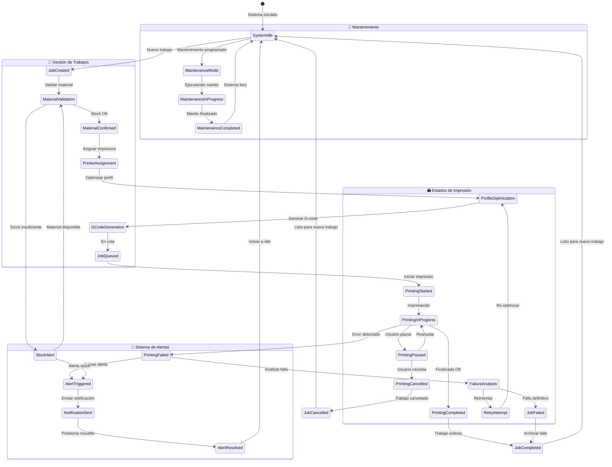
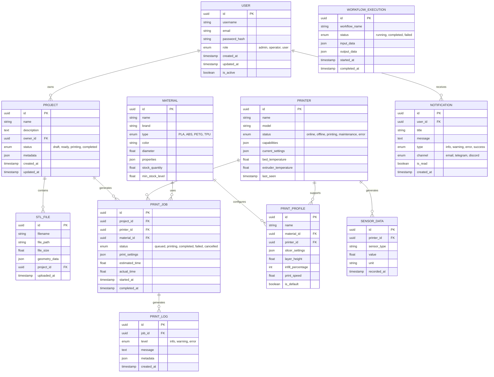
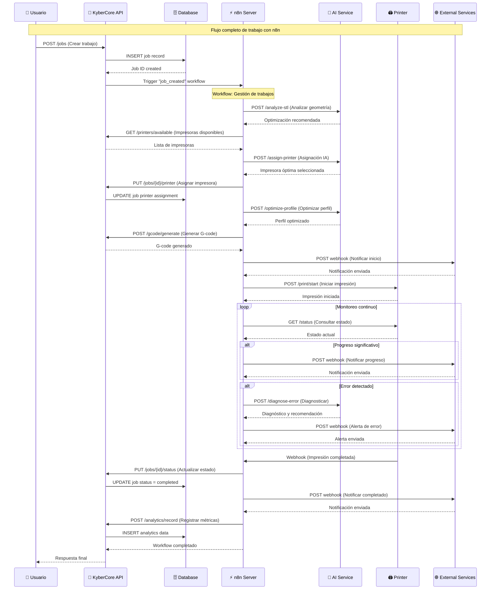

# KyberCore - Arquitectura Completa del Sistema
# Orquestador Local de Impresoras 3D con IA Integrada

## 🏗️ DIAGRAMA PRINCIPAL - ARQUITECTURA GLOBAL DEL SISTEMA

```mermaid
graph TB
    subgraph "🌐 PRESENTATION LAYER"
        WEB[🖥️ Web Interface<br/>React/Vue Frontend]
        MOBILE[📱 Mobile App<br/>Progressive Web App]
        API_DOCS[📚 API Documentation<br/>OpenAPI/Swagger]
    end
    
    subgraph "🚪 API GATEWAY LAYER"
        GATEWAY[🚪 API Gateway<br/>FastAPI/Flask]
        AUTH[🔐 Authentication<br/>JWT + OAuth2]
        RATE_LIMIT[⏱️ Rate Limiting<br/>Redis-based]
        CORS[🔄 CORS Handler<br/>Cross-origin]
    end
    
    subgraph "🧠 BUSINESS LOGIC LAYER"
        subgraph "Core Controllers"
            PRINT_CTRL[🖨️ Print Controller]
            FLEET_CTRL[🚗 Fleet Controller]
            JOB_CTRL[📋 Job Controller]
            MATERIAL_CTRL[🧪 Material Controller]
            USER_CTRL[👤 User Controller]
        end
        
        subgraph "Business Services"
            PRINT_SVC[🖨️ Print Service]
            FLEET_SVC[🚗 Fleet Service]
            JOB_SVC[📋 Job Service]
            AI_SVC[🤖 AI Service]
            MATERIAL_SVC[🧪 Material Service]
            NOTIFICATION_SVC[📱 Notification Service]
        end
    end
    
    subgraph "⚡ ORCHESTRATION LAYER"
        N8N_SERVER[⚡ n8n Server<br/>Workflow Engine]
        
        subgraph "Automated Workflows"
            WF_JOBS[🔄 Job Management<br/>Workflow]
            WF_ALERTS[🚨 Alert System<br/>Workflow]
            WF_BACKUP[💾 Backup & Sync<br/>Workflow]
            WF_ANALYTICS[📊 Analytics<br/>Workflow]
            WF_MAINTENANCE[🔧 Maintenance<br/>Workflow]
        end
    end
    
    subgraph "🤖 AI & PROCESSING LAYER"
        AI_CORE[🧠 AI Core Engine<br/>TensorFlow/PyTorch]
        STL_PROCESSOR[📐 STL Analyzer<br/>Geometry Processing]
        GCODE_GEN[⚙️ G-code Generator<br/>Slicer Integration]
        PROFILE_OPT[🎯 Profile Optimizer<br/>ML-based Tuning]
        FAILURE_DETECT[🔍 Failure Detection<br/>Computer Vision]
        RECOMMENDER[💡 Recommendation Engine<br/>Decision Trees]
    end
    
    subgraph "💾 DATA LAYER"
        POSTGRES[(🐘 PostgreSQL<br/>Primary Database)]
        REDIS[(🔴 Redis<br/>Cache & Sessions)]
        MONGODB[(🍃 MongoDB<br/>Logs & Analytics)]
        FILE_STORAGE[📁 File Storage<br/>STL/G-code Files]
        BACKUP_STORAGE[(💿 Backup Storage<br/>Automated Backups)]
    end
    
    subgraph "🖨️ HARDWARE LAYER"
        subgraph "Printer Fleet"
            PRINTER_1[🖨️ Printer 1<br/>Prusa/Ender]
            PRINTER_2[🖨️ Printer 2<br/>Bambu/Creality]
            PRINTER_N[🖨️ Printer N<br/>Industrial]
        end
        
        subgraph "IoT Sensors"
            CAMERAS[📷 AI Cameras<br/>Quality Control]
            TEMP_SENSORS[🌡️ Temperature<br/>Environment Monitor]
            FILAMENT_SENSORS[📏 Filament Sensors<br/>Material Detection]
        end
    end
    
    subgraph "🔌 EXTERNAL INTEGRATIONS"
        EMAIL[📧 Email Services<br/>SMTP/SendGrid]
        TELEGRAM[💬 Telegram Bot<br/>Instant Notifications]
        DISCORD[💭 Discord Webhooks<br/>Community Alerts]
        ERP[🏢 ERP Systems<br/>SAP/Odoo Integration]
        CLOUD[☁️ Cloud Storage<br/>AWS S3/Google Drive]
        GITHUB[🐙 GitHub<br/>Version Control]
    end
    
    %% Connections - User Flow
    WEB --> GATEWAY
    MOBILE --> GATEWAY
    API_DOCS --> GATEWAY
    
    %% Gateway Processing
    GATEWAY --> AUTH
    GATEWAY --> RATE_LIMIT
    GATEWAY --> CORS
    
    %% Business Logic Flow
    GATEWAY --> PRINT_CTRL
    GATEWAY --> FLEET_CTRL
    GATEWAY --> JOB_CTRL
    GATEWAY --> MATERIAL_CTRL
    GATEWAY --> USER_CTRL
    
    PRINT_CTRL --> PRINT_SVC
    FLEET_CTRL --> FLEET_SVC
    JOB_CTRL --> JOB_SVC
    MATERIAL_CTRL --> MATERIAL_SVC
    USER_CTRL --> NOTIFICATION_SVC
    
    %% AI Integration
    PRINT_SVC --> AI_SVC
    JOB_SVC --> AI_SVC
    AI_SVC --> AI_CORE
    AI_SVC --> STL_PROCESSOR
    AI_SVC --> GCODE_GEN
    AI_SVC --> PROFILE_OPT
    AI_SVC --> FAILURE_DETECT
    AI_SVC --> RECOMMENDER
    
    %% n8n Orchestration
    PRINT_SVC --> N8N_SERVER
    FLEET_SVC --> N8N_SERVER
    JOB_SVC --> N8N_SERVER
    
    N8N_SERVER --> WF_JOBS
    N8N_SERVER --> WF_ALERTS
    N8N_SERVER --> WF_BACKUP
    N8N_SERVER --> WF_ANALYTICS
    N8N_SERVER --> WF_MAINTENANCE
    
    %% Data Layer
    PRINT_SVC --> POSTGRES
    FLEET_SVC --> POSTGRES
    JOB_SVC --> POSTGRES
    MATERIAL_SVC --> POSTGRES
    
    AI_SVC --> REDIS
    NOTIFICATION_SVC --> REDIS
    
    AI_CORE --> MONGODB
    WF_ANALYTICS --> MONGODB
    
    STL_PROCESSOR --> FILE_STORAGE
    GCODE_GEN --> FILE_STORAGE
    
    WF_BACKUP --> BACKUP_STORAGE
    
    %% Hardware Communication
    FLEET_SVC --> PRINTER_1
    FLEET_SVC --> PRINTER_2
    FLEET_SVC --> PRINTER_N
    
    FAILURE_DETECT --> CAMERAS
    AI_CORE --> TEMP_SENSORS
    MATERIAL_SVC --> FILAMENT_SENSORS
    
    %% External Integrations
    WF_ALERTS --> EMAIL
    WF_ALERTS --> TELEGRAM
    WF_ALERTS --> DISCORD
    WF_BACKUP --> ERP
    WF_BACKUP --> CLOUD
    WF_BACKUP --> GITHUB
    
    %% Styling
    classDef presentation fill:#e1f5fe,stroke:#01579b,stroke-width:2px
    classDef api fill:#f3e5f5,stroke:#4a148c,stroke-width:2px
    classDef business fill:#e8f5e8,stroke:#1b5e20,stroke-width:2px
    classDef orchestration fill:#fff3e0,stroke:#e65100,stroke-width:2px
    classDef ai fill:#fce4ec,stroke:#880e4f,stroke-width:2px
    classDef data fill:#f1f8e9,stroke:#33691e,stroke-width:2px
    classDef hardware fill:#e3f2fd,stroke:#0d47a1,stroke-width:2px
    classDef external fill:#fff8e1,stroke:#f57f17,stroke-width:2px
    
    class WEB,MOBILE,API_DOCS presentation
    class GATEWAY,AUTH,RATE_LIMIT,CORS api
    class PRINT_CTRL,FLEET_CTRL,JOB_CTRL,MATERIAL_CTRL,USER_CTRL,PRINT_SVC,FLEET_SVC,JOB_SVC,AI_SVC,MATERIAL_SVC,NOTIFICATION_SVC business
    class N8N_SERVER,WF_JOBS,WF_ALERTS,WF_BACKUP,WF_ANALYTICS,WF_MAINTENANCE orchestration
    class AI_CORE,STL_PROCESSOR,GCODE_GEN,PROFILE_OPT,FAILURE_DETECT,RECOMMENDER ai
    class POSTGRES,REDIS,MONGODB,FILE_STORAGE,BACKUP_STORAGE data
    class PRINTER_1,PRINTER_2,PRINTER_N,CAMERAS,TEMP_SENSORS,FILAMENT_SENSORS hardware
    class EMAIL,TELEGRAM,DISCORD,ERP,CLOUD,GITHUB external
```

## 📋 DIAGRAMA ESPECÍFICO 1 - FLUJO DE TRABAJO DE IMPRESIÓN

```mermaid
flowchart TD
    START([👤 Usuario inicia impresión]) --> SELECT{📦 Seleccionar piezas}
    
    SELECT -->|Todas| ALL_PIECES[📋 Cargar todas las piezas]
    SELECT -->|Específicas| PIECE_SELECTOR[🎯 Selector individual]
    
    ALL_PIECES --> MATERIAL_SELECT[🧪 Selección de material]
    PIECE_SELECTOR --> MATERIAL_SELECT
    
    MATERIAL_SELECT --> STOCK_CHECK{📦 Validar stock}
    STOCK_CHECK -->|Suficiente| PRODUCTION_MODE{🏭 Modo producción}
    STOCK_CHECK -->|Insuficiente| STOCK_ALERT[⚠️ Alerta de stock]
    
    STOCK_ALERT --> ALTERNATIVES[💡 Sugerir alternativas]
    ALTERNATIVES --> PURCHASE[🛒 Generar orden compra]
    PURCHASE --> MATERIAL_SELECT
    
    PRODUCTION_MODE -->|Prototipo| PROTO_CONFIG[🔬 Config. prototipado]
    PRODUCTION_MODE -->|Fábrica| FACTORY_CONFIG[🏭 Config. producción]
    
    PROTO_CONFIG --> PRINTER_ASSIGNMENT{🖨️ Asignación impresoras}
    FACTORY_CONFIG --> PRINTER_ASSIGNMENT
    
    PRINTER_ASSIGNMENT -->|Automática| AI_ASSIGN[🤖 IA asigna óptima]
    PRINTER_ASSIGNMENT -->|Manual| USER_SELECT[👤 Usuario selecciona]
    
    AI_ASSIGN --> CAPACITY_ANALYSIS[📊 Análisis capacidad]
    USER_SELECT --> CAPACITY_ANALYSIS
    
    CAPACITY_ANALYSIS --> PROFILE_ADAPT[🎯 Adaptación de perfil]
    PROFILE_ADAPT --> GEOMETRY_ANALYSIS[📐 Análisis geométrico]
    GEOMETRY_ANALYSIS --> MATERIAL_OPT[🧪 Optimización material]
    MATERIAL_OPT --> PRINTER_CALIBRATION[🖨️ Calibración específica]
    
    PRINTER_CALIBRATION --> STL_PROCESSING[🔄 Procesamiento STL]
    STL_PROCESSING --> GCODE_GENERATION[⚙️ Generación G-code]
    GCODE_GENERATION --> VALIDATION[✅ Validación final]
    
    VALIDATION -->|Válido| PRINT_PLAN[📋 Plan de impresión]
    VALIDATION -->|Inválido| ERROR_HANDLE[❌ Manejo errores]
    
    ERROR_HANDLE --> PROFILE_ADAPT
    
    PRINT_PLAN --> USER_CONFIRM{👤 Confirmación usuario}
    USER_CONFIRM -->|Aprueba| QUEUE_JOB[📋 Encolar trabajo]
    USER_CONFIRM -->|Rechaza| MATERIAL_SELECT
    
    QUEUE_JOB --> SEND_TO_PRINTER[🚀 Enviar a impresora]
    SEND_TO_PRINTER --> MONITOR[👁️ Monitoreo tiempo real]
    
    MONITOR --> STATUS_CHECK{📊 Estado impresión}
    STATUS_CHECK -->|En progreso| PROGRESS_UPDATE[📈 Actualizar progreso]
    STATUS_CHECK -->|Completada| SUCCESS[✅ Trabajo completado]
    STATUS_CHECK -->|Error| FAILURE_ANALYSIS[🔍 Análisis de fallo]
    
    PROGRESS_UPDATE --> NOTIFY_PROGRESS[📱 Notificar progreso]
    NOTIFY_PROGRESS --> MONITOR
    
    SUCCESS --> NOTIFY_SUCCESS[🎉 Notificar éxito]
    NOTIFY_SUCCESS --> ARCHIVE[📁 Archivar trabajo]
    
    FAILURE_ANALYSIS --> AI_DIAGNOSIS[🤖 Diagnóstico IA]
    AI_DIAGNOSIS --> RETRY_DECISION{🔄 ¿Reintentar?}
    RETRY_DECISION -->|Sí| PROFILE_ADAPT
    RETRY_DECISION -->|No| NOTIFY_FAILURE[📧 Notificar fallo]
    
    NOTIFY_FAILURE --> ARCHIVE
    ARCHIVE --> END([🏁 Fin del proceso])
    
    %% Styling
    classDef startEnd fill:#e8f5e8,stroke:#2e7d32,stroke-width:3px
    classDef process fill:#e3f2fd,stroke:#1565c0,stroke-width:2px
    classDef decision fill:#fff3e0,stroke:#ef6c00,stroke-width:2px
    classDef ai fill:#fce4ec,stroke:#ad1457,stroke-width:2px
    classDef error fill:#ffebee,stroke:#c62828,stroke-width:2px
    classDef success fill:#e8f5e8,stroke:#388e3c,stroke-width:2px
    
    class START,END startEnd
    class ALL_PIECES,PIECE_SELECTOR,MATERIAL_SELECT,PROTO_CONFIG,FACTORY_CONFIG,CAPACITY_ANALYSIS,STL_PROCESSING,GCODE_GENERATION,SEND_TO_PRINTER,MONITOR,ARCHIVE process
    class SELECT,STOCK_CHECK,PRODUCTION_MODE,PRINTER_ASSIGNMENT,VALIDATION,USER_CONFIRM,STATUS_CHECK,RETRY_DECISION decision
    class AI_ASSIGN,PROFILE_ADAPT,GEOMETRY_ANALYSIS,MATERIAL_OPT,PRINTER_CALIBRATION,AI_DIAGNOSIS ai
    class STOCK_ALERT,ERROR_HANDLE,FAILURE_ANALYSIS,NOTIFY_FAILURE error
    class SUCCESS,NOTIFY_SUCCESS success
```

## 🔄 DIAGRAMA ESPECÍFICO 2 - ESTADOS DEL SISTEMA (STATE DIAGRAM)

## 🏢 DIAGRAMA ESPECÍFICO 3 - ARQUITECTURA DE DATOS (ERD)

## 🔌 DIAGRAMA ESPECÍFICO 4 - INTEGRACIÓN CON n8n (SEQUENCE)

## 📊 DIAGRAMA ESPECÍFICO 5 - VISTA DE DESPLIEGUE (DEPLOYMENT)

```mermaid
graph TB
    subgraph "🖥️ DESARROLLO"
        DEV_MACHINE[💻 Máquina Desarrollador]
        DEV_DOCKER[🐳 Docker Local]
        DEV_DB[📊 DB Local]
    end
    
    subgraph "☁️ STAGING/TESTING"
        STAGING_SERVER[🔧 Servidor Staging]
        STAGING_COMPOSE[🐳 Docker Compose]
        STAGING_DB[📊 PostgreSQL]
        STAGING_REDIS[🔴 Redis]
    end
    
    subgraph "🏭 PRODUCCIÓN"
        subgraph "Load Balancer"
            LB[⚖️ Nginx/HAProxy]
        end
        
        subgraph "Application Tier"
            APP1[📦 KyberCore App 1]
            APP2[📦 KyberCore App 2]
            N8N_PROD[⚡ n8n Production]
        end
        
        subgraph "Data Tier"
            PG_MASTER[(🐘 PostgreSQL Master)]
            PG_REPLICA[(🐘 PostgreSQL Replica)]
            REDIS_CLUSTER[(🔴 Redis Cluster)]
            MONGO_CLUSTER[(🍃 MongoDB Cluster)]
        end
        
        subgraph "Storage Tier"
            NFS[📁 NFS Storage]
            S3[☁️ S3 Compatible]
            BACKUP[💿 Backup Storage]
        end
        
        subgraph "Monitoring"
            PROMETHEUS[📊 Prometheus]
            GRAFANA[📈 Grafana]
            ALERTMANAGER[🚨 AlertManager]
        end
    end
    
    subgraph "🖨️ HARDWARE FÍSICO"
        subgraph "Printer Network"
            SWITCH[🔌 Network Switch]
            PRINTER_FARM[🖨️ Farm de Impresoras]
        end
        
        subgraph "IoT Sensors"
            IOT_HUB[📡 IoT Hub]
            SENSORS[📊 Sensores]
            CAMERAS[📷 Cámaras IA]
        end
    end
    
    subgraph "🌐 SERVICIOS EXTERNOS"
        EMAIL_SVC[📧 Email Service]
        TELEGRAM_API[💬 Telegram API]
        CLOUD_STORAGE[☁️ Cloud Storage]
        ERP_SYSTEM[🏢 Sistema ERP]
    end
    
    %% Development Flow
    DEV_MACHINE --> STAGING_SERVER
    STAGING_SERVER --> LB
    
    %% Production Architecture
    LB --> APP1
    LB --> APP2
    APP1 --> PG_MASTER
    APP2 --> PG_MASTER
    APP1 --> REDIS_CLUSTER
    APP2 --> REDIS_CLUSTER
    
    N8N_PROD --> PG_MASTER
    N8N_PROD --> REDIS_CLUSTER
    N8N_PROD --> MONGO_CLUSTER
    
    %% Data Replication
    PG_MASTER --> PG_REPLICA
    
    %% Storage
    APP1 --> NFS
    APP2 --> NFS
    NFS --> S3
    PG_MASTER --> BACKUP
    
    %% Monitoring
    APP1 --> PROMETHEUS
    APP2 --> PROMETHEUS
    N8N_PROD --> PROMETHEUS
    PROMETHEUS --> GRAFANA
    PROMETHEUS --> ALERTMANAGER
    
    %% Hardware Integration
    APP1 --> SWITCH
    APP2 --> SWITCH
    SWITCH --> PRINTER_FARM
    APP1 --> IOT_HUB
    IOT_HUB --> SENSORS
    IOT_HUB --> CAMERAS
    
    %% External Integrations
    N8N_PROD --> EMAIL_SVC
    N8N_PROD --> TELEGRAM_API
    N8N_PROD --> CLOUD_STORAGE
    N8N_PROD --> ERP_SYSTEM
    
    %% Styling
    classDef dev fill:#e8f5e8,stroke:#2e7d32
    classDef staging fill:#fff3e0,stroke:#ef6c00
    classDef prod fill:#e3f2fd,stroke:#1565c0
    classDef data fill:#f1f8e9,stroke:#33691e
    classDef hardware fill:#fce4ec,stroke:#ad1457
    classDef external fill:#fff8e1,stroke:#f57f17
    
    class DEV_MACHINE,DEV_DOCKER,DEV_DB dev
    class STAGING_SERVER,STAGING_COMPOSE,STAGING_DB,STAGING_REDIS staging
    class LB,APP1,APP2,N8N_PROD,PROMETHEUS,GRAFANA,ALERTMANAGER prod
    class PG_MASTER,PG_REPLICA,REDIS_CLUSTER,MONGO_CLUSTER,NFS,S3,BACKUP data
    class SWITCH,PRINTER_FARM,IOT_HUB,SENSORS,CAMERAS hardware
    class EMAIL_SVC,TELEGRAM_API,CLOUD_STORAGE,ERP_SYSTEM external
```

## 🔐 DIAGRAMA ESPECÍFICO 6 - SEGURIDAD Y AUTENTICACIÓN

```mermaid
graph TB
    subgraph "🌐 Cliente/Frontend"
        BROWSER[🌐 Navegador Web]
        MOBILE_APP[📱 App Móvil]
        API_CLIENT[🔌 Cliente API]
    end
    
    subgraph "🚪 API Gateway & Security"
        GATEWAY[🚪 API Gateway]
        
        subgraph "Authentication Layer"
            JWT_AUTH[🎫 JWT Validator]
            OAUTH2[🔐 OAuth2 Provider]
            SESSION_MGR[📝 Session Manager]
        end
        
        subgraph "Authorization Layer"
            RBAC[👥 Role-Based Access Control]
            PERMISSION_CHECK[✅ Permission Checker]
            RESOURCE_GUARD[🛡️ Resource Guard]
        end
        
        subgraph "Security Middleware"
            RATE_LIMITER[⏱️ Rate Limiter]
            CORS_HANDLER[🔄 CORS Handler]
            INPUT_VALIDATOR[🔍 Input Validator]
            CSRF_PROTECTION[🛡️ CSRF Protection]
        end
    end
    
    subgraph "🏢 Identity Management"
        USER_STORE[(👤 User Database)]
        ROLE_STORE[(👥 Roles & Permissions)]
        SESSION_STORE[(📝 Session Storage)]
        TOKEN_BLACKLIST[(🚫 Token Blacklist)]
    end
    
    subgraph "🔒 Secrets Management"
        SECRET_VAULT[🔐 Secrets Vault]
        API_KEYS[🗝️ API Keys Store]
        CERT_STORE[📜 Certificate Store]
        ENCRYPTION_KEYS[🔑 Encryption Keys]
    end
    
    subgraph "📊 Audit & Monitoring"
        AUDIT_LOG[(📋 Audit Logs)]
        SECURITY_MONITOR[👁️ Security Monitor]
        THREAT_DETECTOR[🚨 Threat Detector]
        COMPLIANCE_CHECKER[✅ Compliance Checker]
    end
    
    subgraph "🤖 AI Security"
        ANOMALY_DETECTOR[🔍 Anomaly Detection]
        BEHAVIOR_ANALYZER[📊 Behavior Analysis]
        FRAUD_DETECTOR[🚫 Fraud Detection]
    end
    
    %% Client Authentication Flow
    BROWSER --> GATEWAY
    MOBILE_APP --> GATEWAY
    API_CLIENT --> GATEWAY
    
    %% Authentication Process
    GATEWAY --> JWT_AUTH
    GATEWAY --> OAUTH2
    JWT_AUTH --> SESSION_MGR
    OAUTH2 --> SESSION_MGR
    
    %% Authorization Process
    SESSION_MGR --> RBAC
    RBAC --> PERMISSION_CHECK
    PERMISSION_CHECK --> RESOURCE_GUARD
    
    %% Security Middleware
    GATEWAY --> RATE_LIMITER
    GATEWAY --> CORS_HANDLER
    GATEWAY --> INPUT_VALIDATOR
    GATEWAY --> CSRF_PROTECTION
    
    %% Data Storage
    SESSION_MGR --> USER_STORE
    RBAC --> ROLE_STORE
    SESSION_MGR --> SESSION_STORE
    JWT_AUTH --> TOKEN_BLACKLIST
    
    %% Secrets Management
    OAUTH2 --> SECRET_VAULT
    JWT_AUTH --> API_KEYS
    GATEWAY --> CERT_STORE
    SESSION_MGR --> ENCRYPTION_KEYS
    
    %% Monitoring & Audit
    GATEWAY --> AUDIT_LOG
    GATEWAY --> SECURITY_MONITOR
    SECURITY_MONITOR --> THREAT_DETECTOR
    THREAT_DETECTOR --> COMPLIANCE_CHECKER
    
    %% AI Security Integration
    SECURITY_MONITOR --> ANOMALY_DETECTOR
    SECURITY_MONITOR --> BEHAVIOR_ANALYZER
    THREAT_DETECTOR --> FRAUD_DETECTOR
    
    %% Alert Flow
    ANOMALY_DETECTOR --> SECURITY_MONITOR
    BEHAVIOR_ANALYZER --> SECURITY_MONITOR
    FRAUD_DETECTOR --> THREAT_DETECTOR
```

## 📈 DIAGRAMA ESPECÍFICO 7 - MÉTRICAS Y ANALYTICS (DASHBOARD VIEW)

```mermaid
graph TB
    subgraph "📊 DATA SOURCES"
        APP_METRICS[📱 Application Metrics]
        PRINTER_DATA[🖨️ Printer Telemetry]
        JOB_STATS[📋 Job Statistics]
        USER_ACTIVITY[👤 User Activity]
        SYSTEM_LOGS[📝 System Logs]
        IoT_SENSORS[📡 IoT Sensor Data]
    end
    
    subgraph "🔄 DATA PROCESSING"
        DATA_COLLECTOR[📥 Data Collector]
        ETL_PIPELINE[🔄 ETL Pipeline]
        AGGREGATOR[📊 Data Aggregator]
        ML_PROCESSOR[🤖 ML Data Processor]
    end
    
    subgraph "💾 ANALYTICS STORAGE"
        TIME_SERIES[(📈 Time Series DB)]
        DATA_WAREHOUSE[(🏬 Data Warehouse)]
        CACHE_LAYER[(🔴 Analytics Cache)]
    end
    
    subgraph "📊 ANALYTICS ENGINES"
        REAL_TIME[⚡ Real-time Analytics]
        BATCH_PROCESSING[📦 Batch Processing]
        ML_INSIGHTS[🧠 ML Insights Engine]
        PREDICTIVE[🔮 Predictive Analytics]
    end
    
    subgraph "📈 VISUALIZATION LAYER"
        subgraph "Operational Dashboards"
            FLEET_DASHBOARD[🖨️ Fleet Status Dashboard]
            JOB_DASHBOARD[📋 Job Management Dashboard]
            PERFORMANCE_DASHBOARD[⚡ Performance Dashboard]
        end
        
        subgraph "Strategic Dashboards"
            EXECUTIVE_DASHBOARD[🏢 Executive Dashboard]
            FINANCIAL_DASHBOARD[💰 Financial Dashboard]
            QUALITY_DASHBOARD[✅ Quality Dashboard]
        end
        
        subgraph "Technical Dashboards"
            SYSTEM_DASHBOARD[🖥️ System Health Dashboard]
            SECURITY_DASHBOARD[🔒 Security Dashboard]
            AI_DASHBOARD[🤖 AI Performance Dashboard]
        end
    end
    
    subgraph "🚨 ALERTING & NOTIFICATIONS"
        ALERT_ENGINE[🚨 Alert Engine]
        NOTIFICATION_ROUTER[📤 Notification Router]
        ESCALATION_MGR[⬆️ Escalation Manager]
    end
    
    subgraph "📱 OUTPUT CHANNELS"
        WEB_DASHBOARD[🌐 Web Dashboard]
        MOBILE_APP[📱 Mobile Reports]
        EMAIL_REPORTS[📧 Email Reports]
        API_ENDPOINTS[🔌 API Endpoints]
        SLACK_INTEGRATION[💬 Slack Integration]
    end
    
    %% Data Flow
    APP_METRICS --> DATA_COLLECTOR
    PRINTER_DATA --> DATA_COLLECTOR
    JOB_STATS --> DATA_COLLECTOR
    USER_ACTIVITY --> DATA_COLLECTOR
    SYSTEM_LOGS --> DATA_COLLECTOR
    IoT_SENSORS --> DATA_COLLECTOR
    
    DATA_COLLECTOR --> ETL_PIPELINE
    ETL_PIPELINE --> AGGREGATOR
    AGGREGATOR --> ML_PROCESSOR
    
    %% Storage
    ML_PROCESSOR --> TIME_SERIES
    AGGREGATOR --> DATA_WAREHOUSE
    REAL_TIME --> CACHE_LAYER
    
    %% Analytics Processing
    TIME_SERIES --> REAL_TIME
    DATA_WAREHOUSE --> BATCH_PROCESSING
    TIME_SERIES --> ML_INSIGHTS
    ML_INSIGHTS --> PREDICTIVE
    
    %% Dashboard Generation
    REAL_TIME --> FLEET_DASHBOARD
    REAL_TIME --> JOB_DASHBOARD
    REAL_TIME --> PERFORMANCE_DASHBOARD
    
    BATCH_PROCESSING --> EXECUTIVE_DASHBOARD
    BATCH_PROCESSING --> FINANCIAL_DASHBOARD
    PREDICTIVE --> QUALITY_DASHBOARD
    
    REAL_TIME --> SYSTEM_DASHBOARD
    ML_INSIGHTS --> SECURITY_DASHBOARD
    ML_INSIGHTS --> AI_DASHBOARD
    
    %% Alerting
    REAL_TIME --> ALERT_ENGINE
    PREDICTIVE --> ALERT_ENGINE
    ALERT_ENGINE --> NOTIFICATION_ROUTER
    NOTIFICATION_ROUTER --> ESCALATION_MGR
    
    %% Output
    FLEET_DASHBOARD --> WEB_DASHBOARD
    EXECUTIVE_DASHBOARD --> MOBILE_APP
    BATCH_PROCESSING --> EMAIL_REPORTS
    REAL_TIME --> API_ENDPOINTS
    NOTIFICATION_ROUTER --> SLACK_INTEGRATION
    
    %% Styling for better visualization
    classDef dataSource fill:#e8f5e8,stroke:#2e7d32
    classDef processing fill:#e3f2fd,stroke:#1565c0
    classDef storage fill:#fff3e0,stroke:#ef6c00
    classDef analytics fill:#f3e5f5,stroke:#7b1fa2
    classDef dashboard fill:#fce4ec,stroke:#c2185b
    classDef alerting fill:#ffebee,stroke:#d32f2f
    classDef output fill:#e0f2f1,stroke:#00695c
    
    class APP_METRICS,PRINTER_DATA,JOB_STATS,USER_ACTIVITY,SYSTEM_LOGS,IoT_SENSORS dataSource
    class DATA_COLLECTOR,ETL_PIPELINE,AGGREGATOR,ML_PROCESSOR processing
    class TIME_SERIES,DATA_WAREHOUSE,CACHE_LAYER storage
    class REAL_TIME,BATCH_PROCESSING,ML_INSIGHTS,PREDICTIVE analytics
    class FLEET_DASHBOARD,JOB_DASHBOARD,PERFORMANCE_DASHBOARD,EXECUTIVE_DASHBOARD,FINANCIAL_DASHBOARD,QUALITY_DASHBOARD,SYSTEM_DASHBOARD,SECURITY_DASHBOARD,AI_DASHBOARD dashboard
    class ALERT_ENGINE,NOTIFICATION_ROUTER,ESCALATION_MGR alerting
    class WEB_DASHBOARD,MOBILE_APP,EMAIL_REPORTS,API_ENDPOINTS,SLACK_INTEGRATION output
```

