# Propuesta de Integración n8n con KyberCore

## 📋 Visión General

La integración de n8n en KyberCore transformará el sistema en una plataforma de orquestación inteligente, permitiendo automatización avanzada, integración con servicios externos y flujos de trabajo personalizables para la gestión de impresión 3D industrial.

## 🎯 Objetivos Estratégicos

- **Automatización Completa**: Orquestación de procesos complejos sin intervención manual
- **Integración Universal**: Conectividad con APIs externas, servicios de notificación y sistemas ERP
- **Extensibilidad**: Permitir a usuarios crear flujos personalizados
- **Monitorización Avanzada**: Tracking completo de procesos y eventos
- **Escalabilidad**: Preparar el sistema para crecer y adaptarse a nuevas necesidades

---

## 🏗️ Arquitectura de Integración

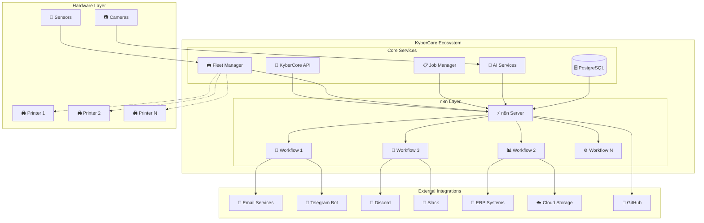

---

## 🔄 Diagramas de Flujo de Procesos

### **Flujo 1: Gestión Automática de Trabajos de Impresión**

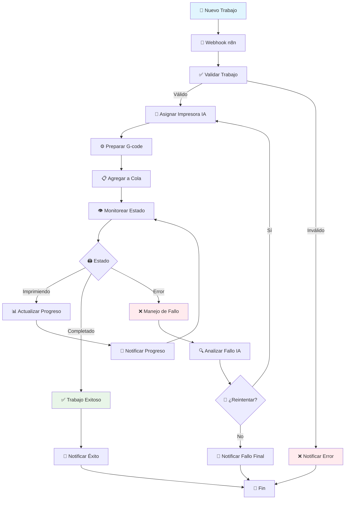

### **Flujo 2: Sistema de Alertas y Monitorización**

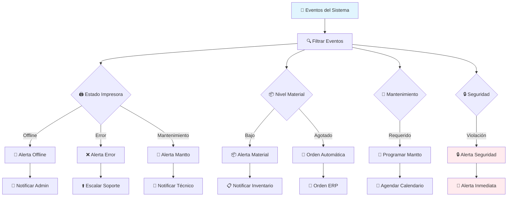

### **Flujo 3: Integración con Sistemas Externos**

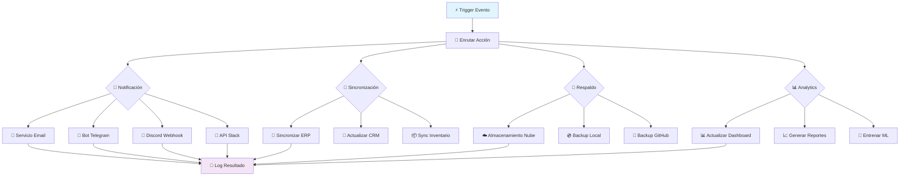

---

## 👥 Diagramas de Casos de Uso

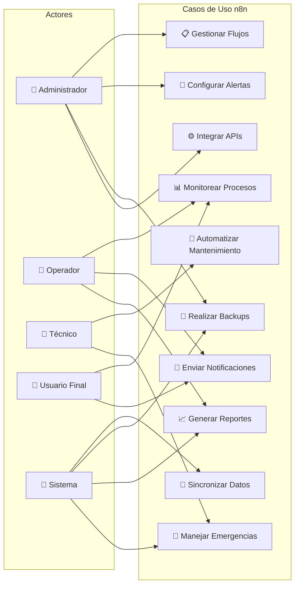

---

## 🔗 Diagramas UML

### **Diagrama de Clases - Integración n8n**

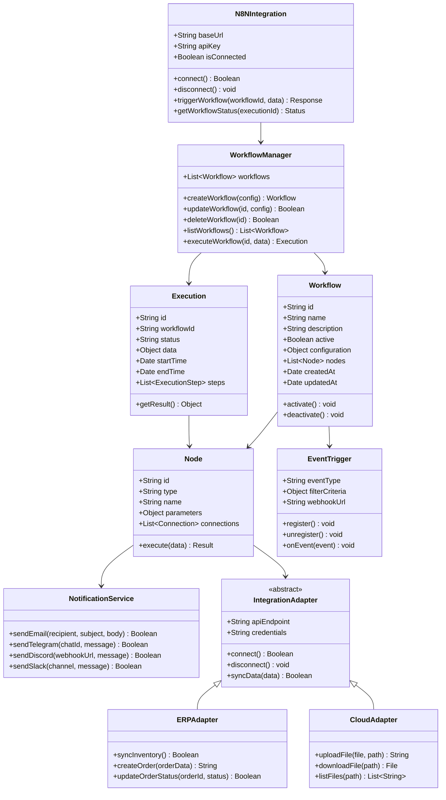

### **Diagrama de Secuencia - Procesamiento de Trabajo**

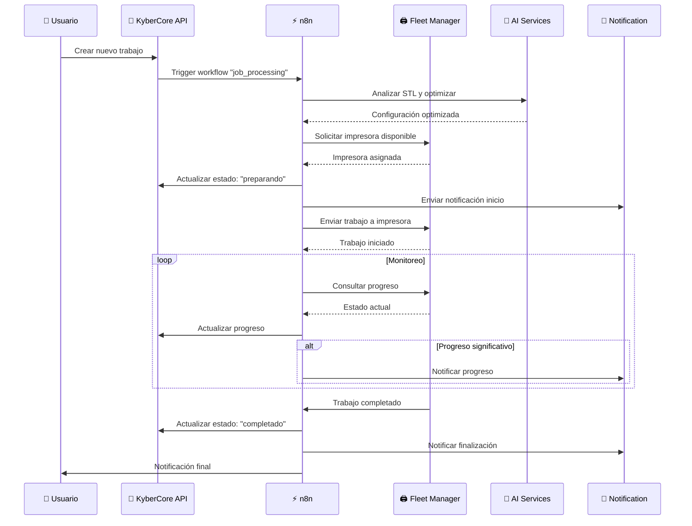

---

## 📊 Diagramas de Interacción

### **Interacción entre Componentes**

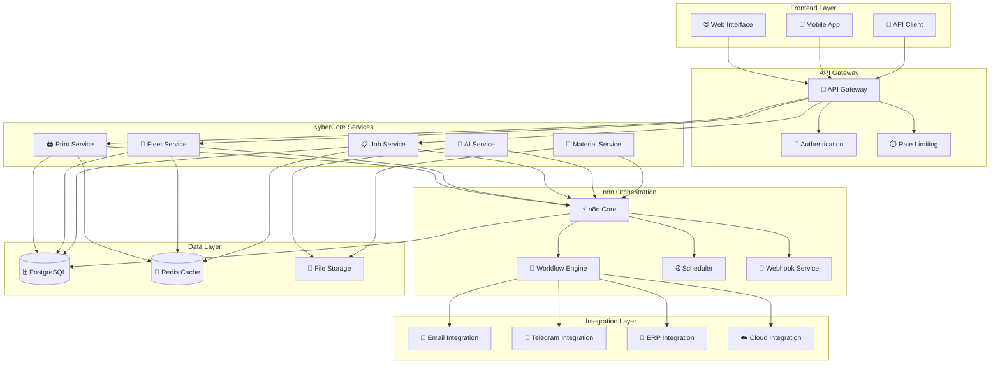

---

## 🚀 Plan de Implementación

### **Fase 1: Infraestructura Base (Semanas 1-2)**

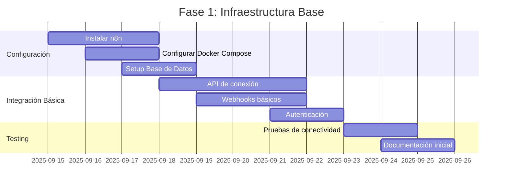

### **Fase 2: Workflows Fundamentales (Semanas 3-4)**

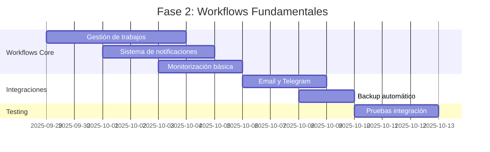

### **Fase 3: Automatización Avanzada (Semanas 5-6)**

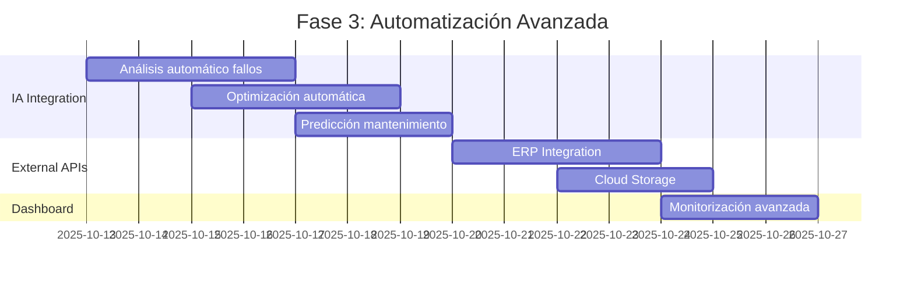

### **Fase 4: Personalización y Escalabilidad (Semanas 7-8)**

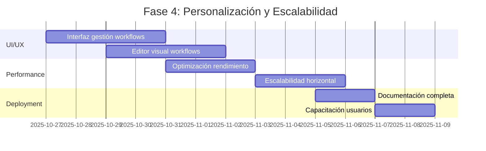

---

## 🔧 Configuración Docker Compose

```yaml
version: '3.8'

services:
  kybercore:
    build: .
    ports:
      - "8000:8000"
    depends_on:
      - postgres
      - redis
      - n8n
    environment:
      - N8N_WEBHOOK_URL=http://n8n:5678/webhook
    networks:
      - kybercore-network

  n8n:
    image: n8nio/n8n:latest
    ports:
      - "5678:5678"
    environment:
      - DB_TYPE=postgresdb
      - DB_POSTGRESDB_HOST=postgres
      - DB_POSTGRESDB_DATABASE=n8n
      - DB_POSTGRESDB_USER=n8n_user
      - DB_POSTGRESDB_PASSWORD=n8n_password
      - N8N_BASIC_AUTH_ACTIVE=true
      - N8N_BASIC_AUTH_USER=admin
      - N8N_BASIC_AUTH_PASSWORD=kybercore_n8n
      - WEBHOOK_URL=http://localhost:5678/
      - GENERIC_TIMEZONE=UTC
    volumes:
      - n8n_data:/home/node/.n8n
      - ./n8n/workflows:/home/node/.n8n/workflows
      - ./n8n/credentials:/home/node/.n8n/credentials
    depends_on:
      - postgres
    networks:
      - kybercore-network

  postgres:
    image: postgres:14
    environment:
      - POSTGRES_DB=kybercore
      - POSTGRES_USER=kybercore_user
      - POSTGRES_PASSWORD=kybercore_password
      - POSTGRES_MULTIPLE_DATABASES=n8n:n8n_user:n8n_password
    volumes:
      - postgres_data:/var/lib/postgresql/data
      - ./scripts/create-multiple-databases.sh:/docker-entrypoint-initdb.d/create-multiple-databases.sh
    networks:
      - kybercore-network

  redis:
    image: redis:7-alpine
    volumes:
      - redis_data:/data
    networks:
      - kybercore-network

volumes:
  postgres_data:
  redis_data:
  n8n_data:

networks:
  kybercore-network:
    driver: bridge
```

---

## 📋 Workflows Predefinidos

### **1. Workflow: Gestión Automática de Trabajos**
```json
{
  "name": "job_management",
  "description": "Gestión completa del ciclo de vida de trabajos de impresión",
  "triggers": [
    {
      "type": "webhook",
      "path": "/job/created"
    }
  ],
  "nodes": [
    {
      "name": "Validate Job",
      "type": "function",
      "code": "// Validar datos del trabajo"
    },
    {
      "name": "AI Optimization",
      "type": "http",
      "url": "http://kybercore:8000/api/ai/optimize"
    },
    {
      "name": "Assign Printer",
      "type": "http",
      "url": "http://kybercore:8000/api/fleet/assign"
    },
    {
      "name": "Send Notification",
      "type": "telegram",
      "chatId": "{{ $env.TELEGRAM_CHAT_ID }}"
    }
  ]
}
```

### **2. Workflow: Sistema de Alertas**
```json
{
  "name": "alert_system",
  "description": "Sistema de alertas y notificaciones automáticas",
  "triggers": [
    {
      "type": "cron",
      "expression": "*/5 * * * *"
    }
  ],
  "nodes": [
    {
      "name": "Check Printer Status",
      "type": "http",
      "url": "http://kybercore:8000/api/fleet/status"
    },
    {
      "name": "Analyze Status",
      "type": "function",
      "code": "// Analizar estados y generar alertas"
    },
    {
      "name": "Send Alerts",
      "type": "email",
      "to": "admin@kybercore.com"
    }
  ]
}
```

---

## 📊 Métricas y Monitorización

### **KPIs de Integración n8n**
- **Workflows Activos**: Número de flujos en ejecución
- **Ejecuciones por Hora**: Throughput de procesamiento
- **Tasa de Éxito**: % de ejecuciones exitosas
- **Tiempo de Respuesta**: Latencia promedio de workflows
- **Integraciones Activas**: Servicios externos conectados

### **Dashboard de Monitorización**
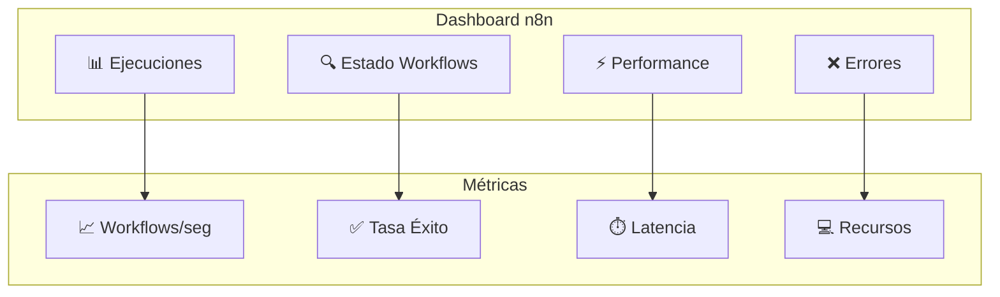

---

## 🔒 Seguridad y Consideraciones

### **Medidas de Seguridad**
- **Autenticación OAuth2**: Para acceso a n8n
- **API Keys**: Tokens seguros para integraciones
- **Rate Limiting**: Prevención de abuso de APIs
- **Logs Auditables**: Tracking completo de ejecuciones
- **Cifrado**: Datos sensibles en tránsito y reposo

### **Backup y Recuperación**
- **Workflows**: Versionado automático en Git
- **Datos**: Backup diario de configuraciones
- **Credenciales**: Vault seguro para secretos
- **Logs**: Retención configurable

---

## 🎯 Casos de Uso Específicos

### **Caso 1: Fábrica 24/7**
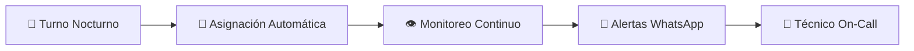

### **Caso 2: Prototipado Rápido**
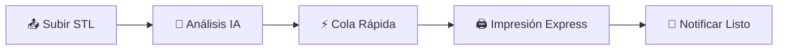

### **Caso 3: Mantenimiento Predictivo**
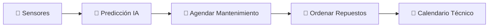

---

## 📝 Conclusiones y Recomendaciones

### **Beneficios Esperados**
- **+80% Reducción** en tareas manuales repetitivas
- **+60% Mejora** en tiempo de respuesta a fallos
- **+90% Automatización** de notificaciones y reportes
- **100% Trazabilidad** de procesos y decisiones

### **Próximos Pasos**
1. **Aprobación** de arquitectura propuesta
2. **Setup** de entorno de desarrollo
3. **Implementación** fase por fase
4. **Testing** y validación en paralelo
5. **Deploy** gradual en producción

### **Riesgos y Mitigación**
- **Complejidad**: Documentación exhaustiva y capacitación
- **Performance**: Monitorización continua y optimización
- **Dependencias**: Fallback manual para procesos críticos
- **Seguridad**: Auditorías regulares y mejores prácticas

---

*Esta propuesta establece las bases para transformar KyberCore en una plataforma de orquestación inteligente, aprovechando al máximo las capacidades de n8n para automatización, integración y escalabilidad.*